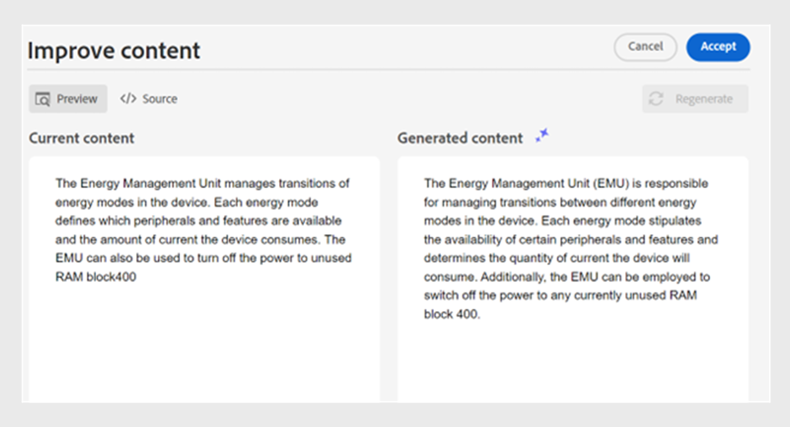

# AI Assistant，以智慧效率撰寫檔案

Experience Manager Guides提供AI Assistant工具，可幫助您更聰明、更快速地完成撰寫。 您會透過智慧型建議與最佳化，體驗簡化的檔案處理。 使用此工具，檢視智慧建議以重複使用現有內容存放庫中的內容。 使用文字提示功能，提供提示並變更內容，或根據您的需求產生輸出。 使用AI助理將段落聰明地轉換為清單。 您可以建立目前主題的簡短說明。 此功能也可協助您輕鬆改善及翻譯選取的內容。

>[!NOTE]
>
> 若要在右側面板中新增AI助理功能，您的系統管理員必須在&#x200B;**Workspace設定** **Workspace設定圖示**&#x200B;的&#x200B;**面板**&#x200B;索引標籤下選取選項。
> &#x200B;> 此外，您必須出庫檔案才能檢視AI助理圖示。

此功能僅適用於DITA主題。 在主題中選取文字後，您可以選擇執行任何「AI輔助程式」動作：

## 建議可重複使用的內容

使用&#x200B;**建議可重複使用的內容** 功能，以一致且正確地編寫內容。 您可以選取內容，而Experience Manager Guides會提供有關如何重複使用存放庫中現有內容的建議。
深入瞭解如何使用[AI支援的智慧型建議來編寫內容](authoring-ai-based-smart-suggestions.md)。

## 使用文字提示

文字提示是指示、問題或陳述式，可引導AI助理產生特定回應或輸出。

您可以使用文字提示來變更內容並產生輸出。  例如，您可以產生產品功能的摘要，並在您的報告中使用它來展示產品。 您也可以使用此功能來比較兩個產品。 例如，您也可以建立兩個產品功能的比較表。

1. 選取您要使用文字提示的文字。
1. 從&#x200B;**AI助理**&#x200B;面板中選取 **ai使用文字提示圖示**。
1. 以下列其中一種方式發出提示：

   - 從建議的提示中選擇提示。
   - 根據您的需求，修訂或編輯建議的提示，以建立自訂提示。

     >[!NOTE]
     >
     > 您的管理員已在`ui_config.json`中設定建議的提示。

   - 在文字方塊中輸入提示。

1. 選取&#x200B;**重新產生** ，以根據您的提示產生其他回應或輸出，例如AI工具。

1. （選擇性）選取&#x200B;**展開** 以開啟&#x200B;**使用文字提示**&#x200B;編輯器。 它會顯示目前和產生的內容。 您可以編輯來源版面配置內容並檢查預覽。

   >[!NOTE]
   >
   > 系統會根據選取的內容產生回應。

1. 您也可以在編輯器中編輯提示並重新產生回應。 例如，您可以變更提示，讓文字更簡潔，大約為40個字。

   

1. 您可以驗證產生內容的來源，並視需要加以編輯。

1. 選取&#x200B;**接受**，將主題中選取的內容取代為產生的內容。
1. **取消**：取消文字提示動作。 返回到面板的初始狀態。

   >[!NOTE]
   >
   > 在功能面板中選取&#x200B;**取消**&#x200B;圖示也會將您帶回初始狀態。

## 改善內容

改善所選內容。 檢查拼字、語言和文法結構，並建議更好的內容版本。 它也能提升句子的品質。

1. 選取內容。
1. 選取&#x200B;**改善內容** 以尋找改善內容的建議。
1. 選取&#x200B;**重新產生**，以取得其他改善內容的建議。

1. （選擇性）選取&#x200B;**展開**&#x200B;以開啟改良的內容編輯器。 它會顯示目前和產生的內容。 您可以在來源版面配置中編輯內容，也可以檢查預覽。

接受建議、重新產生其他回應，或取消動作以回到先前的狀態。

## 建立簡短描述

根據約30至50字的選取內容，建立主題的簡短說明。 簡短說明可協助使用者搜尋及尋找相關內容。
例如，您可以列出系統需求並產生相應的簡短說明。

1. 選取內容。
1. 選取&#x200B;**建立簡短描述** 以建立目前主題的簡短描述。
1. 選取&#x200B;**接受**&#x200B;以建立新的簡短描述（如果簡短描述尚未出現）。 如果存在簡短說明，您需要先確認該說明，才能將其取代為新的簡短說明。

您也可以執行下列動作：

- 選取&#x200B;**重新產生**，為您的主題產生其他簡短描述，例如AI工具。
- 選取&#x200B;**展開**&#x200B;以開啟&#x200B;**建立shortdesc**&#x200B;編輯器。

## 逐項列出內容

此功能會聰明地將選取的段落轉換為清單。  它會分析內容並建立專案的邏輯清單。 您不需要手動建立專案。 例如，如果您有一個詳細說明建立使用者帳戶步驟的段落，則工具可以將其轉換為逐步清單，而無需逐一手動建立專案。

1. 選取內容。
1. 選取&#x200B;**逐項化內容** ，將選取的內容轉換為清單。
AI助理工具會聰明地將內容轉換為專案清單。
1. （選擇性）選取&#x200B;**展開**&#x200B;以開啟&#x200B;**專案化內容**&#x200B;編輯器。
1. 清單準備就緒後，請接受所產生內容中的變更。 接著產生的內容會取代所選的內容。

## 翻譯內容

使用此智慧型功能，將選取的內容翻譯成目標語言。 例如，您可以新增英文內容並快速將其翻譯為德文。
執行以下步驟來翻譯內容：

1. 選取您要翻譯的內容。
1. 從AI助理面板選取&#x200B;**翻譯內容** 。
1. 從下拉式清單中選取目標語言。 翻譯的內容會顯示在「AI助理」面板中。

1. （選擇性）選取&#x200B;**展開**&#x200B;以開啟&#x200B;**翻譯內容**&#x200B;編輯器。
1. 您也可以從下拉式選單中選取其他語言，並以所選語言重新產生內容。 例如，如果您選取[法文]，然後選取[重新產生] **&#x200B;**，內容就會轉譯成法文。

