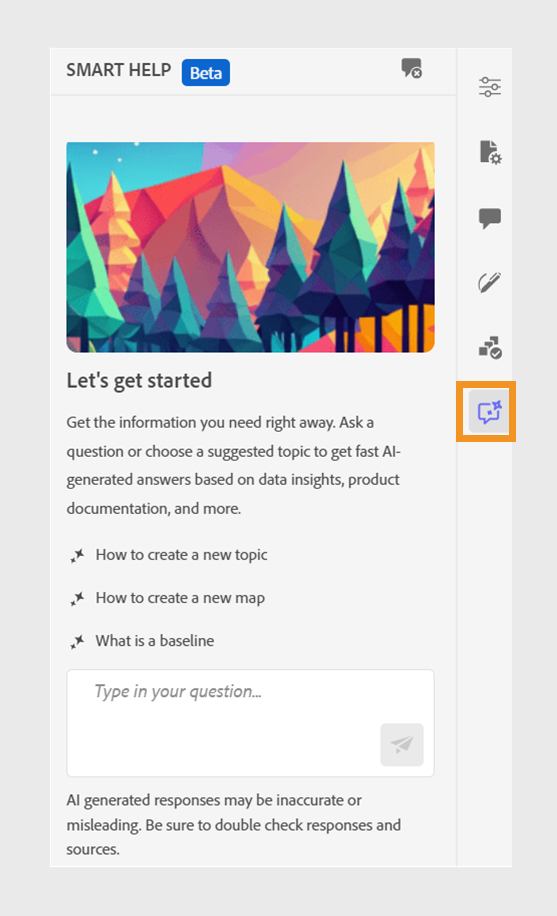
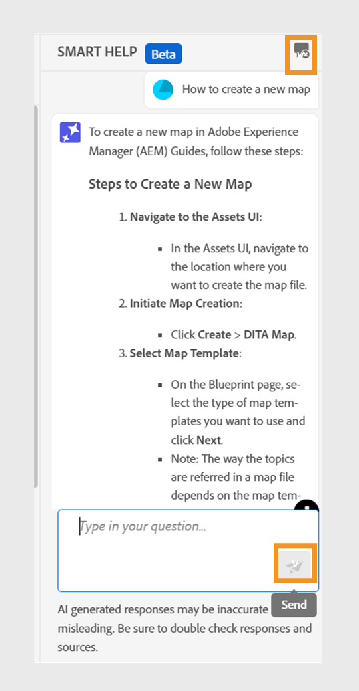

# AI支援的Smart Help可搜尋內容

Experience Manager Guides提供GenAI型Smart Help，這是對話式搜尋功能，可協助您從[Adobe Experience Manager Guides檔案](https://experienceleague.adobe.com/en/docs/experience-manager-guides/using/overview)尋找相關內容。
您可以透過資訊化方式詢問問題並獲得答案。 您的查詢答案取決於產品檔案中的內容。 此搜尋完全是對話式的。 您可以提出問題，然後根據回應提出進一步的問題。 回應也包含來原始檔的連結，您可以參閱以取得詳細資訊。

例如，您可以在Experience Manager Guides中建立檔案主題。 您可以詢問，*如何建立主題？*&#x200B;您收到回應，以及相關文章的連結。 然後，如果您想瞭解如何產生檔案的PDF輸出，可以詢問有關問題。 例如，*如何將主題發佈至PDF？*&#x200B;或&#x200B;*如何產生主題的PDF輸出？*

當您開啟Web編輯器時，**智慧型說明**&#x200B;面板會出現在右側。

>[!NOTE]
>
> 您的管理員必須設定&#x200B;**智慧說明**&#x200B;功能。 如需詳細資訊，請檢視《安裝與設定指南》中的[設定AI支援的Smart Help以搜尋內容](/help/product-guide/cs-install-guide/conf-smart-help.md)區段以取得Cloud Service。

{width="300" align="left"}

*檢視&#x200B;**智慧型說明**面板。*

執行以下步驟來使用對話式搜尋，以尋找適當的內容並解決您的查詢：

1. 選取&#x200B;**智慧型說明** 以開啟面板。

   >[!NOTE]
   >
   > 在[全域或資料夾層級設定檔](/help/product-guide/cs-install-guide/conf-folder-level.md#conf-ai-guides-assistant)中，您的管理員需要定義出現在面板中的預設問題。

1. 輸入問題以在Experience Manager Guides檔案中尋找相關內容。 您可以在面板中選取預設問題，或在文字方塊中輸入問題。

1. 選取&#x200B;**傳送** 或按&#x200B;**Enter**&#x200B;檢視您問題的回應。

   根據您的問題，您可以檢視內容、適用的影像和文章連結。

   {width="300" align="left"}

   *選取範例問題並檢視內容與影像回應。*

1. 選取文章結尾的連結，並檢視有關您問題的詳細資訊。

1. 選取&#x200B;**清除交談** 以從面板移除交談記錄。 接著，您就可以開始全新的交談，並尋找相關內容。

此智慧功能可協助您快速尋找解決方案，讓您專注於檔案並有效完成工作。
