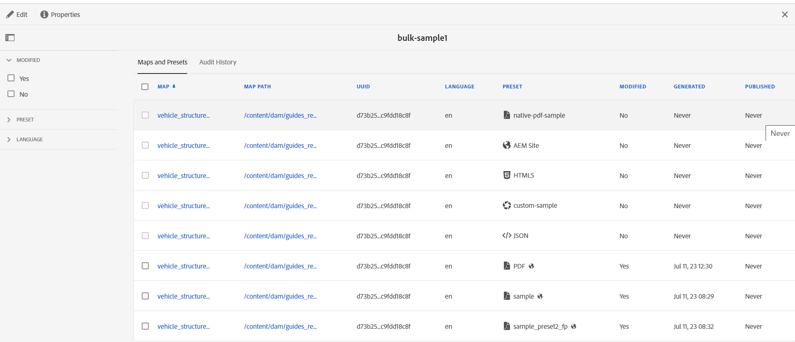

# 建立大量啟用地圖集合 {#id214GG0E90EV}

若要建立大量啟動對映集合，請執行以下步驟：

1. 從工具清單中選取&#x200B;**指南**。

1. 選取頂端的Adobe Experience Manager連結，然後選擇&#x200B;**工具**。

1. 選取&#x200B;**大量發佈儀表板**&#x200B;圖磚。

   系統首次顯示空白的集合頁面。 如果您先前已建立大量啟動集合，則會顯示在此頁面上。

1. 按一下「**建立**」。

1. 輸入大量啟用地圖集合的標題，然後按一下[建立]。****

   成功訊息會在建立大量啟用地圖集合時顯示。

1. 在成功訊息上按一下&#x200B;**開啟**。

1. 選取&#x200B;**編輯**，然後選取&#x200B;**新增地圖**。

1. 尋找並新增您要新增至大量啟動對映集合的DITA map。

   依預設，所有與地圖關聯的預設集和區域設定都會自動新增。

1. 透過開啟或關閉滑動按鈕來選取所需的輸出。

   您可以跨可用地區設定選擇多個輸出預設集。

1. 按一下&#x200B;**完成**。

DITA map檔案會新增至您的大量啟動對映集合中。

{width="800" align="left"}

## 地圖和預設集索引標籤

**地圖和預設集**&#x200B;索引標籤會顯示下列資料欄中的資訊：

- **對應**：顯示DITA map檔案的標題。
- **對應路徑**：顯示DITA map檔案的完整路徑。

- **UUID**：顯示與檔案相關聯的唯一識別碼。

- **語言**：顯示DITA map的語言代碼。
- **Preset**: Shows the title of the output preset configured on the map file. It also displays the icon based on the type of output preset.

  >[!NOTE]
  >
  > 小型圖示表示資料夾設定檔層級預設集。

- **Modified**: Indicates if the DITA map is updated after last publication. Based on this information, you can decide if you want to activate the output for this DITA map or not.
- **Generated**: Shows the date and time of the last generated output.
- **Published**: Shows the date and time of the last published (or activated) output. If you select the link, the **Activation Results** page is displayed, which contains the logs with information about the root path where the content is activated.

## Audit History tab

The **Audit History** tab presents information about the activated map outputs in the following columns:
- **對應**：顯示DITA map檔案的標題。
- **對應路徑**：顯示DITA map檔案的完整路徑。
- **UUID** : Shows the unique identifier associated with the file.
- **語言**：顯示DITA map的語言代碼。
- **Preset**: Shows the title of the output preset configured on the map file. It also displays the icon based on the type of output preset.
- **Status**: Shows the status of activation as successful or unsuccessful.
- **Destination**: If you generate the output on Experience Manager Guides as a Cloud Service, you can view the output&#39;s destination as Publish or Preview.

  >[!NOTE]
  >
  > 小型圖示表示資料夾設定檔層級預設集。

- **Modified**: Indicates if the DITA map was updated after the last publication. Based on this information, you can decide whether to activate the output for this DITA map.
- **Published**: Shows the date and time of the last published (or activated) output. If you select the link, the Activation Results page is displayed, which contains the logs with information about the root path where the content is activated.
  {width="800" align="left"}

  *View the information about the activated map outputs in the **Audit History**tab.*

  >[!NOTE]
  >
  > **稽核歷史記錄**&#x200B;索引標籤中的輸出是根據&#x200B;**已發佈**&#x200B;資料行排序。

## 左側面板

左側面板上有以下篩選選項：

- **已修改**：您可以選取「是」或「否」。 如果您選取「是」，則只會顯示修改過的DITA map。 修改後的對應是自上次發佈後產生的對應。
- **預設集**：選取您要篩選掉地圖檔案的預設集。 此欄顯示地圖檔案上設定的輸出預設集標題。 例如，如果您選擇&#x200B;*AEM網站*&#x200B;預設集，則只會顯示設定了&#x200B;*AEM網站*&#x200B;輸出預設集的地圖。
- **語言**：您可以選取任何可用的語言代碼，並在[地圖和預設集]索引標籤中僅顯示選取的語言。

當您從&#x200B;**對應和預設集**&#x200B;標籤切換到&#x200B;**稽核歷史記錄**&#x200B;標籤時，篩選器會更新，反之亦然。

**父級主題： **[大量啟用已發佈的內容](conf-bulk-activation.md)
