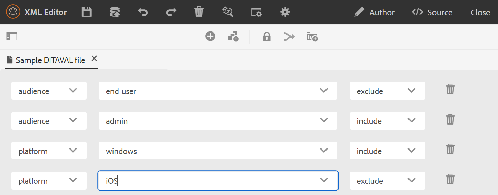

# DITAVAL編輯器 {#ditaval-editor}

DITAVAL檔案用於產生條件輸出。 在單一主題中，您可以使用元素屬性來新增條件，以條件化內容。 然後，您會建立DITAVAL檔案，在其中指定應擷取以產生內容的條件，以及應從最終輸出中排除哪些條件。

AEM Guides可讓您使用DITAVAL編輯器輕鬆建立及編輯DITAVAL檔案。 DITAVAL編輯器會擷取您系統中定義的屬性\（或標籤\），您可以使用它們來建立或編輯DITAVAL檔案。 如需有關在AEM中建立和管理標籤的詳細資訊，請參閱AEM檔案中的[管理標籤](https://experienceleague.adobe.com/docs/experience-manager-cloud-service/sites/authoring/features/tags.html?lang=zh-Hant)區段。

## 建立DITAVAL檔案

執行以下步驟來建立DITAVAL檔案：

1. 在Assets UI中，導覽至您要建立DITAVAL檔案的位置。

1. 按一下&#x200B;**建立** \> **DITA主題**。

1. 在Blueprint頁面上，選取DITAVAL檔案範本，然後按一下&#x200B;**下一步**。

1. 在[內容]頁面上，指定DITAVAL檔案的&#x200B;**標題**&#x200B;和&#x200B;**名稱**。

   >[!NOTE]
   >
   > 系統會根據檔案的標題自動建議名稱。 如果您要手動指定檔案名稱，請確定「名稱」不含任何空格、單引號或大括弧，且結尾為.ditaval。

1. 按一下「**建立**」。 「主題已建立」訊息便會顯示。

   您可以選擇開啟DITAVAL檔案以在DITAVAL編輯器中編輯，或將主題檔案儲存在AEM存放庫中。

## 編輯DITAVAL檔案

執行以下步驟來編輯DITAVAL檔案：

1. 在Assets UI中，導覽至您要編輯的DITAVAL檔案。

1. To get an exclusive lock on the file, select the file and click **Check Out**.

1. Select the file and click **Edit** to open the file in AEM Guides DITAVAL editor.

   The DITAVAL editor allows you to perform the following tasks:

   A: Toggle Left Panel
Toggle the left panel view. If you have opened the DITAVAL file through DITA map, the map and repository are shown in this panel. For more information about opening a file through DITA map, see [Edit topics through DITA map](map-editor-advanced-map-editor.md#id17ACJ0F0FHS).

   B: Save
Saves the changes you have made in the file. All your changes are saved in the current version of your file.

   C: Add Property
Add a single property in your DITAVAL file.

   

   The first drop-down lists the allowed DITA attributes that you can use in the DITAVAL file. There are five attributes that are supported - `audience`, `platform`, `product`, `props`, and `otherprops`.

   The second drop-down list shows the values configured for the selected attribute. Then, the next drop-down list shows the actions that you can configure on the selected attribute. The allowed values in the action drop-down are - `include`, `exclude`, `passthrough`, and `flag`. For more information about these values, see the definition of [prop](http://docs.oasis-open.org/dita/dita/v1.3/errata01/os/complete/part3-all-inclusive/langRef/ditaval/ditaval-prop.html#ditaval-prop) element in OASIS DITA documentation

   D: Add All Properties
If you want to add all conditional properties or attributes defined in your system with a single click, use the Add All Properties feature.

   >[!NOTE]
   >
   > If all defined conditional properties already exist in the DITAVAL file, you cannot add more properties. You get an error message in this scenario.

   

1. Once you have finished editing your DITAVAL file, click **Save**.

   >[!NOTE]
   >
   > If you close the file without saving, the changes will be lost. If you do not wish to commit changes into AEM repository, click **Close**, and then click **Close Without Saving** in the **Unsaved Changes** dialog.

## DITAVAL編輯器檢視

AEM Guides的DITAVAL編輯器支援以兩種不同的模式或檢視檢視DITAVAL檔案：

**作者**：   這是DITAVAL編輯器的典型「所見即所得」檢視。 您可以使用簡單使用者介面新增或移除屬性，該介面會在下拉式清單中顯示屬性、屬性和動作。 在「作者」檢視中，您有選項可按一下插入個別屬性，以及插入所有屬性。

您也可以將指標暫留在檔案名稱上，找到目前使用的DITAVAL檔案版本。

**Source**：   Source檢視會顯示構成DITAVAL檔案的基礎XML。 除了在此檢視中進行一般文字編輯外，作者也可以使用「智慧型目錄」新增或編輯屬性。

若要叫用智慧型錄，請將游標放在任何屬性定義的結尾並輸入&quot;&lt;&quot;。 編輯器將顯示您可以在該位置插入的所有有效XML元素清單。

