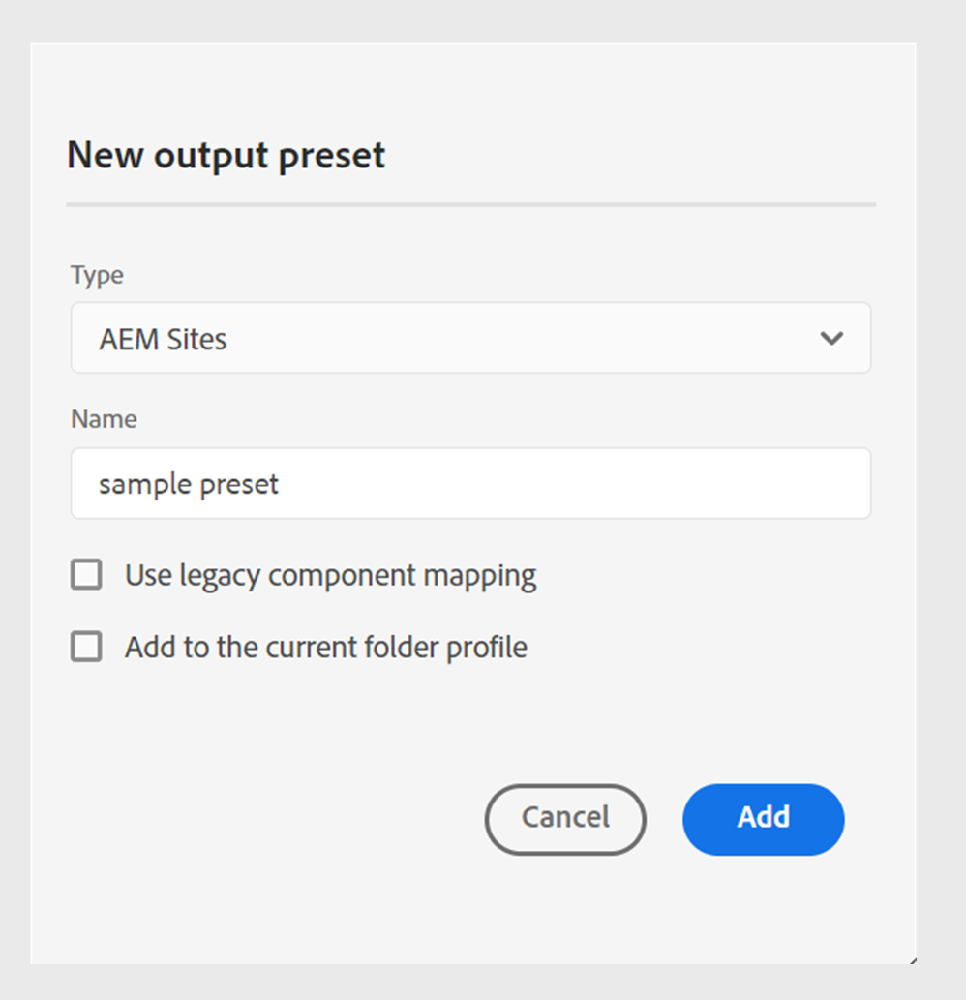

# 網頁編輯器中的AEM Sites預設集

您可以從網頁編輯器建立AEM Sites預設集，並將其設定為產生AEM Sites輸出。 AEM Sites輸出以複合元件對應以及`guides-components`為基礎，有助於有效率的內容建立和管理。

Experience Manager Guides為建立AEM Sites提供預先定義的範本。 這些預設集可協助您確保內容版面配置與結構的一致性。
- [根據這些預先定義的範本建立首頁](/help/product-guide/cs-install-guide/download-install-aem-sites-templates-cs.md#create-a-home-page-using-the-template)。
- 您可以[編輯主題範本](/help/product-guide/cs-install-guide/download-install-aem-sites-templates-cs.md#package-installation)，並根據您的需求套用樣式。
- 您也可以[自訂現有的AEM Sites範本](/help/product-guide/cs-install-guide/download-install-aem-sites-templates-cs.md#customize-existing-aem-sites-templates)。

## 建立AEM Sites預設集

執行以下步驟，從網頁編輯器建立AEM Sites預設集：

1. 在「存放庫」面板中，在「對映檢視」中開啟DITA map檔案。
1. 在&#x200B;**輸出**&#x200B;索引標籤中，選取+圖示以建立輸出預設集。
1. 從&#x200B;**新增輸出預設集**&#x200B;對話方塊的&#x200B;**型別**&#x200B;下拉式清單中選取&#x200B;**AEM Sites**。
1. 從&#x200B;**新輸出預設集**&#x200B;對話方塊中取消選取&#x200B;**使用舊元件對應**&#x200B;選項。

>[!NOTE]
>
>在為Experience Manager Guides設定AEM Sites預設集之前，您的管理員需要使用範本建立AEM Sites結構。
- **內部部署軟體**：深入瞭解如何[下載並安裝內部部署軟體的AEM Sites範本](/help/product-guide/install-guide/download-install-aem-sites-templates.md)。
- **Cloud Service**：進一步瞭解如何[下載並安裝適用於Cloud Service的AEM Sites範本](/help/product-guide/cs-install-guide/download-install-aem-sites-templates-cs.md)。

### 將預設集新增至目前的資料夾設定檔

身為管理員，Experience Manager Guides可讓您建立並管理全域和資料夾設定檔的輸出預設集。 從&#x200B;**新增輸出預設集**&#x200B;對話方塊中選取&#x200B;**新增到目前的資料夾設定檔**&#x200B;選項，以建立目前資料夾設定檔的輸出預設集。 圖示表示資料夾設定檔層級預設集。  深入瞭解[管理全域和資料夾設定檔輸出預設集](./web-editor-manage-output-presets.md)。

### 以舊版元件對應為基礎的AEM Sites預設集

您也可以使用舊版元件對應來建立AEM Sites預設集。 若要根據舊版元件對應建立AEM Sites預設集，請從&#x200B;**新增輸出預設集**&#x200B;對話方塊中選取&#x200B;**使用舊版元件對應**&#x200B;選項。

使用舊版元件對應的預設集可能有某些不同選項。

## 設定AEM Sites預設集

這些設定會整理在&#x200B;**一般**、**內容**、**主題清單**&#x200B;和&#x200B;**交叉對應參考**&#x200B;標籤下。

**一般**

**一般**&#x200B;索引標籤包含下列與產生輸出相關的設定：

- 使用網站路徑
- 網站路徑
- 網站
- 發佈路徑
- 主題頁面範本
- 根據以下條件產生頁面名稱：
   - 主題檔案名稱
   - 主題標題
- 清理先前產生的頁面
   - 為從地圖中移除的主題刪除先前產生的頁面
   - 刪除此路徑下其他來源建立的所有頁面：
- 貼文產生工作流程

**內容**

**Content**&#x200B;索引標籤包含下列設定：

- 使用基準線
- 條件篩選
- 其他DITA-OT命令列引數
- 後設資料
   - 檔案(Assets)屬性
   - 使用對應屬性作為遞補

如需詳細資訊，請參閱[AEM Sites設定](#aem_sites_config)。

**主題清單**

**主題清單**&#x200B;顯示DITA map目前工作復本中的主題清單。 依預設，會包含所有主題。 您可以選取特定主題，並僅為其產生AEM Sites輸出。 例如，您已更新一些主題，因此您可以僅發佈這些主題，而非發佈整個DITA map。

未根據舊版對應建立的AEM預設集中有&#x200B;**主題清單**&#x200B;索引標籤。

**交叉對應參考**
此清單包含的主題包含具有`scope ="peer"`的交叉對映參考。 您可以為其他DITA map中可用主題的交叉對映參照清單指定發佈內容，其中包含`scope="peer"`。 如果您使用Experience Manager Guides (UUID)版本，此標籤就會出現。

深入瞭解如何[發佈連結的主題](#publish-linked-topics)。

## AEM Sites設定 {#aem_sites_config}

下列選項適用於AEM Sites輸出：

| AEM Sites選項 | 說明 |
| --- | --- |
| 使用網站路徑 | 使用此選項將您的內容發佈至Experience Manager網站。 如果您知道您要發佈輸出的確切網站路徑，請選取此選項。 此外，在網站路徑欄位中提及完整路徑。 |
| 網站路徑 | 如果您選取&#x200B;**使用網站路徑**&#x200B;選項，就會出現此選項。 瀏覽您要發佈輸出的確切Experience Manager網站路徑。 |
| 網站 | 您要發佈內容的Experience Manager Sites名稱。 下拉式清單中的選項會根據AEM Sites中可用的網站清單填入。  選取&#x200B;**重新整理** 以擷取新的選項清單，並反映更新的資料。 |
| 發佈路徑 | AEM存放庫內儲存輸出的路徑。 「發佈路徑」會填入包含根據首頁範本建立之頁面的所有路徑。 DITA map的AEM Sites輸出會在此路徑下產生。  例如，如果您將網站指定為`AEMG-Docs`，並將發佈路徑指定為`aemg-docs-en/docs/product-abc.`，則會在`aemg-docs-en/docs/product-abc/`中的`crx/de`節點下產生AEM Sites輸出。 |
| 主題頁面範本 | 可用於在多個檔案中一致地組織內容的結構元件。 這些範本已在Adobe Experience Manager網站範本中預先定義。 這些選項會填入所有可用於所選場地的主題頁面範本。 選取要套用至所有輸出主題的範本。 |
| 根據以下條件產生頁面名稱： | **主題檔案名稱**：使用DITA主題的檔案名稱來建立網站URL。  **主題標題**：使用DITA主題的標題來建立Experience Manager網站名稱。 |
| 清理先前產生的頁面 | - **刪除從對映中移除之主題先前產生的頁面**：如果DTIA對映的結構變更，您可以使用此選項來移除先前產生之主題頁面。 此功能僅適用於完整地圖發佈。  假設您已發佈DITA map，其中包含主題a.dita、b.dita和c.dita。 再次發佈對應之前，您已從對應移除b.dita主題。 現在，如果您已選取此選項，則會從AEM Sites輸出中移除與b.dita相關的所有內容，並且僅發佈a.dita和c.dita。  **注意**：有關已刪除頁面的資訊也會擷取到輸出產生記錄檔中。 如需有關存取記錄檔的詳細資訊，請[檢視並檢查記錄檔](generate-output-basic-troubleshooting.md#id1821I0Y0G0A__id1822G0P0CHS)。   **警告**：刪除主題時，已發佈網站的頁面會變成無法使用。 因此，在刪除主題之前，會顯示警告。 您必須確認以刪除它們。  - **刪除此路徑上其他來源建立的所有頁面**：如果您選取此選項，會刪除其他地圖、個別主題或任何其他來源在此路徑上發佈的所有頁面。 已發佈網站的頁面也會變得無法使用。 因此，在刪除主題之前，會顯示警告。 您必須確認以刪除它們。 |
| 貼文產生工作流程 | 選擇此選項時，會顯示新的「產生後工作流程」下拉式清單，其中包含AEM中設定的所有工作流程。 您必須選取要在輸出產生工作流程完成後執行的工作流程。 |
| 使用基準線 | 如果您已經為選取的DITA map建立基準線，請選取此選項以指定要發佈的版本。  **重要**：當您產生AEM網站的增量輸出時，會使用檔案的目前版本而非附加的基準線來建立輸出。  檢視[使用基準線](generate-output-use-baseline-for-publishing.md#id1825FI0J0PF)以取得詳細資料。 |
| 條件式篩選 | 選取下列其中一個選項：  **無**：如果您不想在發佈的輸出上套用任何條件，請選取此選項。 **使用DITAVAL**：選取DITAVal檔案以產生條件式內容。 您可以使用瀏覽對話方塊或輸入檔案路徑來選取多個DITAVal檔案。 使用檔案名稱附近的十字圖示可將其移除。 DITAVal檔案會依指定的順序計算，因此第一個檔案中指定的條件優先於後續檔案中指定的相符條件。 您可以透過新增或刪除檔案來維持檔案順序。 如果DITAVal檔案被移動到其他位置或被刪除，它不會自動從對映圖示板中刪除。 您必須更新位置，才能移動或刪除檔案。 您可以將滑鼠停留在檔案名稱上，檢視檔案儲存所在的AEM存放庫中的路徑。 您只能選取DITAVal檔案，如果您選取任何其他檔案型別，則會顯示錯誤。 **條件預設集**：從下拉式清單中選取條件預設集，以在發佈輸出時套用條件。 如果您已為DITA map檔案新增條件，則會顯示此選項。 條件設定可在DITA map主控台的「條件預設集」標籤中使用。 若要進一步瞭解條件預設集，請檢視[使用條件預設集](generate-output-use-condition-presets.md#id1825FL004PN)。 |
| 其他DITA-OT命令列引數 | 指定在產生輸出時要DITA-OT處理的其他引數。 如需有關DITA-OT支援的命令列引數的詳細資訊，請檢視[DITA-OT檔案](https://www.dita-ot.org/)。 |
| 中繼資料   檔案(Assets)屬性 | 選取您要當作中繼資料處理的屬性。 這些屬性是從DITA map或bookmap檔案的「屬性」頁面設定的。 您從下拉式清單中選取的屬性會顯示在&#x200B;**檔案屬性**&#x200B;欄位下。 選取屬性旁的十字圖示以將其移除。   **注意**：中繼資料屬性區分大小寫。  *如果您已選取「基準線」，則屬性的值會以所選「基準線」的版本為基礎。 *&#x200B;如果您尚未選取「基準線」，則屬性的值會以最新版本為基礎。  您也可以使用DITA-OT發行將中繼資料傳遞至輸出。 如需詳細資料檢視，請[使用DITA-OT](pass-metadata-dita-ot.md#id21BJ00QD0XA)將中繼資料傳遞至輸出。  **注意**：如果您尚未在[屬性]選項中定義`cq:tags`，則即使您已選取要發佈的基準線，`cq:tags`的值也會從目前的工作復本中挑選出來。 |
| 中繼資料   使用地圖屬性作為遞補 | 如果選取，為對映檔案定義的屬性也會複製到未定義此類屬性的主題中。 使用此選項時，請考量下列幾點：  *只能將字串、日期或長（單一和多值）屬性傳遞至AEM網站頁面。 *&#x200B;字串型別屬性的中繼資料值不支援任何特殊字元（例如`@, #, " "`）。 *此選項應與`Properties`選項搭配使用。 |
| 保留暫存檔 | 選取此選項可保留DITA-OT產生的暫存檔案。 如果您在透過DITA-OT產生輸出時發生錯誤，請選取此選項以保留暫存檔案。 然後，您可以使用這些檔案來疑難排解輸出產生錯誤。   產生輸出後，請選取&#x200B;**下載暫存檔** 圖示來下載包含暫存檔的ZIP資料夾。   **注意**：如果在產生期間新增檔案屬性，輸出暫存檔也會包含包含包含這些屬性的&#x200B;*metadata.xml*&#x200B;檔案。 |

### 使用範本產生AEM Sites輸出

Experience Manager Guides可讓您使用立即可用的範本，或新增您自己的AEM Sites範本。

在設定AEM Sites預設集之前，請務必使用範本建立AEM Sites結構。\
如需詳細資訊，請檢視[下載並安裝AEM Sites範本](/help/product-guide/install-guide/download-install-aem-sites-templates.md)。

執行以下步驟來建立和設定AEM Sites預設集：
1. 開啟您要發佈的DITA map的&#x200B;**輸出預設集**&#x200B;標籤。
1. 選取&#x200B;**AEM Sites**&#x200B;輸出預設集。
1. （選用）取消勾選&#x200B;**使用舊版元件對應**&#x200B;選項，以建立非舊版AEM Sites預設集。
1. 按一下&#x200B;**「新增」**。隨即建立AEM Sites的預設集。
1. 您可以透過兩種方式設定現成可用的網站範本：
   1. 選取&#x200B;**網站**，然後從填入的選項中選擇發佈路徑和主題頁面範本：
      1. 選取網站。
      1. 選取&#x200B;**網站**。 例如，`AEMG Docs`。
      1. **發佈路徑**&#x200B;和&#x200B;**主題頁面範本**&#x200B;選項會在下拉式清單中自動設定。 您也可以選擇選項。 例如，`AEMG-Docs-Site/en/docs/product1`和`Topic page`分別設定。
   1. 選取完整的網站路徑：
      1. 選取&#x200B;**使用網站路徑**&#x200B;選項。
      1. 選取完整的網站路徑。 例如，`/content/AEMG-Docs-Site/en/docs/product1`。
      1. 「主題頁面範本」會自動設定為`Topic Page`。

1. 儲存對預設集所做的變更。
1. 選取&#x200B;**產生**&#x200B;選項。
1. 為對應的對應產生AEM Sites。 例如，`/content/AEMG-Docs-Site/en/docs/product`。

   >[!NOTE]
   >
   > 如果您是第一次將內容發佈至AEM網站，建議您在網站層級發佈頁面。 這可確保輸出在&#x200B;**Publish**&#x200B;執行個體上正確顯示，而不會造成任何CSS中斷。

### 發佈連結的主題

Experience Manager Guides可讓您使用`peer @scope`建立主題參考，簡化複雜檔案的發佈。 然後，您可以從AEM Sites預設集定義這些參照的發佈內容，最後產生連結主題的輸出。
如需詳細資訊，請檢視[從其他地圖產生連結主題的輸出](../user-guide/generate-output-aem-site.md#generate-output-linking-topics-from-other-maps)。

執行下列步驟，指定交叉連結檔案的發佈內容：
1. 開啟您要發佈的DITA map的&#x200B;**輸出預設集**&#x200B;標籤。
1. 選取&#x200B;**AEM Sites**&#x200B;輸出預設集。

   您可以檢視&#x200B;**一般**、**內容**、**主題清單**&#x200B;和&#x200B;**交叉對應參考**&#x200B;標籤。 如果您使用Experience Manager Guides (UUID)版本，會出現&#x200B;**交叉對應參考**&#x200B;標籤。

   在下列情況下，您將無法檢視跨對應連結：
   - 針對4.6版之前建立的預設集。 「交叉參照」標籤已停用，工具提示「參照對映」圖示板出現。
   - 適用於從地圖儀表板建立的預設集。 請參閱出現的「對應」控制面板工具提示。
   - 如需OOTB預設集的相關資訊，請參閱地圖控制面板工具提示出現。
   - 對於全域預設集，請建立此全域預設集的本機副本，以設定交叉對映參照。
如果您想要從網頁編輯器使用AEM Sites預設集，請建立新預設集或複製現有預設集。

1. 開啟&#x200B;**交叉對應參考**&#x200B;標籤。

   您會看到主題及其參照的清單。 您可以為具有`scope="peer"`之其他DITA map中可用主題的交叉對映參照清單指定發佈內容。

   若要使用網頁編輯器的跨對應參考面板，`<xrefs>`必須有唯一識別碼。 如果沒有`<xrefs>`的唯一ID，系統會在編輯/儲存較舊內容時自動產生該ID。

   >[!NOTE]
   >
   >**交叉對應參考**&#x200B;索引標籤僅顯示使用`scope="peer"`連結的主題。 對於具有`scope="local"`的連結，您不需要指定發佈內容。

   依預設，所有連結的主題都會選取其最新的輸出預設集和地圖。 所有連結主題的發佈內容預設為`<Most recently generated>`對應。

   

1. 如果要使用地圖中每個相依檔案最近發佈的輸出，請選取&#x200B;**對所有相依主題使用最近產生的**發佈內容。
在發佈包含連結主題的地圖之前，您應該發佈選取為父對映的地圖。 如果含有已連結主題的地圖未發佈，則連結會在AEM Sites輸出中顯示為普通文字，而非超連結。
您應該為連結的主題選取相同型別的AEM Sites預設集。 例如，如果目前的AEM Sites預設集使用舊版元件對應，則選取連結主題的類似AEM Sites預設集。
1. 在「父對映」下拉式清單中，選取要與其輸出連結目前對映輸出的對映檔案。
選取對應檔案會在「父系對應UUID」欄中顯示對應的UUID。 與所選地圖相關的輸出預設集會列在「父地圖」的「預設集」清單中。 例如，地圖A中的主題1包含對主題2的參照。 主題2可以出現在單一或多個地圖中。 您可以選取上層地圖和特定的預設集，或每個連結最近發佈的輸出。

1. 如果同一主題在檔案中被參照多次，則您可以為每個執行個體新增不同的發佈內容。 這可提供更大的彈性並控制其內容。 例如，主題3同時存在於對映B和對映C中。主題1包含兩個對主題3的參照。 您可以選擇對應B作為第一個連結的父對應，選擇對應C作為第二個連結的父對應。

1. 在「父對映」的「預設集」下拉式清單中，選取您要與目前對映的輸出連結的輸出預設集。
   >[!NOTE]
   >
   > 目前地圖的其他AEM Sites預設集會出現在下拉式清單中。 如果您未選取預設集，則會出現警告圖示，且輸出產生會失敗。
1. 為所有來源主題選取必要的對映及其輸出預設集，並選取&#x200B;**產生**。

**父級主題：** [瞭解輸出預設集](generate-output-understand-presets.md)
