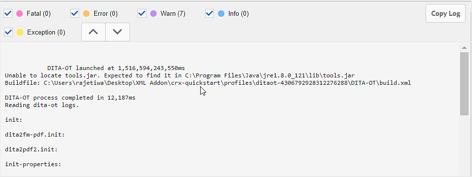
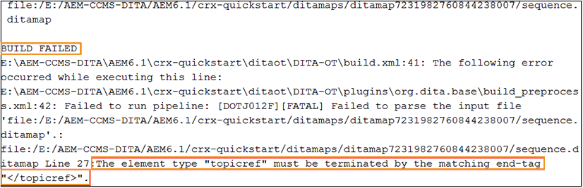

# 基本疑難排解 {#id1821I0Y0G0A}

使用AEM Guides時，您在發佈或開啟檔案時可能會遇到錯誤。 此類錯誤可能位於DITA map、主題或AEM Guides程式本身中。 本節提供如何存取及剖析輸出產生記錄檔中的資訊。 此外，如果您的DITA主題太大，您可能會看到JSP編譯錯誤。 本節也提供如何解決JSP編譯錯誤的資訊。

## 檢視並檢查記錄檔 {#id1822G0P0CHS}

執行以下步驟來檢視及檢查輸出產生記錄檔：

1. 啟動輸出產生程式後，在DITA map主控台中按一下&#x200B;**輸出**。

   **產生的輸出**&#x200B;的&#x200B;**一般**&#x200B;資料行會顯示圖示，以提供有關輸出產生成功或失敗的視覺提示。

   {width="300" align="left"}

   在上述熒幕擷圖中，第一個和第三個圖示顯示無法產生的輸出。 第二個圖示會顯示成功的輸出產生，但會有訊息。 最後一個是產生輸出成功，沒有訊息。

1. 工作完成之後，請按一下&#x200B;**產生時間**&#x200B;欄中的連結。

   日誌檔案會在新標籤中開啟。

   {width="800" align="left"}

1. 套用下列篩選器以反白標示記錄檔中的文字：
   - 嚴重：以粉紅色反白記錄檔中的嚴重錯誤。
   - 錯誤：以橘色醒目提示記錄檔中的錯誤。
   - 警告：以紫色醒目提示記錄檔中的警告。
   - 資訊：以藍色反白標示記錄檔中的資訊訊息。
   - 例外：以黃色醒目提示記錄檔中的例外。
1. 使用向上和向下導覽按鈕跳至記錄檔案中反白顯示的文字。

   Alternatively, scroll through the log file and check the messages.

## Copy and check the log file in a text editor

Perform the following steps to copy and check the output generation log file in a text editor:

1. 啟動輸出產生程式後，在DITA map主控台中按一下&#x200B;**輸出**。

1. 工作完成之後，請按一下&#x200B;**產生時間**&#x200B;欄中的連結。

   日誌檔案會在新標籤中開啟。

1. Click **Copy Log** button. The log file is copied to the clipboard.
1. Open a text editor and paste the log file in the editor.

1. Scroll through the log file and check for messages.

   The following information will help you determine whether there is an error in the DITA file or AEM Guides process:

   - *DITA map file related error*: In case there is an error found in the DITA map file or any other file contained in the DITA map, the log file will contain a string, &quot;BUILD FAILED&quot;. You can check the information given in the log file to locate the erroneous file and fix the issue.

   In the following sample log file snippet, you can see the `BUILD FAILED` message along with the reason for the error.

   {width="650" align="left"}

   - *AEM Guides-related error*: The other type of error that you can identify in the log file is related to AEM Guides process itself. In this case, the DITA map file is parsed successfully, but the output generation process fails because of some internal error in AEM Guides. For such kind of errors, you have to seek help from the technical support team.

   In the following sample log file snippet, you can see the `BUILD SUCCESSFUL` message, followed by other technical error.

   {width="650" align="left"}

## Resolve JSP compilation error

If your DITA topic is too large, then you might see the JSP compilation error \(`org.apache.sling.api.request.TooManyCallsException`\) in your browser. This error might appear when you open a topic for editing, reviewing, or publishing.

Perform the following steps to resolve this issue:

1. From the Global Navigation, select Tools and choose Operations \> Web Console.

   The Adobe Experience Manager Web Console Configuration page appears.

1. Search for and click on the *Apache Sling Main Servlet* component.

   隨即顯示Apache Sling主要Servlet的可設定選項。

1. 根據您的需求，增加每個請求&#x200B;*引數的*&#x200B;呼叫數值。

**父級主題：**&#x200B;[&#x200B;輸出產生](generate-output.md)
