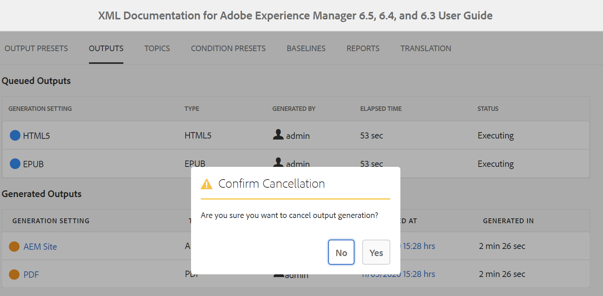

# 從Map主控台產生DITA Map的輸出 {#id1825FG00UHT}

執行以下步驟來產生DITA map的輸出：

1. 在Assets UI中，導覽至並按一下您要發佈的DITA map檔案。

   DITA map主控台會出現，其中列出可用於產生輸出的輸出預設集。

1. 選取要用來產生輸出的一或多個輸出預設集。

   {width="800" align="left"}

   >[!NOTE]
   >
   > 如果您正在產生AEM網站輸出，則發佈程式會使用`.ditamap`檔案中定義的結構，來建立AEM網站結構。

1. 按一下「產生」圖示以啟動輸出產生程式。

您可以按一下「輸出」，檢視輸出產生請求的目前狀態。 如需詳細資訊，請參閱[檢視輸出產生工作的狀態](#viewing_output_history)

>[!IMPORTANT]
>
> 如果預設集的輸出產生程式在佇列中或進行中，則無法起始相同預設集的另一個輸出產生任務。

您可以從網頁編輯器為針對DITA map建立的一或多個輸出預設集產生PDF輸出。 如需詳細資訊，請參閱[使用[快速產生]面板來產生並檢視預設集的輸出](web-editor-quick-generate-panel.md#)。

您也可以從網頁編輯器產生一或多個主題的AEM網站輸出，或產生整個DITA map。 如需詳細資訊，請參閱[從網頁編輯器](web-editor-article-publishing.md#id218CK0U019I)以文章為基礎的發佈。

## 增量輸出產生 {#generating_standalone_topic}

>[!NOTE]
>
> 增量輸出產生僅適用於AEM網站輸出。 此外，您只能從DITA map或子地圖重新產生DITA \(.dita/.xml\)主題。 如果您選取DITA map、子對應、主題群組或具有`@processing-role="resource-only"`的主題，則再生選項無法使用。

可能有許多例項只更新DITA map中的幾個主題，並只即時推播這些更新的主題。 若要處理這類案例，AEM Guides可讓您建立增量輸出。 如果您已更新一些主題，則不需要重新產生整個DITA map。 您只能選取更新的主題並重新產生它們。

If your map is chunked and you have updated a single topic in that map, then you need to regenerate the entire map for the updated topic or content to reflect in the output. You will not get the output regeneration option at a topic level, it is only available at the \(chunked\) map level. This is applicable to the parent map and all sub-maps.

Perform the following steps to regenerate output for a specific topic or a group of topics:

>[!IMPORTANT]
>
> When you are regenerating the AEM Site output, then the output is created using the current version of the files and not the attached Baseline.

1. 在Assets UI中，導覽至DITA map檔案並按一下。

   DITA map主控台會出現，其中列出可用於產生輸出的輸出預設集。

1. Select the **Topics** tab.

   A list of topics available in the DITA map is displayed.

1. Select the topics that you want to regenerate.

   >[!NOTE]
   >
   > If you have added new topics to the DITA map, you will not be able to generate those new topics from here. You must first publish the newly added topics by using the DITA map publish function.

   {width="800" align="left"}

1. Click **Regenerate**.

   The Regenerate Selected Topics page appears.

1. Select the output preset that you want to use to regenerate the selected topics.

1. Click **Regenerate** to start the output generation process.

>[!IMPORTANT]
>
> If you rename a topic title and regenerate the topic, the updated topic title does not reflect in the DITA map table of contents. To update the topic title in the TOC, you must generate the entire DITA map.

您可以按一下「輸出」，檢視輸出產生請求的目前狀態。 For more information, see [View the status of the output generation task](#viewing_output_history).

## 檢視輸出產生工作的狀態 {#viewing_output_history}

Once you initiate the output generation task for a map or regenerate selected topics, AEM Guides sends this task to the output generation queue. This queue is updated in real time, showing the status of each output generation task in the queue.

Perform the following steps to view the output generation queue:

1. In the Assets UI, navigate to and click on the map file for which you want to check the output generation status.

1. Click **Outputs**.

   {width="800" align="left"}

   The Outputs page is divided into two parts:

   - **Queued Outputs:**

     Lists the outputs that are either waiting to be generated or are under generation process. The queued or in progress tasks are shown with a blue color icon before the preset name. You can also find the output generation setting or preset used for the queued task, the type, user who initiated the task, time since when the task is queued, and the current status.

     Click on the link to access the **Publish Dashboard** and view the current running status. A list of all active publishing tasks is available in the Publish Dashboard. The **Queued Outputs** and the **Publish Dashboard** link are displayed only when there are outputs that are either waiting to be generated or are under generation process. They don&#39;t appear when the output tasks have been completed.For more details on Publish Dashboard, see [Manage publish tasks using the Publish Dashboard](generate-output-publish-dashboard.md#).

   - **Generated Outputs**

     Lists the output tasks that have been completed. Again, the information shown here is similar to the Queued Outputs section with a few differences. You have new set of information in the form of output result icon and the output generation time.

     In this list, you could have tasks that have executed successfully, tasks that have executed with message, or failed tasks. The successful tasks are shown with green color icon, the tasks with a message have an orange color icon, and the failed tasks are shown with red color icon.

     For all the tasks, the publishing process creates a log file \(logs.txt\) that can be accessed by clicking the link in the Generated At column. For tasks that have failed or have messages, you can check the log file, which is explained in the section [View and check the log file](generate-output-basic-troubleshooting.md#id1822G0P0CHS).

     >[!NOTE]
     >
     > When you click on a link of the generated PDF output, you are asked to download the PDF. This is the default behavior in AEM 6.5 and 6.4.

## Cancel an output generation task {#id2061H100T5Z}

AEM Guides gives publishers a simple and easy way to cancel any ongoing publishing task. As a publisher, you can cancel an ongoing publishing task from the DITA map console or the [Publish Dashboard](generate-output-publish-dashboard.md#).

Perform the following steps to cancel an output generation task from the DITA map console:

1. 在Assets UI中，導覽至並按一下您要取消進行中輸出產生任務的對應檔案。

1. 按一下&#x200B;**輸出**。

1. 在「排入佇列的輸出」清單中，將指標暫留在您要取消的工作上。

1. 按一下&#x200B;*取消此工作*&#x200B;圖示。

   {width="800" align="left"}

1. 在確認取消訊息提示上按一下&#x200B;**是**。

   {width="800" align="left"}

   如果工作尚未開始，則會對工作執行取消命令。 對於正在取消的工作，「狀態」會設為「正在取消」。

   工作成功取消後，就會移至狀態為&#x200B;**已取消**&#x200B;的&#x200B;**產生的輸出**&#x200B;清單。 當您將滑鼠停留在已取消的任務上時，它會顯示已取消任務的使用者名稱。 在下列熒幕擷圖中，*HTML5*&#x200B;工作已取消。

   {width="800" align="left"}

## 從DITA map主控台刪除輸出工作

當您為DITA map產生多個輸出時，在一段時間內，此類map的已產生輸出清單會變得很長。 作為發行者，您可以從&#x200B;*產生的輸出*&#x200B;清單中移除過時的工作，以清除任何對應檔案的輸出歷史記錄。 請注意，不會從系統移除輸出，只會從&#x200B;*產生的輸出*&#x200B;清單移除產生的輸出專案。

執行以下步驟，從「產生的輸出」清單中移除輸出工作：

1. 在Assets UI中，導覽至並按一下您要刪除工作的對應檔案。

1. 按一下&#x200B;**輸出**。

1. 在「產生的輸出」清單中，將指標暫留在您要刪除的工作上。

1. 按一下刪除圖示。

   {width="800" align="left"}

1. 在「確認刪除」訊息提示上按一下&#x200B;**是**。

   任務會從「產生的輸出」清單中刪除。

**父級主題：**[&#x200B;輸出產生](generate-output.md)
