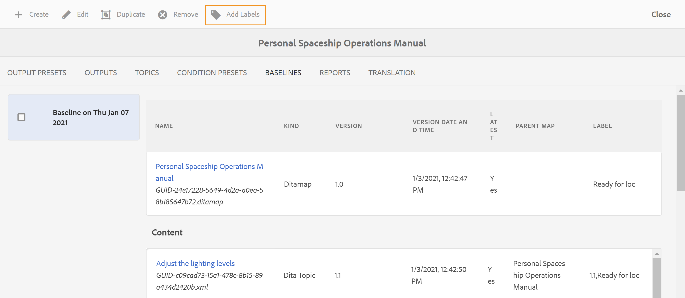
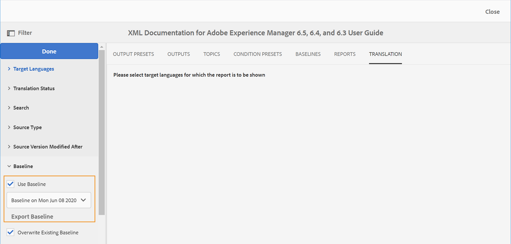

# 使用基準線 {#id1825FI0J0PF}

「基線」功能可讓您建立主題和資產的版本，然後將其用於發佈或翻譯。 例如，如果您的DITA map有`topicA`和`imageA`，您可以建立基準線以使用第3版`topicA`，但使用第4版`ImageA`。 設定好「基準線」後，您只需按一下即可發佈或翻譯不同版本的主題。

對於輸出預設集而言，選取「基準線」是選用的，而DITA map可以有一個以上的「基準線」。 不過，DITA map中的每個輸出預設集只能與單一基線相關聯。 如果發佈時未指定基準線，則會使用最新版本的內容發佈輸出。

同樣地，選取基線以翻譯內容也是選擇性的。 不過，如果您選擇使用「基準線」來翻譯內容，則「基準線」的內容也會與翻譯的副本一起儲存。 然後，您可以使用翻譯後的基準線執行進一步的操作，例如與外部發佈者共用或封存它。 如需匯出已翻譯基準線的詳細資訊，請參閱[匯出已翻譯基準線](#id196SE600GHS)。

>[!TIP]
>
> 如需使用基準的最佳實務，請參閱「最佳實作指南」中的&#x200B;*基準*&#x200B;區段。

您的管理員可以在地圖控制面板上設定「基準線」標籤。 如需詳細資訊，請參閱安裝與設定指南中的&#x200B;*在DITA map儀表板*&#x200B;區段上設定基準線標籤。

您可以執行下列步驟來存取「基準線」功能：

1. 在Assets UI中，導覽至DITA map檔案並按一下。
1. 移至&#x200B;**基準線**&#x200B;標籤。

在「基準線」標籤中，您可以執行下列動作：

- [建立基準線](#id195FI0I0MUQ)
- [檢視基準線的內容](#id195FI0I0TLN)
- [編輯、複製或移除基準線](#id195FI0I0YJL)
- [新增標籤至基準線](#id184KD0T305Z)

## 建立基準線 {#id195FI0I0MUQ}

您可以使用特定版本的主題和參考內容（可在特定日期和時間使用），或是使用為某個版本的主題定義的標籤，來建立「基準線」。 您可以個別指定「基準線」中所選主題的版本，以便每次在發佈或翻譯工作流程中套用「基準線」時，所選主題及其對應版本都會包含在輸出產生或翻譯中。

執行以下步驟來建立基準線：

1. 在[基準線]頁面上，按一下[建立]。****
1. 在&#x200B;**基準名稱**中輸入基準的名稱。
   {width="800" align="left"}
1. 在&#x200B;**設定以**&#x200B;為基礎的版本中，選取下列其中一個選項：

   - **標籤**：選取此選項以根據套用至主題的主題標籤挑選主題。 輸入標籤，以根據輸入的字串篩選清單。 您可以從篩選掉的清單中選擇標籤，以選取具有指定標籤的主題和其他資產。

   當您選取&#x200B;**標籤**&#x200B;時，您也會有額外的選項，可以使用未套用指定標籤的最新版主題。 如果您未選取此選項，而且有任何主題或媒體檔案沒有指定的標籤，則基準線建立程式將會失敗。 如需新增標籤的詳細資訊，請參閱[使用標籤](web-editor-use-label.md#)。

   - **版本於** &lt;*時間戳記*\>：挑選主題在指定日期和時間的版本。 請注意，您在此處指定的時間會對應至AEM伺服器的時區。 如果您的伺服器在不同時區，則會根據您的伺服器時區而不是您的本機時區擷取主題。

   一旦您選取標籤或版本為日期，就會相應地選取地圖中所有參照的主題和媒體檔案。 此主題選取範圍未顯示在使用者介面上，但會儲存在後端。

   >[!NOTE]
   >
   >建立基準線時，建議不要使用&#x200B;**瀏覽所有主題**&#x200B;連結。

1. 按一下「**儲存**」。

## 檢視基準線的內容 {#id195FI0I0TLN}

您可以按一下「基準線」頁簽，並從清單中選取所需的「基準線」版本，來檢視現有「基準線」的內容。 「基準線」頁面分為三個部分：DITA map檔案、map的內容或主題以及參照的內容。 如果您的地圖包含子地圖，則從子地圖參照的主題也會顯示在內容區段中。 「基準線」頁面上的各種資料欄說明如下：

- **名稱**：列出DITA map或主題的標題或資產名稱，例如影像的檔案名稱。

- **Kind**：列出Map中的資產型別或型別，例如DITA map、DITA主題或影像格式。

- **版本**：列出基準線中可用的資產版本。

- **版本日期和時間**：列出所選版本的資產的建立日期和時間。

- **Latest**：列出基準線中是否使用最新版本的資產。

- **父對應**：如果您的對映檔案包含子對應，則此欄包含參考主題的對映名稱。

- **標籤**：列出套用至主題版本的標籤。

- **參考者**：此資料行僅適用於參考的內容。 其會指出所參考資產的父級主題。 如果資產被多個主題引用，則這些主題會以逗號分隔。

## 編輯、複製或移除基準線 {#id195FI0I0YJL}

**編輯基準線**

執行以下步驟來編輯現有的基準線：

1. 選取基準線並按一下&#x200B;**編輯**。
1. 在基準中進行所需的變更。 您可以變更主題或參考內容的名稱和版本。
1. 如果您想要針對一或多個主題使用不同的版本，您可以手動選取這些主題來執行此操作。 按一下&#x200B;**瀏覽主題**，選取您要使用不同版本的主題。 從選取主題的選取版本下拉式清單中，選取要用於基準線中的主題版本，然後按一下&#x200B;**確定**。

   {width="800" align="left"}

   主題及其選取版本的相關資訊會儲存在後端。 您可以重複此步驟來變更多個主題的所選版本。

1. 若要載入從DITA map參照的所有主題和媒體檔案，請按一下&#x200B;**瀏覽所有主題**&#x200B;連結。 主題和媒體檔案的UUID也會顯示在主題標題或\(media\)檔案名稱下方。

   >[!NOTE]
   >
   > 如果您的DITA map中有非常大的檔案集（包含巢狀對映和主題），則按一下瀏覽所有主題可能需要一些時間才能載入所有檔案。

   地圖內容會顯示在三個區段中：地圖檔案、內容\（主題參照\）和參照的內容\（巢狀主題、地圖和其他資產\）。 一旦所有參考內容都可供使用後，您就可以個別選取要用於基準線中的主題版本。

   **版本**&#x200B;下拉式清單會顯示主題或參考內容的可用版本。 對於參照的內容，您可以選擇自動選擇版本。

   如果您選擇「自動挑選&#x200B;**」來挑選參考內容，則系統會自動挑選與參考內容版本相對應的參考內容版本。**&#x200B;例如，假設主題A參考了影像B。建立主題A 1.5版時，存放庫中的影像B版本是1.2。 現在，當基準線是以主題A 1.5版本建立，且影像B設定為&#x200B;**自動挑選**&#x200B;時，系統將自動挑選影像B 1.2版本。

   如果您使用標籤建立基準線，則會將&#x200B;**自動挑選**&#x200B;套用至所有參考內容的版本。

   如果參照的內容或資產\（主題、子地圖、影像或視訊\）未建立版本\（例如新上傳的內容\），則建立基準線將會建立這類檔案的版本。 不過，如果您的檔案已建立版本，則不會為這些檔案建立增量版本。 此行為由自動建立版本設定控制，該設定預設為啟用。 這也是在翻譯內容時需要，因為翻譯程式預期所有檔案都有版本。

   >[!NOTE]
   >
   > 如果您想要為任何特定資源指定不同的版本，可以從&#x200B;**版本**&#x200B;下拉式清單中選擇所需的版本。
1. 按一下「**儲存**」。

**重複的基準線**

選取基準線並按一下&#x200B;**複製**&#x200B;以建立現有基準線的復本。 指定基準線的不同名稱，並選擇主題和參照內容的版本號碼，然後按一下[儲存]。****

**移除基準線**

選取基準線版本，然後按一下&#x200B;**移除**&#x200B;以移除基準線。

## 新增標籤至基準線 {#id184KD0T305Z}

為每個單一主題新增標籤可能會很耗時。 AEM Guides提供按一下機制，可將標籤新增至DITA map中的多個主題和參照內容。

執行以下步驟，將標籤新增至DITA map中的多個主題和參照內容：

1. 在「基準線」頁面上，選取一個基準線，其中包含您要新增標籤的主題和參照內容。

   >[!NOTE]
   >
   > 確保您的基準線沒有任何主題或資產的最新版本。 標籤只能新增到有版本的主題或資產中。

1. 按一下&#x200B;**新增標籤**。

   {width="800" align="left"}

1. 在&#x200B;**新增標籤**&#x200B;對話方塊中，指定要與此基準線關聯的唯一標籤。

   如果您的管理員已設定預先定義的標籤，您會在下拉式清單中顯示這些標籤。 您必須從清單中選擇標籤。

1. 如果要將標籤套用至從子地圖參照的主題，請選取&#x200B;**套用標籤至子地圖和相依專案**&#x200B;選項。

   - 按一下&#x200B;**新增**。
指定的標籤會新增至DITA map和參照的主題與內容。

     {width="650" align="left"}

## 匯出已翻譯基準線 {#id196SE600GHS}

您可以使用「基準線」來翻譯內容。 例如，您可以建立1.1版的基準線，並準備好以法文翻譯。 在「翻譯」索引標籤中，您需要使用「基準線」來篩選內容，然後選取內容的1.1版基準線。 使用基準線來翻譯內容讓您更輕鬆地管理內容。

翻譯內容後，您就可以匯出翻譯後的基準線以存檔，或與組織中的不同團隊共用。 在匯出轉換的「基準線」之前，您必須考慮以下幾點：

- 匯出「基準線」只有在翻譯「基準線」中的內容之後才有可能。 如果您嘗試匯出未開始或未完成翻譯的基準線，則會出現錯誤。
- 您只能傳輸已翻譯版本的基準線。 例如，如果您已經為內容版本1.1建立基準線，且已轉譯，則可以匯出此基準線。 但是，如果您已經為1.2版建立了未轉譯的「基準線」，則無法匯出此「基準線」。
- 如果已匯出基準，您可以在匯出時選取&#x200B;*覆寫現有基準*&#x200B;選項，以覆寫現有基準。

執行下列步驟以匯出轉換的「基準線」：

1. 開啟包含已轉換基準線的DITA map。

1. 在&#x200B;**翻譯**&#x200B;索引標籤中，展開左側邊欄中可用的&#x200B;**基線**&#x200B;選項。

   {width="800" align="left"}

1. 選取&#x200B;**使用基準線**&#x200B;選項，然後選擇您要匯出的基準線。

1. 按一下&#x200B;**匯出基準線**。

   此時會顯示「匯出狀態」。 如果處理成功，則會顯示一則訊息，指出匯出「基準線」的語言。 如果失敗，會顯示失敗的原因。

   如果您嘗試匯出已匯出的「基準線」，也會顯示基準線建立失敗訊息。

1. \(Optional\)若要匯出已匯出的基準，請選取&#x200B;**覆寫現有的基準**，然後按一下&#x200B;**匯出基準**。

**父級主題：**[&#x200B;輸出產生](generate-output.md)
