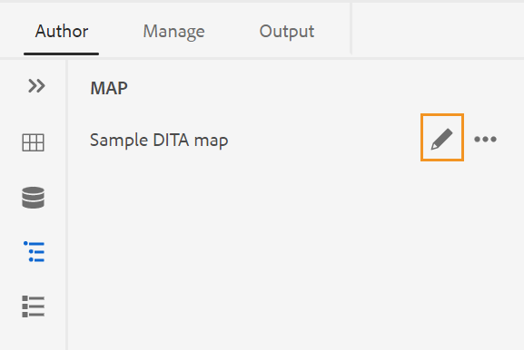
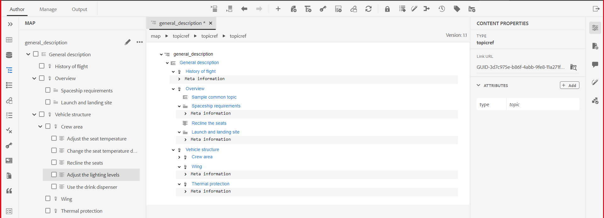
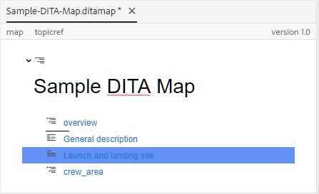
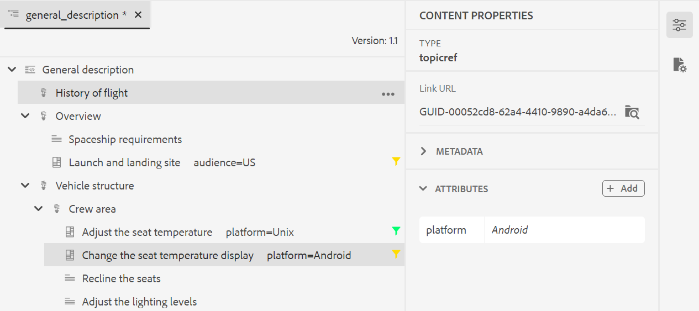
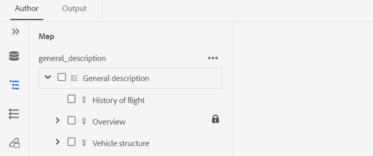
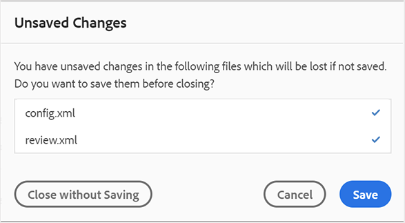

# Work with the Advanced Map Editor {#id1942D0S0IHS}

The Advanced Map Editor comes with intuitive user interface and it is similar to the Web Editor. When you open a map file in the Web Editor, you get an option to edit the map file using the Advanced Map Editor interface. The Advanced Map Editor allows you to add topic references, key references, structure your content and more.

In addition to editing map files directly from the Web Editor, you can also open topic files in a map for editing the Web Editor. This topic walks you through the features in the Advanced Map Editor and how you can open and edit files in a DITA map in the Web Editor.

## Add topics to a map file

Perform the following steps to build your map file using the Advanced Map Editor:

1. 在Assets UI中，導覽至您要編輯的地圖檔案。

   >[!NOTE]
   >
   > Ensure that you have not enabled the asset Select mode.

1. 若要取得對映檔案的獨佔鎖定，請選取對映檔案，然後按一下&#x200B;**簽出**。

   >[!NOTE]
   >
   > Once you have an exclusive lock on a map file, other users would not be able to edit the map. However, they would be able to work on the topics within the map file. If your administrator has configured your Web Editor to checkout files before editing, then you will not be able to edit a file until you check it out. Similarly, if configured, you will be asked to check-in any checked-out a file before closing it

1. With the map file selected, click **Edit Topics**.

   {width="800" align="left"}

   Or, you can also select the **Edit Topics** option from the action menu on the map file:

   {width="800" align="left"}

   The map file is opened for editing in the in the Web Editor.

1. Click the **Edit** icon.

   {width="550" align="left"}

   The map is opened in the Advanced Map Editor interface. If you have opened a new map file, then only the title of the map is shown in the editor.

   {width="800" align="left"}

   - **A** - \(*Main toolbar*\): This is similar to the Web Editor&#39;s main toolbar. See [Main toolbar](web-editor-features.md#id2051EA0G05Z) in the Web Editor for more details.

   - **B** - \(*Secondary toolbar*\) This is the Secondary toolbar that allows you to work with map files. For more information about the functionalities available through Secondary toolbar, see [Features available in the Advanced Map Editor&#39;s toolbar](#id205DEC0005Z).

   - **C** - \(*Map views*\): Allows you to switch the Map Editor between the Layout, Author, Source and Preview. The **Layout** view allows you to organize the topics in a DITA map. This gives the tree or hierarchical view of the map. The **Author** view allows you to edit the topics in the Map Editor. This also gives the WYSIWYG view of the map file. The **Source** view allows you to work with the underlying XML of the map file. The Preview gives you a consolidated view of all topic and sub-maps within the map file. The **Close** link closes the map file.

   - **D** - \(*Left Panel*\): Gives access to the left panel which gives you access to the Favorites, Repository, Map, Outline and other features. 您可以按一下「展開側欄」圖示\(\)來展開或收合它。 For more details about the features available in the left panel, see [Left panel](web-editor-features.md#id2051EA0M0HS) in the Web Editor.

   - **E** - \(*Middle Area*\): Map content editing area.

   - **F** - \(*Right Panel*\): Gives access to the Properties panel. You can see the content properties and the map properties of the selected topic or map. For more details about the functionalities available in this panel, see [Right panel](web-editor-features.md#id2051EB003YK) in the Web Editor.

1. In the Left Panel, switch to the **Repository View**.

1. In the AEM repository, navigate to the folder that contains the topics or sub-maps that you want to add.

1. Select the topic or map file in the **Repository View** and drag-and-drop it into the \(middle\) map content editing area.

   The topic is added in the map.

   {width="800" align="left"}

1. 若要新增後續主題或子地圖，請拖放主題或子地圖至地圖中的必要位置。

   建置地圖檔案時，請考慮以下幾點：

   - 檔案會新增至地圖編輯區域中水準列出現的位置。 在下列熒幕擷圖中，*總覽*&#x200B;主題將會新增至&#x200B;*一般說明*&#x200B;和&#x200B;*啟動與登陸網站*&#x200B;主題之間。

     {width="350" align="left"}

   - 若要取代主題，請將主題放在要取代之主題的頂端、左側或右側。 主題左側或右側的垂直列表示該主題會被掉在其上的主題取代。

     {width="550" align="left"}

     但是，在取代主題之前，您會收到確認提示。 主題只有在您確認後才會被取代。

     {width="300" align="left"}

   - 如果您將子地圖新增至DITA map，則該子地圖會在DITA map中顯示為連結。 若要檢視子地圖的所有主題，請按Crtl +按一下子地圖連結。 子地圖的內容會顯示在新的標籤中。 同樣地，若要從DITA map開啟主題，請按Crtl +按一下主題連結，該連結會在新標籤中開啟。

   - 您可以使用快捷鍵CTRL+Z和CTRL+Y或它們各自的圖示來復原或重做地圖中的任何變更。

   - 若要變更主題的位置，請選取主題\（按一下主題圖示\），然後將其拖放到地圖檔案中的所需位置。 確保水準列在您想要放置主題的位置可見。 在下列熒幕擷圖中，主題&#x200B;*啟動與登陸網站*&#x200B;正移至&#x200B;*總覽*&#x200B;主題之後。

     {width="350" align="left"}

   - 若要檢查地圖檔案的屬性，請在地圖編輯區域的任意位置按一下滑鼠右鍵，然後從內容功能表中選擇&#x200B;**屬性**。 根據您的AEM版本，您可以看到中繼資料、排程\(de\)啟動、參考、檔案狀態等屬性。

1. 按一下&#x200B;**儲存**。

## 進階地圖編輯器工具列中的可用功能 {#id205DEC0005Z}

進階地圖編輯器中的工具列與主題「網頁編輯器」類似。 切換左側面板、儲存對映、建立新版對映、還原/重做上次操作以及刪除選取的元素等基本操作在兩個編輯器中都很常見。 如需這些作業如何運作的詳細資訊，請參閱[瞭解網頁編輯器功能](web-editor-features.md#)區段。

「版面」和「作者」檢視的工具列上也提供下列地圖特定作業：

## 版面配置檢視 {#id205DEC0005Z_layout_view}

當您開啟地圖進行編輯時，它會開啟「地圖編輯器」的「版面配置」檢視。「版面配置」檢視會以樹狀檢視顯示地圖階層，並讓您整理地圖中的主題。

>[!NOTE]
>
> 「配置圖」檢視只會顯示存在於對映中的參照。 如果任何參照被破斷，則在參照的左側會顯示一個小型十字元號

您可以在「配置」檢視中執行下列工作：

**插入主題參考** - 

顯示主題搜尋對話方塊。 導覽至您要插入的主題/地圖檔案，然後按一下選取以將其新增到地圖。
{width="800" align="left"}

**插入主題群組** - 

插入`topicgroup`元素。 如需群組主題的詳細資訊，請參閱OASIS DITA語言規格中的[主題群組](https://docs.oasis-open.org/dita/v1.0/langspec/topicgroup.html)檔案。

**插入索引鍵定義** - 

顯示「插入索引鍵」對話方塊。 使用此對話方塊來定義您要在對應中使用的任何索引鍵定義。

{width="300" align="left"}

**插入在前/插入在後** -  / 

顯示「插入元素」對話方塊。 選取您要插入對映中的元素。 視作業而定，新元素會插入到對映中目前元素之前或之後。

**插入前置內容** - 

當您開啟書籤進行編輯時，此圖示就會顯示。 您可以將元件插入書的開頭，例如目錄、索引和表格清單。

**插入背景內容** - 

當您開啟書籤進行編輯時，此圖示就會顯示。 您可以插入書籍結尾的元件，如索引、字彙表和插圖清單。

**將選取的專案向左/向右移動** -  / 

按一下向左箭頭，將主題移至階層中的左側。 這基本上是在階層中將個別主題提升一個層級。 例如，在選取子主題時按一下向左箭頭，可使其成為其上方主題的同層級主題。 同樣地，如果您按一下向右箭頭，該主題會向右推，使其成為其上方主題的子項。

**將選取的專案上/下移** - / 

按一下向上或向下箭頭圖示，在階層中向上或向下移動主題。

>[!NOTE]
>
> 您也可以拖放參照，在地圖中移動參照。

**鎖定/解除鎖定** -  / 

取得對應檔案的鎖定，然後解除鎖定。 如果您在對應檔案中有未儲存的變更，則在解除鎖定時，系統會提示您儲存對應檔案。 變更會儲存在對映檔案的目前版本中。

**合併** - 

如需有關合併來自相同或不同檔案之不同版本的內容的詳細資訊，請參閱網頁編輯器中的[合併](web-editor-features.md#id205DF04E0HS)。

**版本記錄** - 

檢查使用中主題上的可用版本和標籤，並從編輯器本身回覆成任何版本。

**版本標籤** - 

顯示版本標籤管理對話方塊。 從下拉式清單中選取版本。 選擇您要套用至所選版本的標籤，然後按一下[新增標籤] **&#x200B;**&#x200B;以新增標籤。

**檢視選項** - 

顯示一個下拉式清單，讓您選擇「顯示行號」、「顯示核取方塊」和「顯示檔案名稱」。

- **顯示行號**

顯示或隱藏每個主題的行號。 行號會根據階層中的層級而顯示。

- **顯示核取方塊**

顯示或隱藏每個主題的核取方塊。 您可以使用核取方塊來選取主題，並使用「選項」選單執行各種工作。 如需詳細資訊，請參閱[選項](#id228ID8006H8)功能表。

- **顯示檔案名稱**

顯示主題標題的檔案名稱。

>[!NOTE]
>
> 將指標暫留在主題標題上時，會顯示檔案路徑。

**根據條件篩選檢視主題**&#x200B;如果您在主題上套用了任何條件，則會在主題的右側顯示篩選圖示。 將指標暫留在篩選圖示上時，您會看到套用的條件及其屬性值。

配置檢視中的&#x200B;**選項功能表**

除了組織對映檔案中的主題外，您還可以使用「版面」檢視中元素可用的「選項」選單執行下列動作：

{width="650" align="left"}

- **新增**：您可以選擇從地圖編輯器新增主題或空白參照：
   - **空白參考**：此選項可讓您在DITA map中新增空白參考。 您可以稍後連按兩下插入的空白參照，然後新增主題詳細資訊。 如需詳細資訊，請參閱[在網頁編輯器中建立主題](web-editor-features.md#id228ICI0105U)。
   - **新主題**：當您選擇從功能表建立新主題時，您會看到[建立新主題]對話方塊。 在建立新主題對話方塊中，提供所需的詳細資訊，然後按一下建立。 如需詳細資訊，請參閱[在網頁編輯器中建立主題](web-editor-features.md#id228ICI0105U)。
- **移動**：您可以選擇在階層中上下左右移動主題。您也可以從存放庫面板將主題或地圖拖放至在「地圖編輯器」中開啟的地圖。
- **還原**：還原配置檢視中的上一個作業。
- **取消復原**：取消復原[配置]檢視中的最後一個作業。
- **複製**：從對應檔複製選取的參考。

  >[!NOTE]
  >
  > 您可以顯示，然後選取核取方塊以複製多個參照。

- **貼上**：將複製的參考貼到階層中的目前位置。
- **刪除**：從對應檔中刪除選取的參照。

  >[!NOTE]
  >
  > 您可以顯示，然後選取核取方塊以刪除多個參照。

## 地圖編輯器中的右側面板

右側面板會顯示地圖編輯器的「版面」檢視中的「內容屬性」和「地圖屬性」 。

**內容屬性**

「內容屬性」面板包含目前地圖中所選主題型別、其連結URL及其屬性的相關資訊。 如需詳細資訊，請參閱網頁編輯器中的[內容屬性](web-editor-features.md#id228IDB00HMM)。

- **其他屬性**&#x200B;如果管理員已建立屬性的設定檔，您將會取得這些屬性及其設定的值。 使用內容屬性面板，您可以選擇這些屬性，並將其指派給主題中的相關內容。 您也可以在編輯器設定中的&#x200B;**顯示屬性**&#x200B;標籤下，指派管理員設定的屬性。 為元素定義的屬性會顯示在「配置圖」和「大綱」檢視中。 這可協助您快速檢視地圖中定義特定屬性的所有主題。 例如，所有將platform屬性定義為「Android」的主題。

  {width="650" align="left"}

  如需詳細資訊，請參閱[左側面板](web-editor-features.md#id2051EA0M0HS)區段的&#x200B;*編輯器設定*&#x200B;功能說明中的&#x200B;*顯示屬性*。

- **中繼資料**&#x200B;使用中繼資料，您可以設定中繼資料資訊。 您可以定義導覽標題、連結文字、簡短說明和關鍵字。

如需有關標準主題屬性和中繼資料的詳細資訊，請參閱OASIS DITA語言規格中的[topicref](https://docs.oasis-open.org/dita/v1.2/os/spec/langref/topicref.html)檔案。

**對應屬性**

顯示「對應屬性」對話方塊，您可以在此設定對應的屬性和中繼資料資訊。

## 作者檢視 {#id205DEC0005Z_author_view}

**作者**&#x200B;檢視可讓您在網頁編輯器中編輯您的DITA map。 這會顯示地圖編輯器的WYSIWYG檢視，而且在「作者」檢視中顯示的部分圖示會與在「版面」檢視中顯示的部分圖示相同。 如需詳細資訊，請參閱[配置檢視](#id205DEC0005Z_layout_view)。 此外，您可以看到下列圖示，並從「作者」檢視執行相關工作：

**插入在前/插入在後** -  / 

顯示「插入元素」對話方塊。 選取您要插入對映中的元素。 視作業而定，新元素會插入到對映中目前元素之前或之後。

**插入專案** - 

顯示「插入元素」對話方塊。 選取您要插入的元素。 您可以使用鍵盤捲動元素清單，然後按Enter鍵插入所需元素。 或者，您可以直接按一下元素，將其插入對映。

**插入關聯性資料表** - 

在地圖中插入關係表。 由於使用關係表的概念與「基本對應編輯器」一節中說明的相同，請參閱[在基本對應編輯器中使用關係表](map-editor-basic-map-editor.md#id1944B0I0COB)以取得詳細資訊。

**插入可重複使用的內容** - 

顯示「重複使用內容」對話方塊。 使用此對話方塊插入要在地圖中重複使用的內容。

**重新整理導覽標題屬性** - 

將對應中參考檔案的`title`元素與其`@navtitle`屬性中指定的值同步。 您可以在地圖中新增不同型別的參考檔案，例如主題、參考、任務、\(sub\)地圖等等。 這些檔案大多支援`@navtitle`屬性。 If a file contains the `@navtitle` attribute, then the `@navtitle` attribute for the same file in map is updated. 如果`@navtitle`屬性不存在，則會將`@navtitle`屬性新增至該參考檔案，並且其`title`也會更新以顯示`@navtitle`。

>[!NOTE]
>
> Your administrator can configure auto-adding `@navtitle` attribute to every reference file that you add to a map. 如需有關設定自動新增`@navtitle`屬性的詳細資訊，請參閱安裝和設定Adobe Experience Manager Guides as a Cloud Service中的&#x200B;*預設包含@navtitle屬性*。

按一下「重新整理導覽標題屬性」圖示，以同步`title`專案和`@navtitle`屬性的值。

**切換標籤檢視** - 

顯示或隱藏XML標籤。 這些標籤可作為指示元素邊界的視覺提示。 在此模式中，如果要插入主題/地圖參照，則請在標籤之前或之後拖放所需的檔案。 在「標籤檢視」模式中不會顯示水準條。

**啟用/停用追蹤變更** - 

您可以啟用「追蹤變更」模式，以追蹤對映檔案中所做的所有更新。 啟用追蹤變更後，所有插入和刪除動作都會擷取到檔案中。 如需詳細資訊，請參閱網頁編輯器中的[啟用/停用追蹤變更](web-editor-features.md#id205DF0203Y4)。

**建立稽核任務** - 

您可以直接從Web編輯器建立目前主題的稽核工作或對應檔案。 開啟您要建立複查工作的檔案，然後按一下「建立複查工作」以啟動複查建立程式。 請依照[檢閱主題或地圖](review.md#)中的指示瞭解詳細資訊。

## 透過DITA map編輯主題 {#id17ACJ0F0FHS}

編輯個別主題不會為作者提供完整的內容。 對於主題在DITA map中的放置位置，作者將沒有相關資訊。 如果沒有這些內容相關資訊，作者就很難建立內容。

AEM Guides可讓作者在網頁編輯器中開啟DITA map，並檢視主題在地圖中的位置。 這可協助作者瞭解主題在地圖中的確切位置，並建立更相關的內容。 此外，如果有多位作者在一個專案中工作，他們可以知道在地圖中可以使用的所有主題，並視需要重複使用內容。

若要透過DITA map編輯主題，請執行下列步驟：

1. 在Assets UI中，導覽至包含您要編輯之主題的DITA map。
1. 按一下DITA map以在DITA map主控台中開啟它。
1. 選取&#x200B;**主題**&#x200B;標籤，以檢視DITA map中可用的主題清單。

   >[!TIP]
   >
   > 「主題」標籤提供您下載對應檔案及其相依檔案的選項。 如需詳細資訊，請參閱[匯出DITA map檔案](authoring-download-assets.md#id218UBA00IXA)。

1. 在主工具列中按一下&#x200B;**編輯主題**。

   DITA map會在網頁編輯器中開啟。

   >[!NOTE]
   >
   > 您也可以在Assets UI中選取DITA map檔案，然後按一下主工具列中的&#x200B;**編輯主題**&#x200B;以啟動網頁編輯器。

   {width="350" align="left"}

1. \（*選擇性*\）您也可以從對應選取主題，並在編輯之前取出檔案。 若要簽出檔案\(s\)，請從左窗格中選取一或多個檔案，然後按一下&#x200B;**簽出**。 您也可以選取已出庫的檔案，然後按一下[對映]檢視中的&#x200B;**取消出庫與解除鎖定**&#x200B;圖示，解除任何檔案的鎖定。

   >[!IMPORTANT]
   >
   > 如果您的管理員已設定&#x200B;**停用編輯而不簽出**&#x200B;選項，則您必須先簽出檔案才能進行編輯。 如果您未簽出檔案，則檔案將在編輯器中以唯讀模式開啟。

   下列熒幕擷圖會反白標示「簽出並鎖定\(A\)」、「取消簽出並解鎖\(B\)」、「另存為新版本」和「解鎖\(C\)」、「編輯\(D\)」、「預覽\(E\)」、顯示不同DITA檔案型別\(F\)的不同圖示，以及已簽出的檔案\(G\)。

   {width="550" align="left"}

1. 按一下任何主題連結，在網頁編輯器中開啟以進行編輯。

   您可以在編輯器中開啟多個主題，而每個主題都會在編輯器的新標籤中開啟。 即使您的DITA map包含子對映，子對映中的主題也會在新的標籤中開啟以進行編輯。 如果您想要檢視子地圖下的主題，可以按一下並展開子地圖。

   {width="800" align="left"}

   如果按一下對映檔案，會在網頁瀏覽器的新標籤中開啟對映。

1. 編輯完主題後，您可以執行下列動作：

   - 您可以個別儲存。 如果您按一下&#x200B;**關閉而不儲存主題**，您將會看到一個對話方塊，提示您儲存未儲存的主題：

     {width="550" align="left"}

     您可以選擇儲存所有選取的主題或取消選取您不想儲存的主題。

   - 您可以使用&#x200B;**另存為新版本和解鎖**&#x200B;按鈕來簽入主題。 當您儲存主題版本時，會建立新版本，且也會釋放鎖定。

     建議您在入庫檔案前先儲存變更。  儲存變更時，會驗證XML檔案。

   - 您也可以使用&#x200B;**另存為新版本和解鎖**&#x200B;按鈕來選取並簽入多個主題。 當您儲存主題版本時，會為每個主題建立新版本，並且也會釋放鎖定。 您也可以從&#x200B;**另存為新版本和解除鎖定**&#x200B;對話方塊檢視主題簽入的進度。 入庫檔案時會顯示成功訊息。

   - 如果管理員啟用了關閉時入庫檔案的選項，則每當已出庫的檔案關閉時，系統都會提示您儲存檔案。 啟用此選項後，當您關閉含有已變更檔案的編輯器時，會顯示需要儲存的取出檔案清單。 出庫檔案會顯示一個鎖定圖示：

     {width="550" align="left"}

      - 按一下&#x200B;**關閉而不儲存**&#x200B;按鈕會關閉檔案而不儲存任何變更。

      - 按一下&#x200B;**儲存**&#x200B;按鈕會儲存變更，但不會簽入檔案。

      - 選取&#x200B;**檢查檔案**&#x200B;選項，然後按一下&#x200B;**儲存**&#x200B;按鈕以檢查檔案\（建立另一個版本\）並儲存檔案。

## 預覽地圖

除了能夠檢視地圖中每個主題檔案的位置，您還希望能夠在一個連續的流程中檢視地圖內容。 「預覽地圖」功能可讓您按一下即可檢視地圖檔案的整個內容。 您不需要產生對應檔案的輸出，就能檢視發佈後整個對應的外觀。 您只需存取對映的預覽，所有主題和子對映都會以書籍的形式呈現。

您可以從以下位置存取地圖的預覽：

- **Assets UI**：在Assets UI中，導覽至地圖位置、選取地圖檔案，然後在工具列中選擇&#x200B;**預覽地圖**。 地圖的預覽會顯示在新的標籤中。 您可以在預覽模式中檢視所有主題的內容。 在此檢視中，您無法編輯任何主題。

  >[!NOTE]
  >
  > 如果&#x200B;*預覽地圖*&#x200B;選項在主工具列中看不到，它可能已移到&#x200B;**更多**&#x200B;工具列功能表下。

- **進階地圖編輯器**：在進階地圖編輯器中，按一下[預覽]圖示以檢視目前地圖的預覽。

  {width="350" align="left"}

  您可以在預覽模式中執行下列其他工作：

   - 在主題上按一下滑鼠右鍵，然後選取&#x200B;**編輯**，開啟主題以在新的索引標籤中編輯。

     >[!NOTE]
     >
     > 如果您沒有編輯許可權，主題將以唯讀模式開啟。

   - 按一下地圖樹狀結構中的主題標題\（位於左側面板\），跳至所需主題。

   - 地圖預覽中的目前主題也會在地圖樹中反白顯示。

**父級主題：** [使用對應編輯器](map-editor.md)
