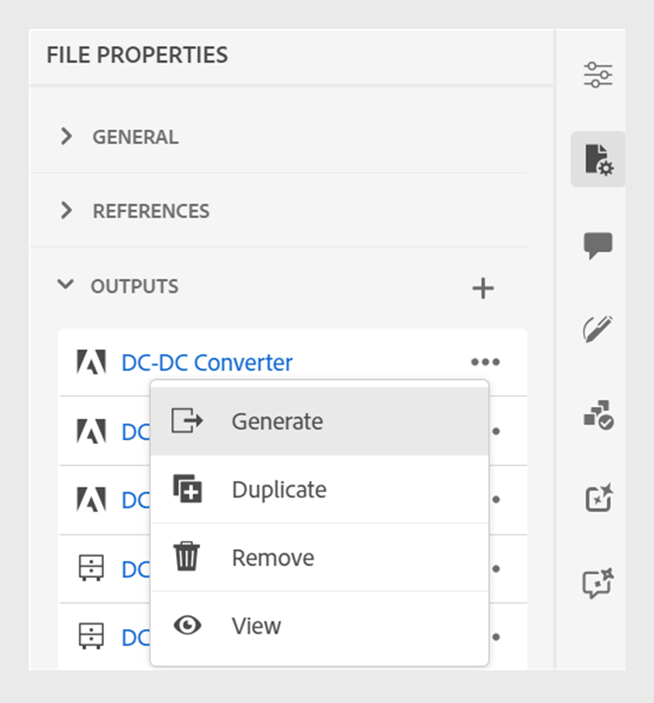

# 發佈Adobe Experience Manager Sites頁面

Experience Manager Sites頁面是指在Adobe Experience Manager網站上發佈的內容。 Experience Manager Guides可讓您將獨立主題發佈至網站頁面。

此功能可讓您發佈主題及其元素，而不需建立DITA map和輸出預設集。 您可以輕鬆更新主題、重新發佈Sites頁面，並在不同網頁中重複使用它。 使用此功能，您可以輕鬆發佈獨立文章或行銷內容。

若要產生「網站」頁面，請執行下列步驟：

1. 從主題&#x200B;**檔案內容**&#x200B;的&#x200B;**輸出**&#x200B;區段中，選取&#x200B;**新輸出** 。
1. 選取&#x200B;**網站頁面**。

1. 在&#x200B;**產生網站頁面**&#x200B;對話方塊中，填入下列詳細資料：
   ![在[產生網站]頁面中新增路徑與範本詳細資料](images/aem-sites-page-generate.png){width="500" align="left"}

   *新增路徑、標題、名稱和範本詳細資訊，將主題或其元素發佈為Sites頁面。 *

   * **路徑**：瀏覽並選取您要發佈Sites頁面的資料夾路徑。
   * **標題**：輸入Sites頁面的標題。 依預設，標題會填入主題的標題。 您可以編輯它。 此標題用於產生Sites頁面的名稱。
   * **名稱**：輸入Sites頁面的名稱。 依預設，名稱會填入主題標題，且不允許的字元（例如空格和特殊字元）會取代為「_」。 例如，*sample_sites_page*。 您可以編輯它。 此名稱用於產生「網站」頁面的URL。
   * **Page template**: Select the Sites page template to create your Sites page. You can view the templates in the folder on the path you select. Your administrator can also upload custom templates.

   * 您也可以選取不同的條件來發佈內容。  選取下列其中一個選項：

      * **無**：如果您不想在發佈的輸出上套用任何條件，請選取此選項。
      * **使用DITAVAL**：選取DITAVAL檔案以產生個人化內容。 您可以使用瀏覽對話方塊或輸入檔案路徑來選取DITAVAL檔案。
      * **使用屬性**：您可以在DITA主題中定義條件屬性。 然後，選取條件屬性以發佈相關內容。

     >[!NOTE]
     > 
     >只有在主題中定義了條件屬性時，才會啟用條件。

1. Click **Generate** to publish the Sites page.
1. You can view the Sites page for a topic under the **Outputs** section in the **File Properties**. The Sites pages appear according to the date and time of their publishing, with the latest as the first.

   {width=300 align="left"}

   *View the Sites page present for a topic and republish them.*

Once you&#39;ve published the Sites page, you can also use them on any Adobe Experience Manager Site.

## Options menu for an Experience Manager Sites

You can also perform the following actions for an Experience Manager Sites from the **Options** menu:

* **Generate**: Republish the Sites page to update it with the latest content from the DITA topic. When you regenerate the output without changing the path, name, title, template, and conditions, the  Sites page simply gets updated with the latest content.

* **Duplicate**: Duplicate an  Sites page. 您可以變更路徑、名稱、標題及範本。 You can also select different conditions when you duplicate a Sites page.

* **Remove**: Remove an Sites page from the outputs list. 確認提示隨即出現。 一旦您確認，網站頁面就會從&#x200B;**輸出**&#x200B;清單中移除。 但是，「網站」頁面不會永久刪除。

* **檢視**：檢視網站頁面編輯器。 您也可以進行變更並儲存。
