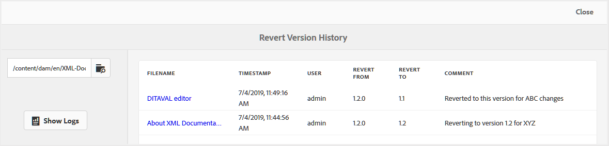

# 還原檔案版本記錄報告 {#id205BBC00PRK}

當您與多位作者一起同時發行多個版本時，您的內容將繫結有多個版本。 多個版本中可能會存在一些通用資訊，不同作者可在他們的專案中使用這些資訊。 為了處理這類工作指派，作者最終可能會有多個版本的檔案。 此類版本可能只是檔案的較新版本或還原為舊版本。 確認檔案何時還原及原因是一項複雜的工作。

AEM Guides可讓您為個別檔案或資料夾中的所有檔案產生版本記錄報告。 此版本記錄為您提供已還原之檔案的所有版本、建立這些版本的人員，以及建立這些版本的原因的整合檢視。

您可以從下列位置存取此報告：

- **Assets UI**：選取檔案並從左側邊欄開啟&#x200B;**版本記錄**。 **版本記錄**&#x200B;檢視在面板底部包含&#x200B;**還原版本記錄**&#x200B;連結。 當您按一下此連結時，就會顯示選取的檔案還原版本的歷程記錄。

  {width="300"}

- **主題預覽**：當您預覽主題時，也可以從左側邊欄開啟&#x200B;**版本記錄**&#x200B;面板。 您將會取得一個類似於Assets UI的面板，您可以從其中按一下&#x200B;**回覆版本記錄**&#x200B;連結，以存取使用中檔案的回覆版本記錄。

- **AEM的「工具」區段**：您也可以從AEM的「工具」區段存取此報告。 下列程式說明如何從AEM的「工具」區段存取回覆版本記錄。

執行以下步驟來存取「還原歷史記錄」報告：

1. 按一下頂端的Adobe Experience Manager連結，然後選擇&#x200B;**工具**。

1. 從工具清單中選取&#x200B;**指南**。

1. 按一下&#x200B;**版本還原歷史記錄**&#x200B;圖磚。

   將會顯示空白的「回覆版本記錄」頁面，您必須在其中瀏覽並選取檔案或資料夾以產生報表。

1. 按一下&#x200B;**顯示記錄檔**，為選取的檔案或資料夾產生報告。

   {width="800"}

   報告包含下列詳細資訊：

   - **檔案名稱**：主題的標題。 按一下主題的標題連結會開啟主題預覽。

   - **時間戳記**：主題回覆成舊版的日期和時間。

   - **使用者**：還原至舊版的使用者名稱。

   - **從**&#x200B;回覆：回覆檔案的原始版本號碼。

   - **還原為**：檔案還原到的版本。

   - **註解**：還原檔案的使用者所給予的任何註解。

**父級主題：**[&#x200B;報告](reports-intro.md)
