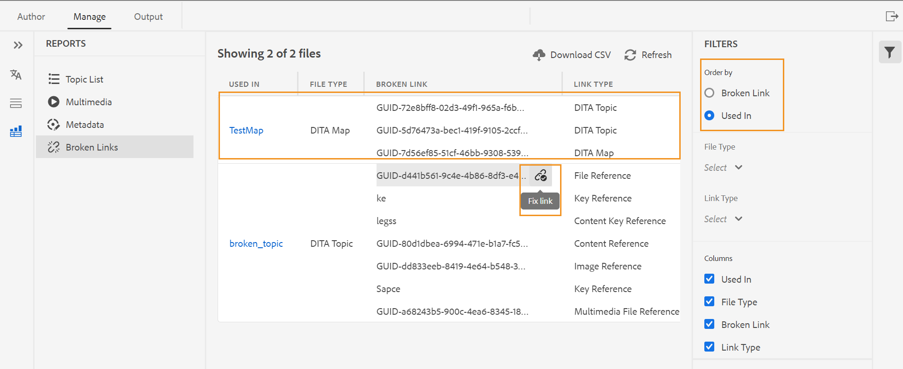

# 來自網頁編輯器的DITA map報表 {#id231HF0Z0NXA}

AEM Guides的網頁編輯器提供了一項功能，可讓您檢查參照的整體完整性，並為參照產生報表。

您可以從Web編輯器的&#x200B;**報表**&#x200B;索引標籤檢視主題清單、管理所有參照的中繼資料，以及檢視目前地圖的多媒體清單。

## 從主題清單檢視產生CSV

**主題清單**&#x200B;檢視可提供您主題的詳細資訊，例如參考型別、檔案狀態和作者。

您可以執行下列步驟，建立主題報表：

1. 在&#x200B;**存放庫**&#x200B;面板中，在[Map檢視]中開啟DITA map檔案。
1. 按一下「**管理**」標籤。
1. 按兩下左側的&#x200B;**主題清單**。 將顯示DITA map中的主題清單。

   {width="800" align="left"}

1. 從&#x200B;**篩選器**&#x200B;面板中，您可以根據&#x200B;**參考型別** \（直接或間接\）、**檔案狀態** \（您主題的目前狀態）來篩選主題。 例如，如果您的主題處於「編輯」、「稽核中」或「已稽核」狀態，則會列出\)或主題的&#x200B;**作者**。

1. 您也可以使用下列主題篩選選項來選擇在清單中顯示下列欄：

   - **主題**&#x200B;主題標題已在DITA map中指定。 您可以按一下主題進行編輯。
   - **檔案名稱**&#x200B;檔案名稱。
   - **UUID**&#x200B;檔案的通用唯一識別碼\(UUID\)。
   - **檔案位置**&#x200B;主題的完整路徑。
   - **參考型別**&#x200B;參考型別 — 直接或間接參考。
   - **檔案狀態**&#x200B;主題的目前狀態。
   - **作者**&#x200B;上次處理此主題的使用者。
   - **父對映**&#x200B;直接參考主題的所有對映清單。
   >[!NOTE]
   >
   > 按一下&#x200B;**重新整理**&#x200B;以取得新的主題清單，並檢視對映檔案中的任何變更，或主題檔案中的任何參考已更新。

1. 按一下&#x200B;**下載CSV**&#x200B;來下載DITA map中主題的目前快照。 CSV包含選取的欄以及在&#x200B;**主題清單**&#x200B;檢視中篩選的主題。 您接著可以在任何CSV編輯器中開啟此主題清單CSV檔案。

**從中繼資料報表大量管理中繼資料**

AEM Guides可讓您從網頁編輯器標籤DITA內容。 您可以在個別主題上套用標籤，或使用大量標籤功能，在多個主題、DITA map或子對映上套用多個標籤。 您也可以將所有所選主題的檔案狀態變更為下一個可能的共同檔案狀態。

## 檢視中繼資料

若要在目前的DITA map中檢視參照的中繼資料，請執行下列步驟：

1. 在「存放庫」面板中，在「對映檢視」中開啟DITA map檔案。
1. 按一下「**管理**」標籤。
1. 按兩下左側的&#x200B;**中繼資料**。 將顯示DITA map中所有參照的中繼資料清單。 這也包括媒體參考。

   {width="800" align="left"}

1. 從&#x200B;**篩選器**&#x200B;面板中，您可以根據&#x200B;**檔案狀態** \（您主題的目前狀態）來篩選主題。 例如，如果您的主題處於編輯、稽核中或稽核狀態，這些會列出\)、**參考** \（直接或間接\）、**檔案型別** \（地圖、主題和影像\）。
1. 您也可以選擇只檢視沒有標籤的&#x200B;**檔案**，或是從&#x200B;**標籤**&#x200B;篩選條件中選擇特定標籤，以檢視與其相關的檔案。
   1. 您也可以使用下列主題篩選選項來選擇在中繼資料清單中顯示下列欄：
      - **標題** \（預設為選取\）參考檔案的標題是在DITA map中指定的。 您可以按一下檔案來編輯它。您也可以按一下並在Web編輯器中播放音訊或視訊檔案。 您可以變更音量或視訊檢視。 在捷徑功能表中，您也有下載、變更播放速度或檢視子母畫面等選項。

        >[!NOTE]
        >
        > 出庫圖示也會出現在出庫檔案的標題附近。 您可以將滑鼠停留在圖示上以檢視使用者名稱。

      - **檔案名稱**&#x200B;檔案的名稱。
      - **檔案位置**&#x200B;檔案的完整路徑。
      - **標籤** \（預設為選取\）套用至檔案的標籤。

        >[!NOTE]
        >
        > 依預設，您可以檢視檔案的兩個標籤。 若要檢視更多標籤，請按一下[顯示更多] ****。 按一下&#x200B;**顯示較少**&#x200B;以再次合約清單。

      - **參考型別**&#x200B;參考型別 — 直接或間接參考
      - **檔案狀態** \（預設為選取\）參考檔案的目前狀態。
      - **檔案型別** \（預設為選取\）來源檔案的型別。 可用的選項包括地圖、主題和影像。
      - **簽出者**&#x200B;已簽出檔案的使用者。
1. 按一下&#x200B;**下載CSV**，即可下載DITA map中參照的目前快照。 CSV包含所選欄以及在「主題清單」檢視中篩選的參照。 您接著可以在任何CSV編輯器中開啟此中繼資料CSV檔案。

**更新中繼資料**

1. 若要更新中繼資料，請選取要更新的檔案。

   >[!NOTE]
   >
   > 您無法選取任何出庫檔案。 出庫圖示也會出現在出庫檔案的標題附近。 您可以將滑鼠停留在圖示上以檢視使用者名稱。

1. 從頂端選取&#x200B;**管理**。

   {width="350" align="left"}

1. 如果您想要新增任何新標籤，請從下拉式清單中選取新標籤，以將其套用至所有選取的主題。 您也可以按一下標籤附近的十字圖示來刪除任何標籤。

   >[!NOTE]
   >
   > 會列出套用至所有選取主題的通用標籤。

1. 如果要變更所有所選參照的檔案狀態，請選取新的檔案狀態。 下拉式清單會顯示所有所選主題的共同可能狀態。 例如，如果您的主題目前狀態為「稽核中」，則您可以檢視「草稿」、「已核准」或「已檢閱」狀態。
1. 按一下&#x200B;**更新**&#x200B;以更新中繼資料。 無論中繼資料更新成功還是更新失敗，系統都會顯示中繼資料的確認訊息。 您也可以按一下&#x200B;**下載報表**，從確認對話方塊下載中繼資料CSV。 此CSV包含所選參考的更新狀態的詳細資訊。

## 產生多媒體報表

**多媒體**&#x200B;報告提供地圖中所使用多媒體的詳細資訊，例如標題、型別\（音訊、視訊和影像\）、使用多媒體的檔案以及使用這些檔案的參考型別。 您也可以檢視UUID和存放庫中多媒體的位置。 您可以執行下列步驟，建立多媒體的報表：

1. 在&#x200B;**存放庫**&#x200B;面板中，在[Map檢視]中開啟DITA map檔案。
1. 按一下「**管理**」標籤。
1. 按兩下左側的&#x200B;**多媒體**。 DITA map中呈現的多媒體清單隨即顯示。
1. 從&#x200B;**篩選器**&#x200B;面板中，您可以依照多媒體或參照中使用的名稱來排序清單。

   - 當您依&#x200B;**多媒體**&#x200B;排序時，多媒體的****name會顯示在第一欄，而使用它們的所有參照的名稱則會顯示在同一列的另一個欄中。 例如，下列熒幕擷圖顯示多媒體WarmCoolForC.gif位於第一欄，而使用它的三個參照則顯示在同一列的第三欄。

     {width="650" align="left"}

   - 如果您依&#x200B;**用於**&#x200B;欄排序，您將檢視已使用多媒體的參照名稱列在第一欄，而多媒體名稱則列在另一欄的不同列。 例如，下列熒幕擷圖在第一欄顯示三個參照\（調整座椅溫度、變更座椅溫度顯示和Crew area\）的名稱，而多媒體WarmCoolForC.gif顯示在第三欄的三個不同列。

     {width="650" align="left"}

1. 您可以根據&#x200B;**多媒體型別**&#x200B;和&#x200B;**參考型別**&#x200B;來篩選您的多媒體。 多媒體檔案清單會根據您在下拉式清單中的選取專案而顯示。 例如，您可以選擇只顯示DITA map中的音訊參照，而檔案只會顯示其中使用的音訊參照。

   >[!NOTE]
   >
   > 視地圖中所使用的多媒體型別而定，影像、視訊和音訊會列在&#x200B;**多媒體型別**&#x200B;下拉式清單中，而直接或間接列在&#x200B;**參考型別**&#x200B;下拉式清單中。

1. 您也可以使用下列篩選選項來選擇在清單中顯示下列欄：

   - **多媒體** \（預設為選取\）多媒體標題是在DITA map中指定的。 您可以按一下多媒體進行編輯。
   - **多媒體位置**&#x200B;多媒體的完整路徑。
   - **多媒體UUID**&#x200B;檔案的通用唯一識別碼\(UUID\)。
   - **多媒體型別** \（預設選取\）多媒體型別。 可用的選項有「音訊」、「視訊」或「影像」。
   - **使用於** \（預設為選取\）已使用多媒體的參考。 您可以按一下參照來編輯它。
   - **參考型別** \（預設為選取\）參考型別 — 直接或間接參考。
   >[!NOTE]
   >
   > 按一下&#x200B;**重新整理**&#x200B;以取得新的多媒體清單，並檢視地圖檔案中的任何變更，或是DITA map中的任何多媒體已更新。

1. 您也可以在Web編輯器中按一下並播放音訊或視訊檔案。 您可以變更音量或視訊檢視。 在捷徑功能表中，您也有下載、變更播放速度或檢視子母畫面等選項。

   {width="800" align="left"}

1. 按一下&#x200B;**下載CSV**，即可在DITA map中下載目前的多媒體快照。 CSV包含選取的資料行，以及在&#x200B;**多媒體**&#x200B;檢視中篩選的多媒體。 然後您可以使用任何CSV編輯器開啟此多媒體CSV檔案。

## 檢視並修正中斷的連結{#report-broken-links}

**中斷連結**是實用的報表，可提供您目前地圖中中斷連結的詳細資料。 您可以檢視中斷連結，這些連結可用於DITA主題、多媒體檔案參照、內容關鍵參照等等。 您也可以在此處自行修正這些錯誤。
報表提供詳細資訊，例如中斷的連結、連結型別、使用參照的檔案以及使用的檔案型別。
您可以透過下列步驟來檢視中斷連結報表：
1. 在&#x200B;**存放庫**&#x200B;面板中，在[Map檢視]中開啟DITA map檔案。
1. 按一下「**管理**」標籤。
1. 按兩下左側的&#x200B;**中斷連結**。 DITA map中出現的中斷連結或參照清單隨即顯示。
1. 從&#x200B;**篩選器**&#x200B;面板中，您可以依照連結或參照中所使用的名稱來排序清單。

    — 當您依&#x200B;**中斷連結**&#x200B;排序時，中斷連結的路徑會顯示在第一欄，而使用中斷連結的所有參照名稱則會顯示在另一個欄的不同列中。 如果在多個檔案中使用了相同的斷開連結，則它們會顯示在一列中，並顯示為分組或子列。 例如，下列熒幕擷圖顯示第一欄中有三個中斷的連結，以及使用這些連結的參照，`TestMap.ditamap`會顯示在第三欄的三個個別列中。
   {width="800" align="left"}

    — 如果您依&#x200B;**用於**&#x200B;欄排序，您將檢視已使用中斷連結的參照名稱列在第一欄，而中斷連結列在同一列的另一欄。 例如，下列熒幕擷圖顯示第一欄中的參照（使用中斷連結） `TestMap.ditamap`，而同一列的第三欄中會顯示中斷連結。
   {width="800" align="left"}
1. 您可以根據&#x200B;**檔案型別**&#x200B;和&#x200B;**連結型別**&#x200B;來篩選中斷的連結。 系統會根據您於下拉式清單中的選取專案，顯示失效連結清單。 例如，您可以選擇只顯示DITA map中的內容參照，而檔案只會顯示其中使用的內容參照。

   根據對應中使用的參照型別，**連結型別**&#x200B;下拉式清單中會列出檔案參照、金鑰參照、內容參照、內容金鑰參照、影像參照以及多媒體檔案參照，而&#x200B;**檔案型別**&#x200B;下拉式清單中會列出&#x200B;**DITA主題**&#x200B;或&#x200B;**DITA對應**。
1. 您也可以使用下列篩選選項來選擇在清單中顯示下列欄：

   - **中斷連結** （預設為選取）中斷連結的路徑在DITA map中指定。

   - **連結型別** （預設為選取）連結型別。 可用的選項有「內容鍵參照」、「內容參照」、「DITA主題」、「檔案參照」、「影像參照」、「鍵參照」和「多媒體檔案參照」。

   - **使用於** （預設為選取）使用中斷連結的參照。 您可以按一下該參照，以創作模式檢視它。

   - **檔案型別** （預設為選取）參照型別 — DITA Map或DITA主題。
按一下**重新整理**&#x200B;以取得中斷連結的新清單，並檢視對映檔案中的任何變更，或檢視DITA map中的任何中斷連結是否已更新。
1. 您可以按一下&#x200B;**修正連結**&#x200B;圖示()來修正中斷的連結。

   >[!NOTE]
   >
   > 將游標暫留在「中斷連結」欄下方的中斷連結路徑上，以檢視「修復」連結()圖示。

   您可以修正兩個檢視中的連結 — 當您已依&#x200B;**中斷連結**&#x200B;或&#x200B;**用於**&#x200B;時。

   >[!NOTE]
   >
   > 當您在依中斷連結排序時修正中斷連結時，該連結將在所有使用該連結的檔案中修正（這些檔案會分組在單一列）。

1. 您需要在&#x200B;**更新連結**&#x200B;對話方塊中更新必要的參考詳細資料。 **更新連結**&#x200B;對話方塊中所需的詳細資訊將視參考型別而定。\
   修正連結後，該連結不會顯示在失效連結清單下。 反之，您可以在「主題清單」或「中繼資料」下檢視它。

1. 按一下&#x200B;**下載CSV**，即可下載DITA map中中斷連結的目前快照。 CSV包含在「中斷連結」檢視中篩選的選取欄和中斷連結。 然後，您就可以在任何CSV編輯器中開啟及檢視此CSV檔案。

**父級主題：**[&#x200B;報告](reports-intro.md)
