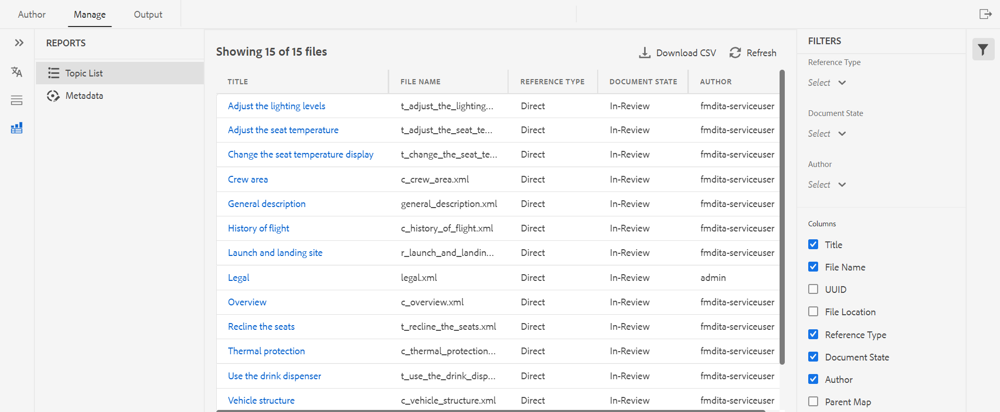
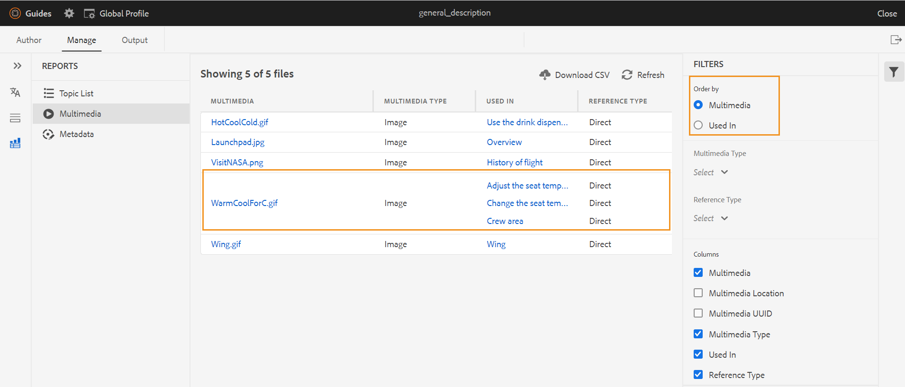
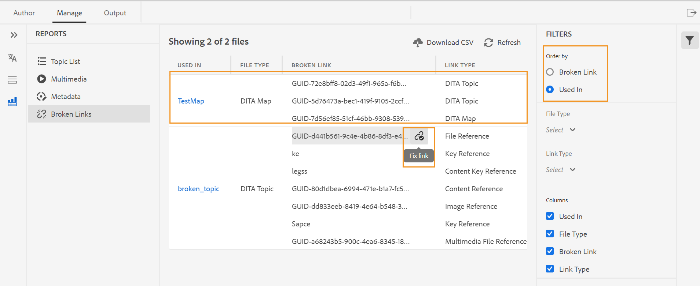

# 來自網頁編輯器的DITA map報表 {#id231HF0Z0NXA}

AEM Guides的網頁編輯器提供了一項功能，可讓您檢查參照的整體完整性，並為參照產生報表。

您可以從Web編輯器的&#x200B;**報表**&#x200B;索引標籤檢視主題清單、管理所有參照的中繼資料，以及檢視目前地圖的多媒體清單。

## 從主題清單檢視產生CSV

**主題清單**&#x200B;檢視可提供您主題的詳細資訊，例如參考型別、檔案狀態和作者。

您可以執行下列步驟，建立主題報表：

1. 在&#x200B;**存放庫**&#x200B;面板中，在[Map檢視]中開啟DITA map檔案。
1. 按一下「**管理**」標籤。
1. 按兩下左側的&#x200B;**主題清單**。 將顯示DITA map中的主題清單。

   {width="800" align="left"}

1. 從&#x200B;**篩選器**&#x200B;面板中，您可以根據&#x200B;**參考型別** \（直接或間接\）、**檔案狀態** \（您主題的目前狀態）來篩選主題。 例如，如果您的主題處於「編輯」、「稽核中」或「已稽核」狀態，則會列出\)或主題的&#x200B;**作者**。

1. 您也可以使用下列主題篩選選項來選擇在清單中顯示下列欄：

   - **主題**&#x200B;主題標題已在DITA map中指定。 您可以按一下主題進行編輯。
   - **檔案名稱**&#x200B;檔案名稱。
   - **UUID**&#x200B;檔案的通用唯一識別碼\(UUID\)。
   - **檔案位置**&#x200B;主題的完整路徑。
   - **參考型別**&#x200B;參考型別 — 直接或間接參考。
   - **檔案狀態**&#x200B;主題的目前狀態。
   - **作者**&#x200B;上次處理此主題的使用者。
   - **父對映**&#x200B;直接參考主題的所有對映清單。
   >[!NOTE]
   >
   > 按一下&#x200B;**重新整理**&#x200B;以取得新的主題清單，並檢視對映檔案中的任何變更，或主題檔案中的任何參考已更新。

1. 按一下&#x200B;**下載CSV**&#x200B;來下載DITA map中主題的目前快照。 CSV包含選取的欄以及在&#x200B;**主題清單**&#x200B;檢視中篩選的主題。 您接著可以在任何CSV編輯器中開啟此主題清單CSV檔案。

**從中繼資料報表大量管理中繼資料**

AEM Guides可讓您從網頁編輯器標籤DITA內容。 您可以在個別主題上套用標籤，或使用大量標籤功能，在多個主題、DITA map或子對映上套用多個標籤。 您也可以將所有所選主題的檔案狀態變更為下一個可能的共同檔案狀態。

## 檢視中繼資料

若要在目前的DITA map中檢視參照的中繼資料，請執行下列步驟：

1. 在「存放庫」面板中，在「對映檢視」中開啟DITA map檔案。
1. 按一下「**管理**」標籤。
1. 按兩下左側的&#x200B;**中繼資料**。 將顯示DITA map中所有參照的中繼資料清單。 這也包括媒體參考。

   {width="800" align="left"}

1. 從&#x200B;**篩選器**&#x200B;面板中，您可以根據&#x200B;**檔案狀態** \（您主題的目前狀態）來篩選主題。 例如，如果您的主題處於編輯、稽核中或稽核狀態，這些會列出\)、**參考** \（直接或間接\）、**檔案型別** \（地圖、主題和影像\）。
1. 您也可以選擇只檢視沒有標籤的&#x200B;**檔案**，或是從&#x200B;**標籤**&#x200B;篩選條件中選擇特定標籤，以檢視與其相關的檔案。
   1. 您也可以使用下列主題篩選選項來選擇在中繼資料清單中顯示下列欄：
      - **標題** \（預設為選取\）參考檔案的標題是在DITA map中指定的。 您可以按一下檔案進行編輯。您也可以在Web編輯器中按一下並播放音訊或視訊檔案。 您可以變更音量或視訊檢視。 在捷徑功能表中，您也有下載、變更播放速度或檢視子母畫面等選項。

        >[!NOTE]
        >
        > 出庫圖示也會出現在出庫檔案的標題附近。 You can hover over the icon to view the name of the user.

      - **File Name** The name of the file.
      - **File Location** The complete path of the file.
      - **Tags** \(selected by default\) Tags applied on the file.

        >[!NOTE]
        >
        > By default, you can view two tags for a file. To view more tags, click **Show More**. Click **Show Less** to contract the list again.

      - **Reference Type** The type of reference – direct or indirect
      - **Document State** \(selected by default\) The current state of the reference file.
      - **File Type** \(selected by default\) Type of the source file. The available options are Map, Topic, and Image.
      - **Checked Out by** The user who has checked out the file.
1. Click **Download CSV** to download the current snapshot of the references in the DITA map. The CSV contains the selected columns and the references filtered in the Topic List view. You can then open this metadata CSV file in any CSV editor.

**更新中繼資料**

1. To update metadata, select the files for which you want to update.

   >[!NOTE]
   >
   > You cannot select any checked-out files. 出庫圖示也會出現在出庫檔案的標題附近。 You can hover over the icon to view the name of the user.

1. Select **Manage** from the top.

   {width="350" align="left"}

1. If you want to add any new tags, select new tags from the dropdown list to apply them to all selected topics. You can also delete any tag by clicking the cross icon near the tag.

   >[!NOTE]
   >
   > The common tags applied on all the selected topics are listed.

1. Select a new document state if you want to change the document state of all the selected references. The dopdown displays the common possible state for all selected topics. For example, if the current state of your topics is In-Review, then you can view Draft, Approved, or Reviewed state.
1. Click **Update** to update the metadata. A confirmation message is displayed for the metadata whether it is updated successfully or has any failed updates. You also click **Download Report** to download the metadata CSV from the confirmation dialog. This CSV contains the details of the update status for the selected references.

## Generate a multimedia report

The **Multimedia** report provides detailed information about the multimedia used in your map, such as the title, type \(audio, video, and images\), files in which multimedia is used, and the reference type of the files, in which they have been used. You can also view the UUID and the location of the multimedia within the repository. You can create a report of the multimedia by performing the following steps:

1. 在&#x200B;**存放庫**&#x200B;面板中，在[Map檢視]中開啟DITA map檔案。
1. 按一下「**管理**」標籤。
1. Double-click **Multimedia** on the left. The list of multimedia present in the DITA map is displayed.
1. From the **Filters** panel you can order the list by multimedia or by the names of used in references.

   - When you order by **Multimedia**, the****name of the multimedia is displayed in the first column and then the names of all references in which they have been used, are displayed in another column on the same row. For example, the following screenshot shows the multimedia WarmCoolForC.gif in the first column and three references in which it is used, are displayed in the third column on the same row.

     {width="650" align="left"}

   - If you order by **Used In** column, you will view the transposed view wherein the names of the references in which multimedia have been used are listed in the first column while the multimedia names are listed in another column on separate rows. For example, the following screenshot shows the names of three references \(Adjust the seat temperature, Change the seat temperature display, and Crew area\) in the first column and the multimedia WarmCoolForC.gif is displayed in the third column on three separate rows.

     {width="650" align="left"}

1. You can filter your multimedia based on the **Multimedia Type**, and **Reference Type**. The list of multimedia files is displayed based on your selection in the drop-down. For example, you can choose to display only the audio references in your DITA map, and a file shows only the audio references used in it.

   >[!NOTE]
   >
   > Depending on the type of multimedia used in your map, Image, Video, and Audio are listed in the **Multimedia Type** drop-down, and Direct or Indirect are listed in the **Reference Type** dropdown.

1. You can also use the following filtering options to choose to display the following columns in the list:

   - **Multimedia** \(selected by default\) The title of the multimedia is specified in the DITA map. You can click the multimedia to edit it.
   - **Multimedia Location** The complete path of the multimedia.
   - **Multimedia UUID** The universally unique identifier \(UUID\) of the file.
   - **Multimedia Type** \(selected by default\) Type of the multimedia. The available options are Audio, Video, or Image.
   - **Used In** \(selected by default\) The references in which the multimedia has been used. You can click the reference to edit it.
   - **Reference Type** \(selected by default\) The type of reference - direct or indirect.
   >[!NOTE]
   >
   > Click **Refresh** to get a fresh list of multimedia and view any change in your map file or if any multimedia within your DITA map is updated.

1. 您也可以在Web編輯器中按一下並播放音訊或視訊檔案。 您可以變更音量或視訊檢視。 在捷徑功能表中，您也有下載、變更播放速度或檢視子母畫面等選項。

   {width="800" align="left"}

1. Click **Download CSV** to download the current snapshot of the multimedia in the DITA map. The CSV contains the selected columns and the multimedia filtered in the **Multimedia** view. You can then open this multimedia CSV file in any CSV editor.

## View and fix the broken links{#report-broken-links}

The **Broken Links** is a useful report which provides you with the details of the broken links present in your current map. You can view the broken links, which can be for DITA topics, multimedia file references, content key references, and so on. You also have the ability to fix the them here itself.
The report provides detailed information such as the broken link, link type, files in which reference is used, and the type of files they have been used in.
You can view the report for broken links by performing the following steps:
1. 在&#x200B;**存放庫**&#x200B;面板中，在[Map檢視]中開啟DITA map檔案。
1. 按一下「**管理**」標籤。
1. Double-click **Broken Links** on the left. The list of broken links or references present in the DITA map is displayed.
1. From the **Filters** panel you can order the list by links or by the names of used in references.

    — 當您依&#x200B;**中斷連結**&#x200B;排序時，中斷連結的路徑會顯示在第一欄，而使用中斷連結的所有參照名稱則會顯示在另一個欄的不同列中。 如果在多個檔案中使用了相同的斷開連結，則它們會顯示在一列中，並顯示為分組或子列。 例如，下列熒幕擷圖顯示第一欄中有三個中斷的連結，以及使用這些連結的參照，`TestMap.ditamap`會顯示在第三欄的三個個別列中。
   {width="800" align="left"}

    — 如果您依&#x200B;**用於**&#x200B;欄排序，您將檢視已使用中斷連結的參照名稱列在第一欄，而中斷連結列在同一列的另一欄。 例如，下列熒幕擷圖顯示第一欄中的參照（使用中斷連結） `TestMap.ditamap`，而同一列的第三欄中會顯示中斷連結。
   {width="800" align="left"}
1. 您可以根據&#x200B;**檔案型別**&#x200B;和&#x200B;**連結型別**&#x200B;來篩選中斷的連結。 系統會根據您於下拉式清單中的選取專案，顯示失效連結清單。 例如，您可以選擇只顯示DITA map中的內容參照，而檔案只會顯示其中使用的內容參照。

   根據對應中使用的參照型別，**連結型別**&#x200B;下拉式清單中會列出檔案參照、金鑰參照、內容參照、內容金鑰參照、影像參照以及多媒體檔案參照，而&#x200B;**檔案型別**&#x200B;下拉式清單中會列出&#x200B;**DITA主題**&#x200B;或&#x200B;**DITA對應**。
1. 您也可以使用下列篩選選項來選擇在清單中顯示下列欄：

   - **中斷連結** （預設為選取）中斷連結的路徑在DITA map中指定。

   - **連結型別** （預設為選取）連結型別。 可用的選項有「內容鍵參照」、「內容參照」、「DITA主題」、「檔案參照」、「影像參照」、「鍵參照」和「多媒體檔案參照」。

   - **使用於** （預設為選取）使用中斷連結的參照。 您可以按一下該參照，以創作模式檢視它。

   - **檔案型別** （預設為選取）參照型別 — DITA Map或DITA主題。
按一下**重新整理**&#x200B;以取得中斷連結的新清單，並檢視對映檔案中的任何變更，或檢視DITA map中的任何中斷連結是否已更新。
1. 您可以按一下&#x200B;**修正連結**&#x200B;圖示()來修正中斷的連結。

   >[!NOTE]
   >
   > 將游標暫留在「中斷連結」欄下方的中斷連結路徑上，以檢視「修復」連結()圖示。

   您可以修正兩個檢視中的連結 — 當您已依&#x200B;**中斷連結**&#x200B;或&#x200B;**用於**&#x200B;時。

   >[!NOTE]
   >
   > 當您在依中斷連結排序時修正中斷連結時，該連結將在所有使用該連結的檔案中修正（這些檔案會分組在單一列）。

1. 您需要在&#x200B;**更新連結**&#x200B;對話方塊中更新必要的參考詳細資料。 **更新連結**&#x200B;對話方塊中所需的詳細資訊將視參考型別而定。\
   修正連結後，該連結不會顯示在失效連結清單下。 反之，您可以在「主題清單」或「中繼資料」下檢視它。

1. 按一下&#x200B;**下載CSV**，即可下載DITA map中中斷連結的目前快照。 CSV包含在「中斷連結」檢視中篩選的選取欄和中斷連結。 然後，您就可以在任何CSV編輯器中開啟及檢視此CSV檔案。

**父級主題：**[&#x200B;報告](reports-intro.md)
