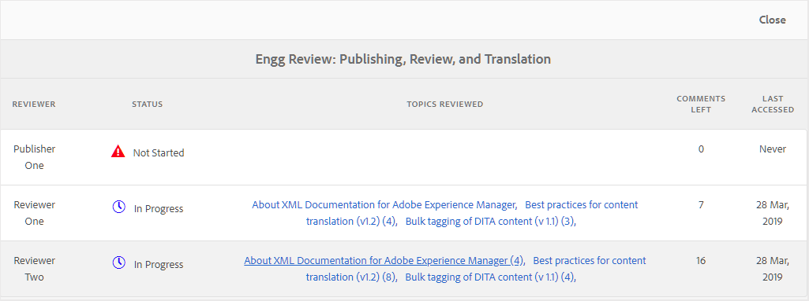

# 使用「稽核儀表板」管理稽核任務 {#id2056B0Y70X4}

稽核管理工作流程可包含各種任務。 例如，您可能想要為特定主題新增稽核者或延長稽核的截止日期。 如果您認為所有利害關係人都已提供其意見反應，您可能也想要將稽核任務標示為完成。 這些工作可以使用「稽核儀表板」來管理。

執行以下步驟來存取及使用「複查儀表板」：

>[!NOTE]
>
> 您只能為您是作者\（或發起人\）的專案管理稽核任務。 即使您是檢閱者或發佈者\(user\)，您也無法存取任何專案任務。

1. 在&#x200B;**專案**&#x200B;主控台中，按一下您要管理的稽核專案。

   隨即顯示具有任務圖磚的「專案」面板。

   {width="800" align="left"}

1. 按一下&#x200B;**檢閱**&#x200B;圖磚中的三個點。

   此時會顯示「稽核儀表板」。 儀表板會列出您已建立的所有稽核任務。

   {width="800" align="left"}

   「稽核儀表板」顯示有關稽核任務的詳細資訊，例如任務名稱、開始稽核的人員、開始稽核的日期、到期日、狀態、尚未被作者接受或拒絕的新註釋數目以及稽核者名稱。 這些任務會按照新建任務到舊任務的順序列出。

   >[!NOTE]
   >
   > 如果按一下「複查任務」連結，則會開啟傳送供複查的主題或對應檔案。

1. 選取稽核任務。

   工具列中顯示[編輯屬性]和[狀態](#check-review-status-id199RF0A0UHS)選項。

1. 如果按一下&#x200B;**編輯屬性**，則會顯示[工作詳細資訊]頁面。

   「任務詳細資訊」頁面有三個索引標籤：任務、內容和稽核者。 以下各節將說明每個標籤下可用的各種功能。

## 任務標籤

{width="800" align="left"}

您可以在&#x200B;**工作**&#x200B;標籤下執行下列動作：

- 在&#x200B;**標題**&#x200B;欄位中修改工作的標題。
- 在&#x200B;**指派給**&#x200B;下拉式清單中新增預設受指派人。 從此新增的稽核者可存取稽核屬於此稽核任務的所有主題。 您可以從[檢閱者標籤](#reviewer-tab-id199RF0N0MUI)中，選擇移除或選擇性地新增更多檢閱者至特定主題。
- 更新&#x200B;**描述**&#x200B;欄位中工作的描述。
- 修改&#x200B;**到期日**。 您可以預先或延後完成任務的截止日期。
- 選取選項可限制使用者僅檢閱指派給他們的主題。
- 按一下&#x200B;**更新**&#x200B;以更新修改的詳細資料。
- 按一下&#x200B;**完成**，在到期日之前將稽核工作標示為完成。 當個別主題的任務標示為完成時，會關閉所選主題的複查。 但是，如果主題是透過DITA map共用以供檢閱，將DITA map任務標示為完成將會關閉對映內共用以供檢閱的所有主題的檢閱。
- 按一下&#x200B;**複製**&#x200B;以建立稽核工作的復本。 建立重複稽核任務的程式與建立新稽核任務類似。 啟動複製任務工作流程後，您會看到「建立稽核任務」頁面。 您必須提供新任務詳細資訊，如[傳送主題以供稽核](review-send-topics-for-review.md#)中所述。

  如果您已選取以DITA map建立的稽核工作，則會顯示屬於該地圖主題的主題。 然後，您可以選擇要包括在新稽核任務中的主題。

  如果稽核任務與一個或多個主題稽核重複，則稽核任務清單中只會顯示這些主題。 您可以選擇將這些主題分享給不同的稽核者進行稽核。

- 按一下&#x200B;**關閉**&#x200B;以移至[收件匣]頁面。

## 內容索引標籤

{width="800" align="left"}

您可以在&#x200B;**Content**&#x200B;標籤下執行下列動作：

- 變更傳送供檢閱的主題版本。 您可以選擇主題的最新版本、日期版本、具有特定標籤的版本或具有特定基準線的版本\（適用於DITA map\）。

- 按一下&#x200B;**更新**，與檢閱者共用主題的更新版本。 稽核者會收到電子郵件通知，指出已傳送較新版本的主題以供稽核。 下次檢閱者開啟主題時，就會看到主題的更新版本。

  >[!NOTE]
  >
  > 如果主題有更新版本，舊註解也會保留在較新版本中。 檢閱者也可以檢視兩個版本之間的差異。

- 按一下&#x200B;**完成**，在到期日之前將稽核工作標示為完成。 當個別主題的任務標示為完成時，會關閉所選主題的複查。 但是，如果主題是透過DITA map共用以供檢閱，將DITA map任務標示為完成將會關閉對映內共用以供檢閱的所有主題的檢閱。

- 按一下&#x200B;**複製**，以目前的工作為基礎來建立新的稽核工作。

## 檢閱者索引標籤 {#reviewer-tab-id199RF0N0MUI}

{width="800" align="left"}

您可以在&#x200B;**檢閱者**&#x200B;標籤下執行下列動作：

- **全選**：選取主題清單中的所有主題。 選取所有主題後，您可以輕鬆執行批次作業。
- **清除選取專案**：取消選取主題清單中選取的主題。

  >[!NOTE]
  >
  > 您也可以按一下主題旁的核取方塊，個別選取或取消選取主題。

- **新增**：顯示[新增檢閱者]對話方塊。 您可以輸入檢閱者或使用者角色\（或群組\）的名稱，以作為檢閱者新增至選取的主題。
- **移除**：顯示[移除稽核者]對話方塊。 您可以鍵入要從所選主題中移除作為稽核者的稽核者或使用者角色\（或群組\）的名稱。
- **重新指派**：顯示[重新指派稽核者]對話方塊。 您可以鍵入要指派稽核任務的稽核者或使用者角色\（或群組\）的名稱。 這會從所選主題中移除所有現有的稽核者，並將新選取的稽核者指派給那些主題。
- **匯出**：可讓您匯出CSV檔案的稽核任務詳細資料。 檔案包含主題的路徑和標題、檢閱者名稱以及傳送供檢閱之主題的版本等詳細資訊。
- **編輯稽核者**：按一下主題清單中的圖示，會顯示[編輯稽核者]對話方塊。 您可以在此對話方塊中為選取的主題新增或移除稽核者。

## 檢查稽核任務的狀態 {#check-review-status-id199RF0A0UHS}

在主「稽核儀表板」頁面中，如果您選取稽核任務並按一下「**狀態**」，則會顯示稽核任務的狀態報告：

{width="800" align="left"}

複查任務的狀態報告包含下列詳細資訊：

- 稽核任務指派給其的稽核者姓名。
- 「狀態」欄指示複查狀態。 「狀態」可能是下列其中一項：
   - **未啟動**：檢閱者尚未開啟檢閱連結。
   - **進行中**：檢閱者已開啟檢閱連結，且正在檢閱主題。
   - **完成**：檢閱者已完成指派給他們的檢閱工作，已完成檢閱。 稽核任務位於每個稽核者的AEM通知收件匣中。
- 當稽核者開啟稽核連結並導覽至特定主題時，該主題會新增到「已稽核主題」清單中。 這有助於作者判斷稽核者是否已開啟其個別章節。 如果提供註解，註解會顯示在方括弧中。
- 在所有主題上發表的評論總數。 若有多個正在檢閱的主題，則會對主題名稱提及\（在方括弧中\）每個主題的註解數。
- 檢閱者上次存取任何主題的日期。

**父級主題：**&#x200B;[&#x200B;檢閱主題或地圖](review.md)
