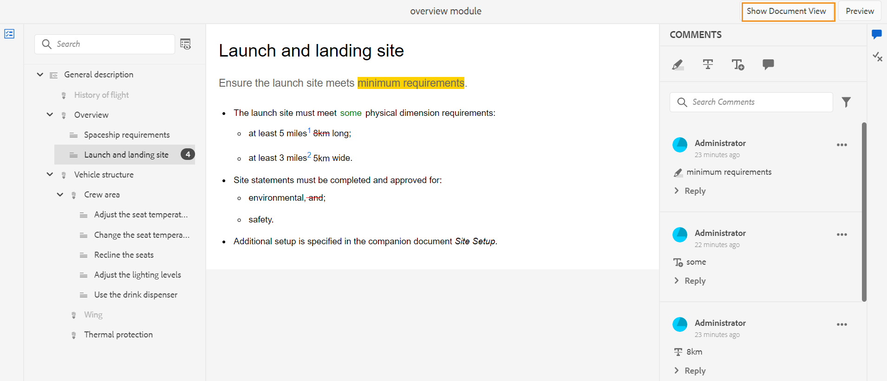

# 檢閱主題 {#id2056B0W0FBI}

如果您是稽核者，則會收到一封包含稽核主題連結的稽核請求電子郵件。 按一下連結即可前往檢閱頁面，您可在此加入對共用主題的意見反應。

執行以下步驟來複查主題：

1. 按一下檢閱要求電子郵件中提供的直接連結。

   主題或地圖連結會在瀏覽器中開啟。

   >[!NOTE]
   >
   > 您也可以從AEM使用者介面的收件匣通知區域存取主題檢閱連結。

1. 根據啟動主題稽核的方式，您可以看到以下兩個畫面中的任何一個：

   >[!NOTE]
   >
   > 如果您是在以下位置建立稽核，則UI可能會不同：
   >
   > - AEM Guides as a Cloud Service2022年11月版或更早版本
   > - AEM Guides 4.1版或更舊版本

   使用DITA map啟動稽核工作流程時，會出現下列畫面：

   {width="800" align="left"}

   此畫面提供下列選項：

   - **A**：稽核工作的名稱。
   - **B**：按一下「主題檢視」圖示，以顯示或隱藏主題面板。

   - **C**：您可以在搜尋列中輸入標題或檔案路徑的部分文字，以搜尋必要的主題。

     選取搜尋列附近的，以選擇檢視所有主題或檢視含有註解的主題。 依預設，您可以檢視稽核任務中存在的所有主題。

   - **D**：您可以從這裡選擇所需的篩選選項，以篩選&#x200B;***F***&#x200B;強調的數字。 您可以依註解型別、狀態、稽核者或版本來篩選註解。 例如，如果您想要檢視每個檢閱主題中已經建立多少刪除線註解，請按一下篩選圖示，然後選擇&#x200B;**檢閱型別** \> **刪除**。

     >[!NOTE]
     >
     > 套用篩選器時，註解面板中只會顯示符合所選篩選器的註解。 已篩選的評論數量會顯示在主題面板的左側。

   - **E**：指派給目前檢閱者的檢閱主題以黑色顯示，且可供點選。 當檢閱者按一下主題連結時，該主題會出現在畫面頂端。
   - **F**：無法檢閱的主題會變成灰色。 主題會以唯讀模式顯示，不允許您在此類主題上新增任何稽核註解。

   - **G**：已收到有關主題的評論數。 此數字會根據您套用的篩選器而變更。

   地圖中的所有主題都會顯示為單一複合檔案。 允許檢閱者檢閱的主題會正常顯示。 不允許稽核的主題不顯示。

   {width="800" align="left"}

   在上述熒幕擷圖中，會共用「一般」說明主題以檢閱目前的檢閱者，該主題正常顯示。 不過，下一個主題「小眾測試版歷程記錄」內容不會共用以供檢閱，且會以唯讀模式顯示。 目前成為焦點的主題也會在目錄中反白顯示。

   選取並共用一個或多個主題以供稽核時，畫面如下：

   {width="800" align="left"}

   >[!NOTE]
   >
   > 如果有多個主題，它們會在檔案檢視中顯示為一個複合檔案。 上述熒幕擷圖以單一檢視呈現兩個不同的主題，一個接著一個。

1. 按一下工具列右上角的&#x200B;**註解**&#x200B;圖示，開啟「註解」面板。

   從工具列選取適當的註解型別，然後按下Enter鍵以提交您的註解，以提供評論註解。

   >[!NOTE]
   >
   > 「註解」面板僅顯示目前主題上的註解。 當您將焦點移動到其他主題時，將會顯示在該主題上提供的註解。

1. 檢閱完主題後，按一下&#x200B;**關閉**&#x200B;按鈕。 按一下&#x200B;**關閉**&#x200B;按鈕後，您將被重新導向到您存取評論主題所在的頁面。

## 評論畫面上可用的新增功能

**檔案檢視和主題檢視** — 依照預設，如果共用多個主題以供檢閱，則會向檢閱者顯示主題的複合檔案檢視。 若是DITA map檢閱，則地圖中的所有主題會以單一檔案的形式呈現，類似書冊檢視。 如果需要，您也可以按一下特定主題，複查畫面只會顯示該主題。

當您檢視單一主題時，您會獲得另一個選項，可切換回檔案檢視。 在下列熒幕擷圖中，會開啟對應檔案中的特定主題以供檢閱。 反白顯示的選項 — **顯示檔案檢視**&#x200B;可讓使用者切換回對應檔案的檔案檢視。

{width="800" align="left"}

**使用不同型別的註解工具** — 您可以反白文字、以文字標示、插入文字或新增註解註解，以新增內嵌註解。 「註解」工具列中提供的不同型別的註解工具說明如下：

{width="350" align="left"}

- **醒目提示** \(\)：若要新增醒目提示，請選取文字並按一下「醒目提示」圖示。 或者，按一下「反白」圖示並選取所要的文字：

  {width="650" align="left"}

  「註解」面板中會出現一個快顯視窗，您可以在其中為反白的內容新增註解。

- **刪除線** \(\)：如果您想要建議移除內容，可以選取內容並按一下「刪除線」圖示來執行此操作。 或者，選取所要的文字，然後按一下Delete鍵：

  「註解」面板中會出現一個快顯視窗，您可以在其中為已刪除的內容新增註解。

- **插入文字** \(\)：如果您要插入文字，請按一下[插入文字]圖示，並將游標置於您要插入文字的位置，然後輸入資訊。 或者，將游標放在您要插入文字的位置，然後開始輸入。 新增的資訊會以綠色字型顯示：

- **新增註解**\(\)：若要新增註解型別的註解，請按一下[新增註解]圖示，然後在快顯視窗中輸入註解。

**內容工具列**

您也可以使用內容工具列，快速反白或刪除線文字。 執行以下步驟來使用內容工具列進行註解：

1. 選取您要反白或刪除的文字。 內容工具列隨即顯示。

   {width="550" align="left"}

1. 按一下&#x200B;**醒目提示**&#x200B;或&#x200B;**刪除線**&#x200B;圖示。
1. 您可以在註解面板中為反白或刪除線動作新增註解。

**使用「註解」面板檢閱** — 「註解」面板顯示有關目前主題的註解清單。 如果主題傳送給多位稽核者，此面板也會列出其他稽核者的註解。 註解面板中的每個註解都會連結到目前主題中的對應文字。 它有助於您識別註解的文字。 每個註解都會顯示已新增註解及時間戳記的檢閱者姓名。

註解會以檔案中註解文字的順序顯示。 例如，在第一句有反白標示的註解，並在第一段中的第二句插入文字註解，則反白標示的文字註解會顯示在插入的文字註解之前。

您可以使用「註解」面板執行的工作說明如下：

- 按一下註解會反白顯示檔案中的對應註解位置。
- 您可以新增評論的回覆。
- 您可以在[註解]面板中按一下註解文字，然後從[選項]功能表選取[編輯] ****，編輯您自己的註解。
- 您可以按一下「註解」面板中的註解，然後從「選項」功能表選取&#x200B;**刪除**&#x200B;選項，刪除自己的註解。

  {width="300" align="left"}

  >[!NOTE]
  >
  > 「選項」選單只有在您將滑鼠停留在您自己的註解上時才會出現。 對於其他稽核者的註解，不會顯示它。

- 所有參與的使用者都可以回應其他使用者提交的註解。 在評論上按一下&#x200B;**回覆**&#x200B;並按Enter以提交回應。

**預覽模式**

- 在「預覽」模式中開啟主題會顯示當作者在套用所有變更後檢視主題時如何顯示主題。 例如，所有插入的文字都會顯示為一般文字，而所有刪除的\(deleted\)文字都會從內容中移除。

- 下列熒幕擷圖顯示&#x200B;*檢閱*&#x200B;模式中的內容：

{width="550" align="left"}

下列熒幕擷圖顯示&#x200B;*預覽*&#x200B;模式中的內容：

{width="550" align="left"}

**新增附件至註解** -   如果您想提供其他檔案中可用的其他資訊來補充您的註解，您可以附加註解來補充。 身為檢閱者，您可以輕鬆將一或多個檔案從本機系統新增至您的註解。 可以將檔案新增至所有支援的註解形式 — 反白顯示、刪除線、插入文字或註解。

插入任何註解時，註解快顯視窗會出現。 在快顯視窗中提供其他註解或資訊後，按下Enter即可提交該註解或資訊。 新增註解後，您就可以選擇將附件新增至該註解。

{width="800" align="left"}

在上述熒幕擷圖中，檔案包含醒目提示註解的快顯視窗，註解也會新增至「註解」面板中。 兩個位置都有檔案附件圖示和註解可供使用。

執行以下步驟，將附件新增至您的註解：

1. 在您要新增附件的註解上按一下&#x200B;*新增附件*&#x200B;圖示。

   檔案「開啟」對話方塊隨即顯示。

1. 選取一或多個要附加的檔案。

   選取的檔案與註解一起顯示在「註解」面板中。

   在「註解」面板中，您可以看到檔案名稱及其大小。 您也可以選擇按一下與檔案名稱關聯的刪除圖示來移除檔案。

1. 按一下「**提交**」。

   附件會上傳並新增至註解。

**關於使用附件的其他附註：**

- 依預設，只會顯示兩個附加註解的檔案。 如果有更多檔案，右邊的&#x200B;**檢視附件**&#x200B;按鈕會顯示與註解相關聯的所有附件\（兩個以上\）數目。 您可以按一下編號來檢視所有附件。 例如，如果您有四個附件的註解，您會在按鈕上看到+2。

{width="550" align="left"}

- 將滑鼠指標停留在附件上可讓您選擇下載或移除附件。 移除附件僅適用於目前檢閱者已新增該註解時，如下列熒幕擷取所示：

{width="550" align="left"}

其他檢閱者或作者僅會取得下載附件選項。

{width="550" align="left"}

- 您可以從&#x200B;**檢視附件**&#x200B;對話方塊下載與註解相關的所有附件。 選取附件並按一下評論層級的&#x200B;**下載**&#x200B;圖示。

- 您也可以從&#x200B;**檢視附件**&#x200B;對話方塊刪除與註解相關聯的附件。 選取附件並按一下&#x200B;**刪除**&#x200B;圖示。

{width="550" align="left"}

**條件面板** -   如果您的主題有條件式內容，您會在右側看到&#x200B;**條件** \(\)圖示。 按一下&#x200B;**條件**&#x200B;圖示會開啟「條件」面板，讓您根據主題中的可用條件反白顯示內容。

：   依預設，**反白顯示所有條件**&#x200B;選項已啟用，所有條件皆已選取，顯示整個內容，且條件化內容在檢閱和預覽模式中都以反白顯示顯示。

：   您可以停用&#x200B;**反白顯示所有條件**&#x200B;選項，並將主題中顯示的所有內容視為沒有反白顯示的一般文字。

{width="350" align="left"}

您可以選擇隱藏或顯示特定條件。

- 如果您隱藏條件，則具有該條件的內容在稽核模式中不會反白顯示。
- 如果您顯示條件化內容，則會在稽核模式中反白該內容。 例如，在下列熒幕擷圖中，只有內容使用兩個條件 — `win`和`mac`會反白顯示。

{width="650" align="left"}

在預覽模式中，會顯示非條件化內容和使用兩個顯示條件 — `win`和`mac`的條件化內容。 不會顯示隱藏條件的其餘條件化內容。

**即時檢閱** -   「註解」面板會以註解以及作者對註解採取的意見反應或動作即時更新。

- 多個檢閱者可以在同一檔案上同時留下註解或回覆註解。 您可以將滑鼠移至熒幕右上角的使用者圖示上，找出目前檢閱檔案的使用者。

- 如果主題是多個稽核任務的一部分，則在一個任務中所做的註釋不會顯示在另一個任務中。

- 按一下「過時的註解」圖示\(\)會顯示檔案最新版本與註解版本之間的差異。 版本編號\（正在比較的版本\）會顯示在檔案頂端。

  {width="800" align="left"}

  >[!NOTE]
  >
  > 當您將滑鼠懸停在「過時的註解」圖示上時，會顯示新增註解的主題版本號碼。 例如，如果在1.0版上提供了註解，則會顯示相同的註解。

- 按一下過時的註解會在左側面板中開啟該註解的版本。 先前版本會顯示在左側面板中，而目前版本會顯示在右側面板中。 過期版本上的所有註解都會在左側匯入。 您可以將先前版本與目前版本進行比較。

**篩選註解** -   您可以篩選檔案中的註解，以視需要檢視特定註解。 若要篩選註解，請按一下「註解」面板中「搜尋註解」文字方塊右邊選單中的&#x200B;**篩選**&#x200B;圖示\(\)。

從&#x200B;**篩選型別**&#x200B;對話方塊中選取下列一或多個篩選選項，然後按一下&#x200B;**套用**。

- **檢閱型別** — 根據註解型別進行篩選 — 反白顯示、刪除、插入或註解。
- **評論狀態** — 根據評論的狀態進行篩選，例如，已接受、已拒絕或無。
- **稽核者** — 根據稽核者名稱進行篩選。

- **版本** — 根據在特定主題版本上收到的註解進行篩選。

  使用篩選時，右側面板上的註解會根據選取範圍進行篩選，而左側面板中的註解數量也會隨之更新。

若要移除篩選器並檢視所有註解，請從&#x200B;**篩選器型別**&#x200B;對話方塊中取消選取所有篩選器，然後按一下&#x200B;**套用**。

**父級主題：**[&#x200B;檢閱主題或地圖](review.md)
