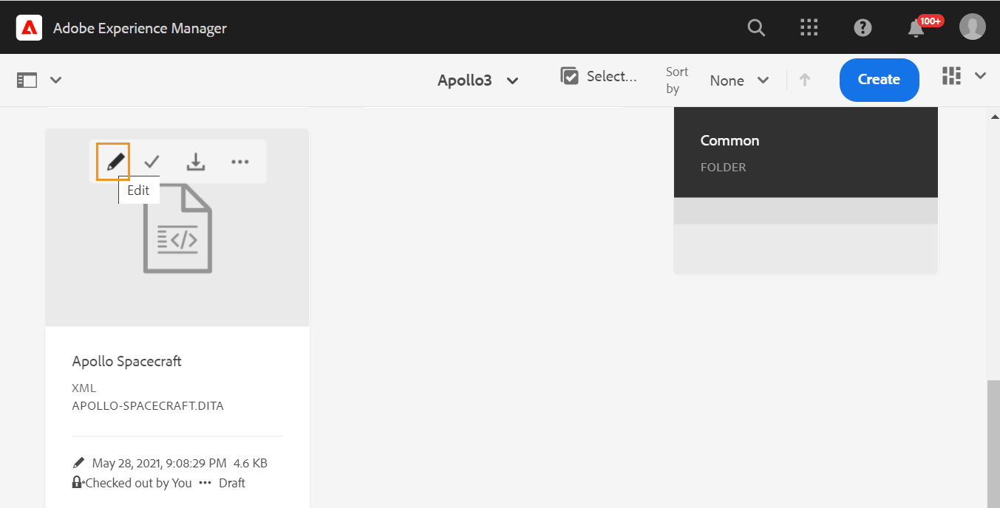

# 啟動網頁編輯器 {#id2056B0140HS}

您可以從下列位置啟動Web編輯器：

- [AEM導覽頁面](#id2056BG00RZJ)
- [AEM ASSETS UI](#id2056BG0307U)
- [DITA map主控台](#id2056BG090BF)

以下小節涵蓋如何從不同位置存取和啟動Web編輯器的詳細資訊。

## AEM導覽頁面 {#id2056BG00RZJ}

登入AEM時，畫面會顯示導覽頁面：

{width="800"}

按一下&#x200B;**Guides**&#x200B;連結，即可直接前往網頁編輯器。

{width="800"}

當您未選取任何檔案就啟動網頁編輯器時，會顯示空白的網頁編輯器畫面。 您可以開啟檔案，以從AEM存放庫或「我的最愛」集合進行編輯。

- 按一下&#x200B;**指南**&#x200B;圖示()以返回AEM導覽頁面。

- 根據您的設定，**關閉**&#x200B;按鈕會帶您前往目的地：

  

  
 雲端服務 

  如果您正在使用雲端服務，請按一下&#x200B;**關閉**&#x200B;按鈕以返回AEM導覽頁面。
  

  

  
 內部部署軟體

  如果您使用AEM Guides內部部署軟體（4.2.1和更新版本），請按一下右側的&#x200B;**關閉**&#x200B;按鈕，返回至Assets UI中的目前檔案路徑。

  

## AEM ASSETS UI {#id2056BG0307U}

另一個可以啟動Web編輯器的位置來自AEM Assets UI。 您可以選取一或多個主題，並直接在網頁編輯器中開啟它們。 若要在Web編輯器中開啟主題，請執行下列步驟：

1. 在Assets UI中，導覽至您要編輯的主題。

   >[!NOTE]
   >
   > 您也可以檢視主題的UUID。

   .

   {width="800"}

   >[!IMPORTANT]
   >
   > 確保您對包含要編輯之主題的資料夾具有讀取和寫入許可權。

1. 若要取得該主題的獨佔鎖定，請選取該主題，然後按一下[出庫]。****

   >[!IMPORTANT]
   >
   > 如果您的管理員已設定&#x200B;**停用編輯而不簽出**&#x200B;選項，則您必須先簽出檔案才能進行編輯。 如果您未出庫檔案，將無法看到編輯選項。

1. 關閉資產選擇模式，然後按一下您要編輯的主題。

   主題預覽隨即顯示。

   您可以從「清單」檢視、「卡片」檢視和「預覽」模式開啟Web編輯器。

   >[!IMPORTANT]
   >
   > 如果您想要開啟多個主題進行編輯，請從資產UI中選取所需的主題，然後按一下編輯。 請確認您的瀏覽器未啟用快顯封鎖程式，否則只會開啟所選清單中的第一個主題進行編輯。

   {width="800"}

   如果您不想預覽主題，並想直接在網頁編輯器中開啟主題，請從卡片檢視按一下快速動作功能表中的「編輯」圖示：

   {width="800"}

1. 按一下&#x200B;**編輯**，在網頁編輯器中開啟主題。

   {width="800"}

## DITA map主控台 {#id2056BG090BF}

若要從DITA map主控台開啟Web編輯器，請執行下列步驟：

1. 在Assets UI中，導覽至並按一下包含您要編輯之主題的DITA map檔案。

   將顯示DITA map主控台。

1. 按一下&#x200B;**主題**。

   隨即顯示地圖檔案中的主題清單。 主題的UUID會顯示在主題標題下方。

1. 選取要編輯的主題檔案。

1. 按一下&#x200B;**編輯主題**。

   {width="800"}

1. 主題會在Web編輯器中開啟。

   >[!IMPORTANT]
   >
   > 如果您的管理員已設定&#x200B;**停用編輯而不簽出**&#x200B;選項，則您必須先簽出檔案才能進行編輯。 如果未出庫檔案，則檔案會在編輯器中以唯讀模式開啟。

**上層主題：**[&#x200B;使用網頁編輯器](web-editor.md)
