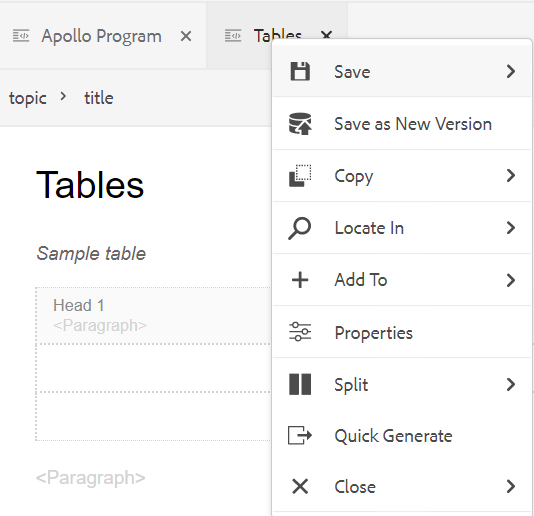
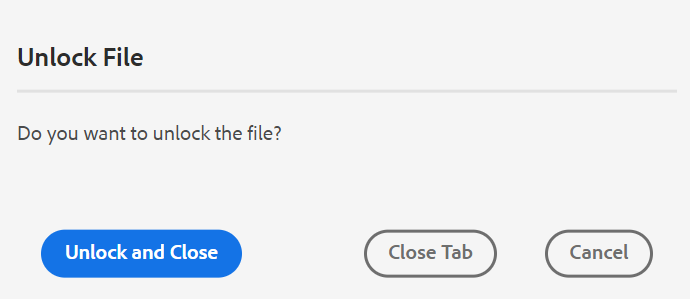
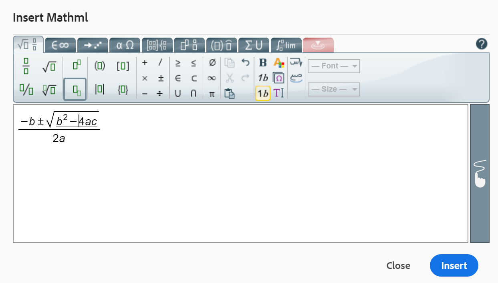

# Other features in the Web Editor {#id2056B0B0YPF}

There are some other useful features in the Web Editor that you can make use of:

**Context menu functions on a file&#39;s tab**

When you open a file in the Web Editor, you can perform various actions from the context menu. You might see different options depending on whether you open a media file, single DITA file, or multiple files.

**Media file**

You get the following functions in the context menu of an opened media file&#39;s tab:

{width="300" align="left"}

**Single DITA file**

You get the following functions in the context menu of an opened file&#39;s tab:

:   {width="300" align="left"}

**Multiple files**

When you have multiple files opened, then you get more options in the context menu:

{width="550" align="left"}

The various options in the context menu are explained below:

***Save***: You can choose from the following options:

- **Save**: To save a file without creating a new version, select **Save**. Whenever you create a new topic, a version-less working copy of the topic is created in DAM. Saving your document updates the working copy of your document in DAM. Doing a simple save on this version does not create a new version of a topic. If your topic is under review, saving a topic does not give your reviewers access to your changed topic content.

- **Save All**: If there are multiple documents opened in the Web Editor, then you also get an option to **Save All** opened documents.

***Save As New Version***

To create a new version of the file, select **Save As New Version**. 如需&#x200B;**儲存**&#x200B;和&#x200B;**另存為新版本**&#x200B;的詳細資訊，請參閱[瞭解網頁編輯器功能](web-editor-features.md#)。

***複製***：您可以選擇下列選項：

- **複製UUID**：若要將目前作用中檔案的UUID複製到剪貼簿，請選取&#x200B;**複製\>複製UUID**。
- **複製路徑**：若要將目前作用中檔案的完整路徑複製到剪貼簿，請選取&#x200B;**複製\>複製路徑**。

***在***&#x200B;中尋找：您可以從下列選項中選擇：

- **對應**：如果您已開啟大型DITA對應，而且想要在對應中找到檔案的確切位置，請選取&#x200B;**在\>對應**&#x200B;中尋找。 當您選取「在對應中尋找」選項時，檔案\（從叫用選項的位置\）會定位並在對應階層中反白顯示。 若要能夠使用此功能，您必須在Web編輯器中開啟對應檔案。 如果「對映檢視」是隱藏的，則叫用此功能會顯示「對映檢視」，且檔案會在對映階層中反白顯示。

- **存放庫**：類似於「在地圖中尋找」，**在\>存放庫**&#x200B;中顯示檔案在存放庫\（或DAM\）中的位置。 「存放庫檢視」會開啟，且選取的檔案會在存放庫中反白顯示。 如果檔案在資料夾中，則該資料夾會展開以顯示所選檔案在存放庫中的位置。

***新增至***：您可以選擇下列選項：

- **我的最愛**：若要將選取的檔案新增至我的最愛集合，請選取&#x200B;**新增至\>我的最愛**。 如需詳細資訊，請參閱[左側面板](web-editor-features.md#id2051EA0M0HS)區段中的&#x200B;**我的最愛**&#x200B;功能說明。

- **可重複使用的內容**：若要將選取的檔案複製到可重複使用的內容清單，請選取&#x200B;**新增到\>可重複使用的內容**。 如需詳細資訊，請參閱[左側面板](web-editor-features.md#id2051EA0M0HS)區段中的&#x200B;**可重複使用的內容**&#x200B;功能說明。

***屬性***

若要檢視所選檔案的AEM屬性頁面，請選取&#x200B;**屬性**。

***分割***：您可以選擇下列選項：

**上、下、左或右**

依預設，網頁編輯器可讓您一次檢視一個主題。 某些情況下，您可能會想要同時看到兩個或多個主題。 分割編輯器的畫面可讓您同時檢視多個主題。 例如，如果您在編輯器中開啟了兩個主題 — A和B。 在主題B上按一下滑鼠右鍵並選擇&#x200B;**分割\>向上**&#x200B;會將編輯器視窗分成兩個部分。 主題B顯示在上半部分，主題A顯示在下半部分。 同樣地，您也可以選取&#x200B;**分割\>左側**&#x200B;或&#x200B;**分割\>右側**&#x200B;來水準分割熒幕。 下列Web編輯器的熒幕擷圖顯示水平與垂直分割的主題。 在每個分割中，您可以有不同的檢視。 例如，在下列熒幕擷圖中，熒幕1在Source檢視模式中，熒幕2有兩個檔案在製作模式中開啟，而熒幕3在預覽模式中。 您可以將檔案從某個熒幕移至另一個熒幕，方法是拖曳檔案標籤並放置到您要放置它的熒幕上。 同樣地，您也可以根據您的偏好拖曳及移動檔案標籤，以重新排序檔案標籤。

{width="800" align="left"}

***快速產生***

為選取的檔案產生輸出。 只能為屬於輸出預設集一部分的檔案產生輸出。 如需詳細資訊，請參閱[從網頁編輯器](web-editor-article-publishing.md#id218CK0U019I)以文章為基礎的發佈。

***關閉***：您可以選擇下列選項：

**關閉**、**關閉其他**，或&#x200B;**全部關閉**

如果要關閉啟動內容功能表的檔案，請選取&#x200B;**關閉\>關閉**。 使用&#x200B;**Close \> Close Others**&#x200B;關閉目前使用中檔案以外其他所有開啟的檔案。 若要關閉所有開啟的檔案，請從內容功能表選取&#x200B;**關閉\>全部關閉**&#x200B;選項，或者您也可以選擇關閉網頁編輯器。 如果您的作業階段中有任何未儲存的檔案，系統會提示您儲存這些檔案。

**檔案關閉並儲存案例**

當您嘗試使用檔案索引標籤上的&#x200B;**關閉**&#x200B;按鈕或[選項]功能表中的&#x200B;**關閉**&#x200B;選項來關閉在Web編輯器中開啟的檔案時，AEM Guides會提示您儲存編輯內容並解除鎖定檔案。

提示會根據管理員選取的下列設定：

- **關閉時要求籤入：**&#x200B;當您關閉編輯器時，您可以選擇簽入檔案\（您已簽出\）。
- **關閉時詢問新版本**：關閉編輯器時，您可以選擇將檔案\（您已編輯\）儲存為新版本。

您的檔案儲存體驗將取決於以下三種情況，其中您有：

- 未對內容進行任何變更。
- 編輯內容並儲存變更。
- Edited the content but not saved the changes.

You may see the following options depending on whether the file is locked/unlocked and has saved or unsaved changes:

- **Unlock and Close**: The lock on the file is released, and the file gets closed.

  {width="400" align="left"}

- **Save as a New Version**: This will save the changes you have made in your content and create a new version of your file. You can also add labels and comments for the newly saved version. 如需有關儲存新版本的詳細資訊，請參閱[另存為新版本](web-editor-features.md#save-as-new-version-id209ME400GXA)。

- **Unlock the File**: If you choose to unlock a file, it will release the lock on your file and the changes are saved in the current version of the file.

  >[!NOTE]
  >
  > If you deselect the option to unlock the file, you also get an option to close the file without saving the changes.

  For example, one of the prompts is shown in the following screenshot:

  {width="400" align="left"}

**Visual cues for broken references**

- If your topic contains broken cross-references or content references, they are shown in red text.

**Smart copy-paste**

- You can easily copy paste content within and across topics. The source element structure is maintained at the destination. Also, if the copied content contains content references, then even those are copied.

**Remember last browsed location**

- The Web Editor provides a smart file browse dialog. The editor remembers the last used location while inserting a reference or content. The first time you invoke the file browse dialog \(via Insert Reference or Insert Reuse Content\), then you are taken to the location where the current document is saved. In the same session, if you try to insert another reference, then the file browse dialog automatically navigates to the location from where you inserted the last reference.

>[!NOTE]
>
> In case of an image, audio, or video file, the file browse dialog defaults to the file&#39;s location and not the last used location.

**Support for article-based publishing**

- From the Web Editor, you can generate the output for one or more topics, or the entire DITA map. You need to create output presets for your DITA map and then you can easily generate the output for one or more topics. If you have updated a few topics in your map, you can also generate the output only for those topics from the Web Editor. 如需詳細資訊，請參閱[從網頁編輯器](web-editor-article-publishing.md#id218CK0U019I)以文章為基礎的發佈。

**Support for Markdown documents**

- 網頁編輯器可讓您使用Markdown檔案\(.md\)以及DITA檔案。 You can easily author and preview a Markdown document in the Web Editor and also add it in your map file through DITA map editor. 如需詳細資訊，請參閱[從網頁編輯器編寫Markdown檔案](web-editor-markdown-topic.md#)。

**Support for DITA glossary term topic**

- The Web Editor support DITA glossary terms that you can insert by adding `term` or `abbreviated-form` elements.

**插入MathML方程式**

- Experience Manager Guides提供開箱即用的支援，可讓您透過與[MathType Web](https://docs.wiris.com/en/mathtype/mathtype_web/intro)應用程式的整合，插入MathML方程式。 若要插入MathML方程式，請選取&#x200B;**插入元素**&#x200B;圖示並輸入mathml。 當您從清單中選取mathml元素時，會顯示&#x200B;**插入MathML**&#x200B;對話方塊：

{width="550" align="left"}

使用MathML方程式工具，建立您的方程式，然後按一下&#x200B;**插入**&#x200B;以將其加入您的檔案。 方程式會以淺灰色背景插入，如下所示：

{width="400" align="left"}

您可以隨時更新方程式，方法是以滑鼠右鍵按一下現有方程式，然後從內容功能表選取&#x200B;**編輯MathML**。

- **在MathML編輯器中驗證方程式**

  當您儲存包含方程式的主題時，Experience Manager Guides會驗證MathML方程式。
使用MathML編輯器插入方程式時，如果有任何語法問題，Experience Manager Guides會以紅色反白顯示方程式。 您可以在插入之前進行修正。 如果您未進行任何變更，但選取**插入**，則會顯示警告。

  {width="400" align="left"}

  如果您插入包含語法錯誤的MathML方程式，則在嘗試儲存主題時會發生驗證錯誤。

**插入註腳**

- 使用`fn`元素在內容中插入註腳。 In the authoring mode, the footnote value is shown inline with the content. However, when you switch you the Preview mode or publish your document, the footnote appears at the end of the topic.

**Rename or replace an element**

- The Web Editor displays the element&#39;s breadcrumb at the top of the topic. If you want to swap or replace an element with another element, then you can do so from the breadcrumb&#39;s context menu. For example, you can swap `p` element with `note` or any other valid element at the context.

{width="400" align="left"}

On the breadcrumb, right-click on an element&#39;s name that you want to replace, then select Rename Element from the context menu. The Rename Element dialog displays all valid elements that are allowed at the current location. From the Rename Element dialog, select the element that you want to use. The original element is replaced with the new element.

In addition to the context menu of the breadcrumb, the Rename Element dialog can also be accessed from other locations:

- Click on the element name on the breadcrumb to select the content of the element and right-click on the selected content to bring up the context menu.

- Enable Tags view, click on the opening tag of any element and then right-click on the selected content to bring up the context menu.

- You can access the Rename Element dialog by invoking the Options menu of an element in the Outline panel.

**Wrap an element**

- Wrapping an element allows you to add an element tag to the selected text. You can wrap the text to any child element following DITA standards. For example, if you have text under a `note` element, then you can wrap the text to a `p` element.

  The **Wrap Element** option is available in the context menu of the topic&#39;s breadcrumb. To wrap an element, right-click on the element and open the context menu. Select the element from the **Wrap Element** dialog. The text appears in the new element.

  You can also select the text or the element in the content and then select the **Wrap Element**  option from the context menu.

**Unwrap an element**

- Unwrapping an element allows you to remove the element tag from the selected text and merge it with its parent element. 例如，如果您在`note`元素中有一個`p`元素，您可以解除`p`元素的包裝，直接在`note`元素中合併文字。 在主題階層連結的內容功能表中可以使用&#x200B;**Unwrap Element**&#x200B;選項。 若要解除專案包裝，請在專案上按一下滑鼠右鍵以開啟內容功能表，最後選取&#x200B;**解除專案包裝**&#x200B;以移除專案，並將專案的文字與其父專案合併。

**DITA元素的空白處理**

- 在XML中，空白字元包括空格、定位字元、歸位字元和空白行。 Experience Manager Guides會將多個後續空格轉換為一個空格。 這可協助您保留網頁編輯器的WYSIWYG檢視。

  >[!NOTE]
  >
  >在某些需要根據DITA規則保留空白的元素中，會保留多個後續空格。 例如，`<pre>`和`<codeblock>`個元素。

**保留分行和縮排**

- 根據在「作者」、「Source」或「預覽」模式中的定義，以及在最終發佈的輸出中的定義，支援並轉譯包含分行符號和空格的DITA元素。 下列熒幕擷圖顯示`msgblock`元素中的內容，其中分行符號和空格\(indentation\)已保留：

{width="500" align="left"}

**在網頁編輯器中處理連續空格**

- 您可以使用&#x200B;**插入特殊字元** 圖示或&#x200B;**Alt** + **空格**&#x200B;捷徑鍵，在檔案中插入不間斷的空格。  These non-breaking spaces appear as an indicator while you edit a topic in the Web Editor. 您可以從&#x200B;**使用者偏好設定** 的&#x200B;**外觀**&#x200B;索引標籤，使用&#x200B;**在作者模式中顯示連續空格指示器**&#x200B;選項關閉連續空格顯示。

- 如果您將任何外部來源中含不斷行間距的內容複製並貼到&#x200B;**作者**檢視中，則不斷行間距會轉換為間距。
However, if you copy and paste content with a non-breaking space from the **Author** view, it&#39;s preserved.

**Auto-generate element ID**

- 您可以為DITA主題中的元素自動產生ID。 這些ID在DITA主題中是唯一的。 例如，如果您產生段落元素的ID，ID將為p\_1、p2、p\_3等。 您可以選取多個元素，並為每個選取的元素產生ID。

請執行以下動作以自動產生一或多個元素的ID：

1. 在網頁編輯器中開啟主題。
1. 選取您要指派ID的內容。
1. 按一下滑鼠右鍵並從內容功能表選取&#x200B;**產生ID。**

   或者，您可以在階層連結中按一下滑鼠右鍵，然後選取&#x200B;**產生ID**。

**上層主題：**[&#x200B;使用網頁編輯器](web-editor.md)
