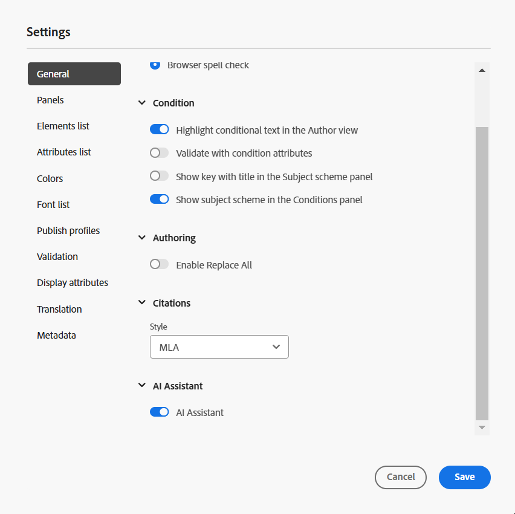

# 設定AI助理

作為管理員，您可以在Experience Manager Guides中設定AI助理功能。 AI小幫手由Adobe IMS驗證型驗證保護。 將您的環境與Adobe的安全權杖型驗證工作流程整合，並開始使用AI助理功能。 下列組態可協助您將&#x200B;**AI組態**&#x200B;索引標籤新增至資料夾設定檔。 新增後，您就可以在Experience Manager Guides中使用AI助理功能。

執行以下步驟來設定「AI小幫手」：

1. [在Adobe Developer Console中建立IMS設定](#create-ims-configurations-in-adobe-developer-console)。
2. [將IMS設定新增至環境](#add-ims-configuration-to-the-environment)
3. [在環境中啟用AI標幟](#enable-ai-flag-in-the-environment)
4. [在環境中新增GUIDES_AI_SITE_ID變數](#add-the-guides_ai_site_id-variable-in-the-environment)
5. [套用變更至環境](#apply-changes-to-the-environment)
6. [在資料夾設定檔中啟用AI助理](#enable-ai-assistant-in-folder-profile)
7. [在資料夾設定檔中設定智慧建議](./conf-folder-level.md#configure-ai-assistant-for-smart-help-and-authoring)

## 在Adobe Developer Console中建立IMS設定

執行以下步驟，在Adobe Developer Console中建立IMS設定：

>[!NOTE]
>
>如果您已建立OAuth專案來設定以微服務為基礎的發佈，您可以略過下列步驟來建立專案。

1. 啟動[Adobe Developer Console](https://developer.adobe.com/console)。
1. 成功登入Developer Console後，您將檢視&#x200B;**首頁**&#x200B;畫面。 **首頁**&#x200B;畫面可讓您輕鬆找到資訊和快速連結，包括專案和下載的頂端導覽連結。
1. 若要建立新的空白專案，請從&#x200B;**快速入門**&#x200B;連結中選取&#x200B;**建立新專案**。
    {width="550" align="left"}
   *建立新專案。*

1. 從&#x200B;**專案**&#x200B;畫面選取&#x200B;**新增API**。  **新增API**&#x200B;畫面會出現。 此畫面會顯示Adobe產品與技術的所有可用API、事件和服務，供您開發應用程式。

1. 選取&#x200B;**I/O管理API**&#x200B;以將其新增至您的專案。
   
   *新增I/O Management API至您的專案。*

1. 建立新的&#x200B;**OAuth認證**&#x200B;並儲存。

   設定API中的

   *將OAuth認證設定到您的API。*

1. 在&#x200B;**專案**&#x200B;索引標籤中，選擇&#x200B;**OAuth伺服器至伺服器**&#x200B;選項，然後選取新建立的認證。

1. 選取&#x200B;**OAuth伺服器對伺服器**&#x200B;連結以檢視專案的認證詳細資料。

    {width="800" align="left"}

   *連線到專案以檢視認證詳細資料。*

1. 返回「**專案**」標籤，並在左側選取「**專案概述**」。

   

   *開始新專案。*

1. 選取頂端的&#x200B;**下載**&#x200B;按鈕以下載服務JSON。

   

   *下載JSON服務詳細資料。*

您已設定OAuth驗證詳細資料並下載JSON服務詳細資料。 將此檔案依下一區段的要求保留為方便使用。

## 將IMS設定新增至環境

執行以下步驟，將IMS設定新增至環境：

1. 開啟Experience Manager，然後選取包含您要設定環境的程式。
1. 切換至&#x200B;**環境**&#x200B;標籤。
1. 選取您要設定的環境名稱。 這應該會將您導覽至&#x200B;**環境資訊**&#x200B;頁面。
1. 切換至&#x200B;**組態**&#x200B;標籤。
1. 將JSON服務詳細資料（在上一節中下載）貼到與&#x200B;**相對應的**&#x200B;值`SERVICE_ACCOUNT_DETAILS`欄位。 請確定您使用與下列熒幕擷取畫面相同的名稱和設定。

   {width="800" align="left"}

## 在環境中啟用AI標幟

若要在Experience Manager Guides UI上啟用AI助理功能，請在環境中新增`ENABLE_GUIDES_AI`標幟。

確定您使用與下列熒幕擷取畫面相同的名稱和設定。

{width="800" align="left"}

將標幟設定為&#x200B;**true**&#x200B;會啟用該功能，而將其設定為&#x200B;**false**&#x200B;則會停用該功能。

## 在環境中新增GUIDES_AI_SITE_ID變數

在您的環境(Cloud Manager)中新增`GUIDES_AI_SITE_ID`變數並將值設定為`id_f651abc807c84f52b425737bb93f87ba`以啟用它。

確定您使用與下列熒幕擷取畫面相同的名稱和設定。

{width="800" align="left"}

## 套用變更至環境

新增IMS設定並啟用AI Assistant標幟到環境後，執行以下步驟來使用OSGi將這些屬性與AEM Guides連結：

1. 在您的Cloud Manager Git專案程式碼中，新增以下指定的兩個檔案（針對檔案內容，請檢視[附錄](#appendix)）。

   * `com.adobe.aem.guides.eventing.ImsConfiguratorService.cfg.json`
   * `com.adobe.guides.ai.config.service.AiConfigImpl.cfg.json`
1. 確保您的`filter.xml`涵蓋新新增的檔案。
1. 認可並推送您的Git變更。
1. 執行管道以在環境中套用變更。

## 在資料夾設定檔中啟用AI助理

套用組態變更後，為所需的資料夾設定檔啟用AI助理員功能。

如需詳細資訊，請檢視[瞭解編輯器功能](../user-guide/web-editor-features.md)。

{width="300" align="left"}

## 在資料夾設定檔中設定智慧建議

啟用AI助理功能後，請在資料夾設定檔中設定智慧建議功能。

如需詳細資訊，請參閱[在資料夾設定檔](./conf-folder-level.md#configure-ai-assistant-for-smart-help-and-authoring)中設定智慧建議。


## 附錄 {#appendix}

**檔案**：
`com.adobe.aem.guides.eventing.ImsConfiguratorService.cfg.json`

**內容**：

```
{
 "service.account.details": "$[secret:SERVICE_ACCOUNT_DETAILS]"
}
```

**檔案**： `com.adobe.guides.ai.config.service.AiConfigImpl.cfg.json`

**內容**：

```
{
  "conref.inline.threshold":0.6,
  "conref.block.threshold":0.7,
  "related.link.threshold":0.5,
  "emerald.url":"https://adobeioruntime.net/apis/543112-smartsuggest/emerald/v1",
  "instance.type":"prod",
  "chat.url":"https://aem-guides-ai-v2.adobe.io"
  }
```

## AI助理設定詳細資料

| 索引鍵 | 說明 | 允許的值 | 預設值 |
|---|---|---|---|
| conref.inline.threshold | 此臨界值可控制針對使用者目前輸入的標籤所擷取建議的精確度/召回率。 | 從–1.0到1.0的任何值。 | 0.6 |
| conref.block.threshold | 此臨界值會控制在整個檔案中為標籤擷取的建議精確度/召回率。 | 從–1.0到1.0的任何值。 | 0.7 |
| emerald.url | 智慧建議向量資料庫的端點 | [https://adobeioruntime.net/apis/543112-smartsuggest/emerald/v1](https://adobeioruntime.net/apis/543112-smartsuggest/emerald/v1) | [https://adobeioruntime.net/apis/543112-smartsuggest/emerald/v1](https://adobeioruntime.net/apis/543112-smartsuggest/emerald/v1) |
| chat.url | AI助理服務的端點 | [https://aem-guides-ai-v2.adobe.io](https://aem-guides-ai-v2.adobe.io) | [https://aem-guides-ai-v2.adobe.io](https://aem-guides-ai-v2.adobe.io) |
| instance.type | AEM執行個體的型別。 請確定此名稱對於已設定智慧建議的每個AEM執行個體都是唯一的。 使用案例是在Stage環境中以「instance.type」=「stage」測試功能，同時在「prod」上也設定此功能。 | 任何可識別環境的唯一關鍵值。 僅允許&#x200B;*個英數字元*&#x200B;值。 &quot;dev&quot;/&quot;stage&quot;/&quot;prod&quot;/&quot;test1&quot;/&quot;stage2&quot; | &quot;prod&quot; |

完成設定後， AI助理圖示會顯示在Experience Manager Guides的首頁和編輯器中。 如需詳細資訊，請檢視Experience Manager使用手冊中的[AI助理](../user-guide/ai-assistant.md)區段。
