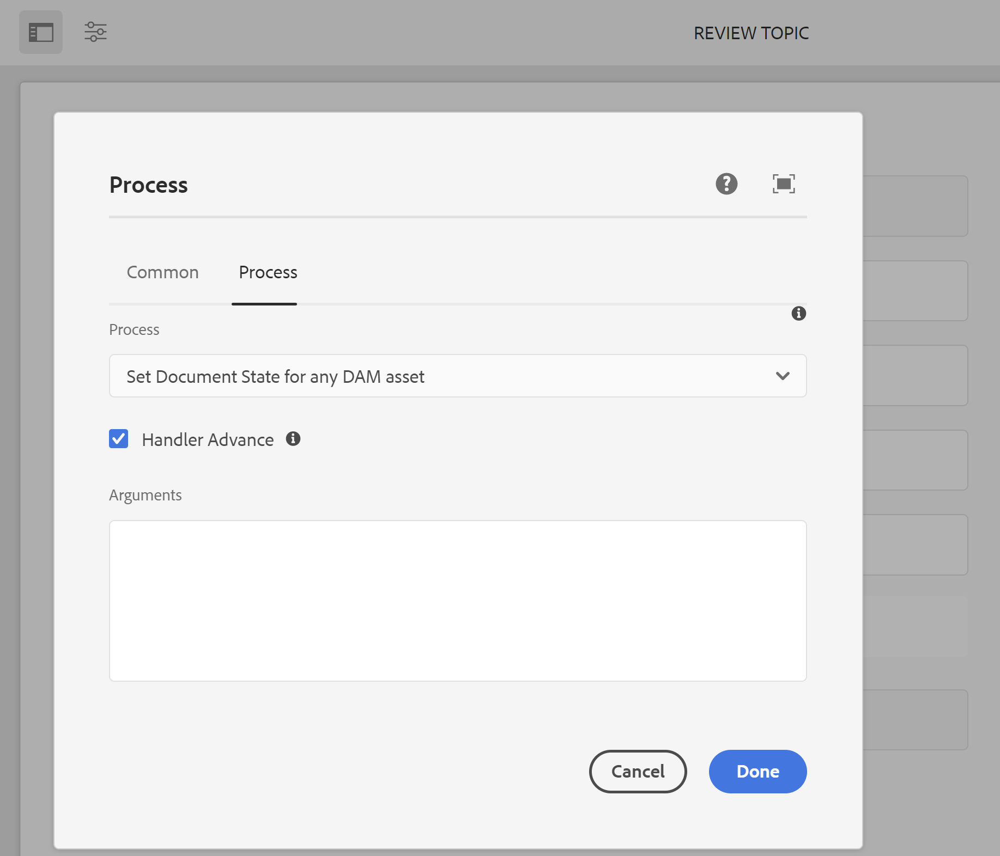

# 設定檔案狀態 {#id181GB0400UI}

AEM Guides可讓您根據組織的需求定義DITA主題的檔案狀態。 您可以從頭到尾定義檔案的不同狀態。 例如，第一個狀態可以是「草稿」，可以移至「稽核」、「已核准」、「已翻譯」，最後移至「已發佈」。

主題從一種狀態轉換到另一種狀態的方式有兩種：手動和自動。 在設定檔中定義的檔案狀態可用於手動變更檔案狀態。 您可以從主題檔案的「屬性」頁面進行這項作業。 您也可以定義誰可以將檔案從一個狀態移動到另一個狀態。 例如，作者可以建立檔案，而檔案的預設狀態可以是「草稿」。 當作者傳送檔案以供稽核時，她可以將檔案狀態變更為稽核中。 稽核者可以根據稽核程式將檔案狀態變更為「已核准」或再次變更為「草稿」。 如果檔案已核准，發佈者可以根據工作流程將檔案狀態變更為已翻譯或已發佈。

>[!NOTE]
>
> 如果使用者屬於&#x200B;*管理員*&#x200B;群組，則使用者可以從任何狀態變更檔案狀態，而不管系統中定義的檔案狀態轉換為何。

## 建立檔案狀態

AEM Guides隨附一組預設檔案狀態。 這些狀態包括：

- 草稿
- 編輯
- 稽核中
- 已核准
- 已檢閱
- 完成

這些預設狀態適用於在DAM下建立的所有DITA主題。 您可以建立自己的檔案狀態，並將這些狀態指派給特定資料夾。 然後，在該資料夾下建立的所有DITA檔案將擁有新建立檔案狀態的存取權。

若要使用「資料夾設定檔」建立檔案狀態，請執行下列步驟：

1. 按一下頂端的Adobe Experience Manager連結，然後選擇&#x200B;**工具**。
1. 從工具清單中選取&#x200B;**參考線**。
1. 按一下「檔案狀態」圖磚。

   Assets狀態頁面隨即顯示。 依預設，頁面會顯示預設的設定檔。

1. 按一下&#x200B;**建立設定檔**&#x200B;並輸入下列詳細資料：
   - 在「設定檔」欄位中輸入設定檔的名稱。
   - 指定您要套用新設定檔的路徑。
   - 在&#x200B;**狀態**&#x200B;底下，指定&#x200B;**允許狀態**&#x200B;中的檔案狀態。 預設檔案狀態為「草稿」、「編輯」、「稽核中」、「已核准」和「完成」。-

     按一下&#x200B;**新增**&#x200B;按鈕以新增檔案狀態。

      - 按一下「刪除」圖示可刪除檔案狀態。

     >[!NOTE]
     >
     > 如果檔案仍然處於狀態，請勿刪除檔案狀態。 如果您刪除檔案狀態，除非您屬於&#x200B;*管理員*&#x200B;使用者群組，否則您將無法變更此類檔案的檔案狀態。

   - 以&#x200B;**開始狀態**&#x200B;指定檔案的開始狀態。
   - 在&#x200B;**結束狀態**&#x200B;中指定檔案的結束狀態。
   - 在&#x200B;**狀態轉換**&#x200B;下的&#x200B;**從**&#x200B;到&#x200B;**到**&#x200B;中指定檔案的狀態轉換。

      - 指定可以在&#x200B;**群組**&#x200B;中變更檔案狀態的使用者和使用者群組。

      - 按一下&#x200B;**新增**&#x200B;按鈕以新增狀態轉換。

      - 按一下「刪除」圖示以刪除狀態轉換。

     >[!NOTE]
     >
     > 如果檔案仍處於`From`狀態，請勿刪除狀態轉換。 如果您刪除狀態轉換，除非您屬於&#x200B;*管理員*&#x200B;使用者群組，否則您將無法變更此類檔案的檔案狀態。

1. 按一下&#x200B;**「完成」**。

## 建立檔案狀態設定檔的復本

您可以視需要建立現有檔案狀態設定檔的復本。 您可以使用副本作為建立其他檔案設定檔的基礎。

若要建立檔案狀態設定檔的復本，請執行下列步驟：

1. 按一下頂端的Adobe Experience Manager連結，然後選擇&#x200B;**工具**。
1. 從工具清單中選取&#x200B;**參考線**。
1. 按一下「檔案狀態」圖磚。

   Assets狀態頁面隨即顯示。

1. 選取您要複製的檔案狀態設定檔，然後按一下&#x200B;**複製設定檔**。
1. 進行必要的變更，然後按一下&#x200B;**完成**。

## 刪除檔案狀態或狀態轉換

>[!NOTE]
>
> 如果檔案仍在狀態或狀態轉換中，請勿刪除檔案狀態或狀態轉換。 如果您刪除狀態或狀態轉換，除非您屬於&#x200B;*管理員*&#x200B;使用者群組，否則您將無法變更此類檔案的檔案狀態。

執行下列步驟，從檔案狀態設定檔中刪除檔案狀態或狀態轉移：

1. 按一下頂端的Adobe Experience Manager連結，然後選擇&#x200B;**工具**。
1. 從工具清單中選取&#x200B;**指南**。
1. 按一下「檔案狀態」圖磚。

   Assets狀態頁面隨即顯示。

1. 選取您要刪除檔案狀態的檔案狀態設定檔，然後按一下&#x200B;**編輯設定檔**。
1. 刪除檔案狀態或狀態轉換，然後按一下&#x200B;**完成**。

## 刪除檔案狀態設定檔

若要刪除檔案狀態設定檔，請執行下列步驟：

1. 按一下頂端的Adobe Experience Manager連結，然後選擇&#x200B;**工具**。
1. 從工具清單中選取&#x200B;**指南**。
1. 按一下&#x200B;**檔案狀態**&#x200B;圖磚。

   Assets狀態頁面隨即顯示。

1. 選取您要刪除的檔案狀態設定檔，然後按一下&#x200B;**刪除設定檔**。

## 自動化檔案狀態變更

如果您不想手動變更檔案狀態，您可以建立工作流程並自動變更檔案狀態。

>[!NOTE]
>
> 自動化工作流程應與設定中定義的檔案狀態和轉變一致。 系統不會執行任何透過自動化工作流程進行的狀態變更檢查。

1. 按一下頂端的Adobe Experience Manager連結，然後選擇&#x200B;**工具**。
1. 從工具清單中選取&#x200B;**工作流程**。

1. 按一下&#x200B;**模型**&#x200B;圖磚。

1. 選取相關工作流程，例如「檢閱主題」。

1. 按一下&#x200B;**編輯**。

   工作流程會在新標籤中開啟。

1. 按一下&#x200B;**編輯** \（右上方\）。

1. 開啟&#x200B;**步驟**&#x200B;瀏覽器；使用頂端工具列最左邊的&#x200B;**切換側面板**

1. 將適當的步驟拖曳到模型中的所需位置。

1. 按一下您在工作流程模型中新增的新步驟，然後從元件工具列選取&#x200B;**設定**

1. 開啟&#x200B;**處理序**&#x200B;標籤。

1. 在&#x200B;**程式**&#x200B;下拉式清單中，選取任何DAM資產的&#x200B;**設定檔案狀態**。

1. 選取&#x200B;**處理常式進階**&#x200B;選項。

   

1. 在&#x200B;**引數**&#x200B;文字方塊中，輸入要從選取的工作流程轉換到的檔案狀態。

   >[!NOTE]
   >
   > 請確定您在「引數」文字方塊中輸入正確的檔案狀態。 如果您輸入不正確的值，檔案將會設定為不正確的狀態。

1. 透過&#x200B;**儲存並關閉**&#x200B;確認變更。


## 啟用核准工作流程

AEM Guides提供檔案核准工作流程，可協助您控制檔案開發流程的生命週期。 若要啟用核准工作流程，請執行下列步驟：

1. 若要下載UI設定檔，請以管理員身分登入Adobe Experience Manager。

1. 按一下頂端的Adobe Experience Manager連結，然後選擇&#x200B;**工具**。
1. 從工具清單中選取&#x200B;**指南**，然後按一下&#x200B;**資料夾設定檔**。
1. 按一下&#x200B;**全域設定檔**&#x200B;圖磚。
1. 選取&#x200B;**XML編輯器設定**&#x200B;索引標籤，然後按一下頂端的&#x200B;**編輯**&#x200B;圖示
1. 按一下「**下載**」圖示，在本機系統上下載ui\_config.json檔案。 您可以接著對檔案進行變更，然後上傳相同的檔案。
1. 在`ui_config.json`檔案中，變更&#x200B;*功能*&#x200B;區段以啟用核准工作流程功能，如下所示：

   ```
   "features":  
   { 
      "approvalWorkflow":  true 
   }
   ```

1. 儲存檔案並上傳。
