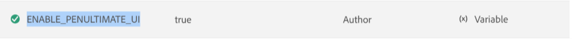

# 設定覆寫 {#id216IFC003XA}

要進行任何設定更新，應使用以下通用方法：

1. 存取您的Cloud Manager Git存放庫。

1. 在下列位置建立新的JSON檔案：

   src/main/content/jcr\_root/apps/fmditaCustom/config/

1. 以下列格式命名檔案：

   $\{PID\}.cfg.json

   在此，PID是設定的處理序ID。

1. 使用以下格式在JSON檔案中新增屬性：

   ```
   {
      "aem.adminuname": "updatedUserjson",
      "valid.characters": "[-a-zA-Z0-9_@$]",
      "dita.serialization": true
   }
   ```

1. 認可變更並執行Cloud Manager管道以部署更新的設定。

## 設定Experience Manager Guides UI

2025.02.0版的Adobe Experience Manager Guides提供翻新過的UI和增強功能，幫助您比以往更快更有效率地工作。 這包括全新的首頁、更乾淨且更有條理的編輯器工具列、專屬的地圖主控台，以及增強功能。

為了確保順暢的轉換並將中斷的情況降至最低，Experience Manager Guides提供可讓您視需要切換回舊版UI （反之亦然）的設定選項。

>[!IMPORTANT]
>
> 在2025.4.0版發行之前，都支援此設定選項來切換新舊的UI。 2025.6.0版已棄用此設定，且無法再用來回覆舊的UI。

執行以下步驟來設定Experience Manager Guides UI：

1. 開啟Adobe Experience Manager，然後選取包含您要設定環境的程式。
2. 切換至&#x200B;**環境**&#x200B;標籤。
3. 選取您要設定的環境名稱。 這應該會將您導覽至&#x200B;**環境資訊**&#x200B;頁面。
4. 切換至&#x200B;**組態**&#x200B;標籤。
5. 選取&#x200B;**新增/更新**。
6. 新增UI設定詳細資料。 確定您使用與下列熒幕擷取畫面相同的名稱和設定。

   {width="800" align="left"}

   將值設定為&#x200B;**true**&#x200B;會保留舊的UI，而&#x200B;**false**&#x200B;會啟用新的UI。


**上層主題：**[&#x200B;下載並安裝](download-install.md)
