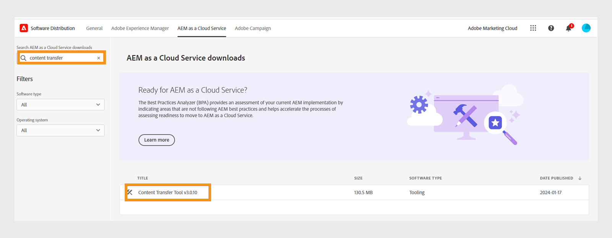
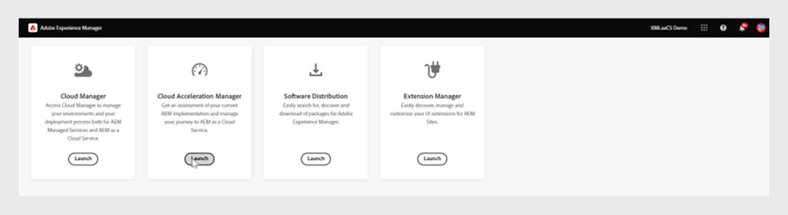
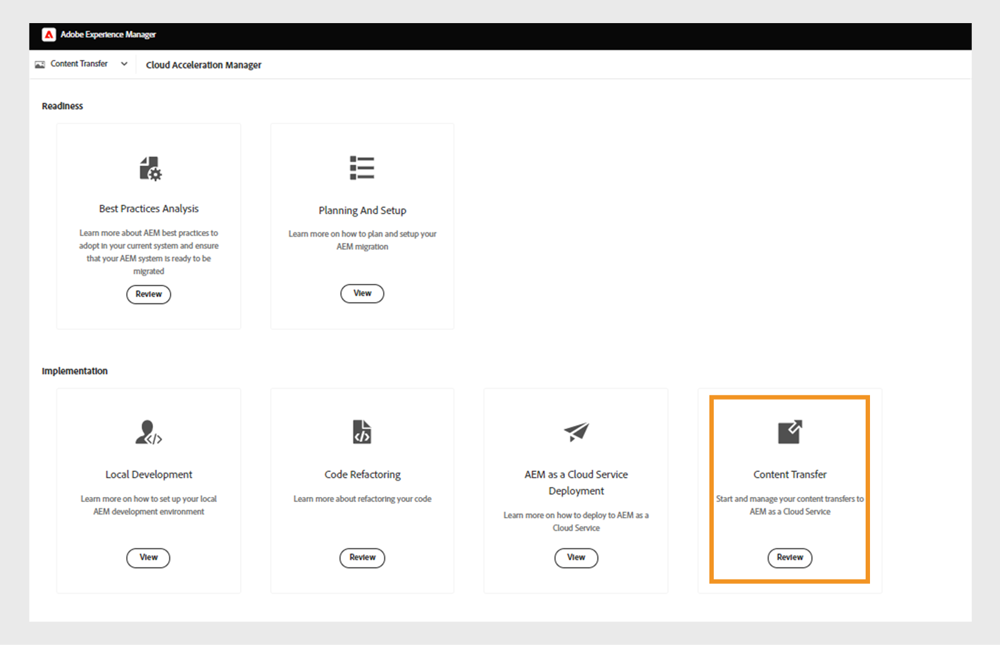
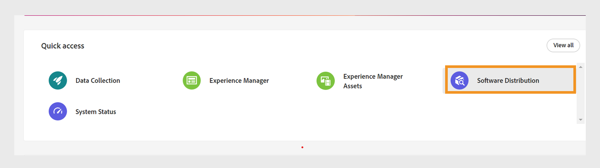
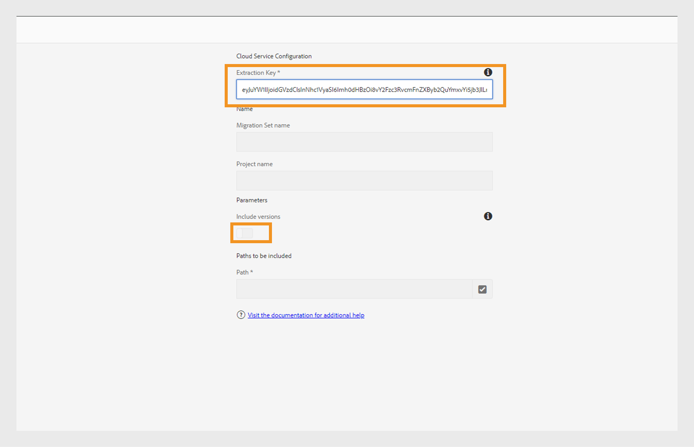
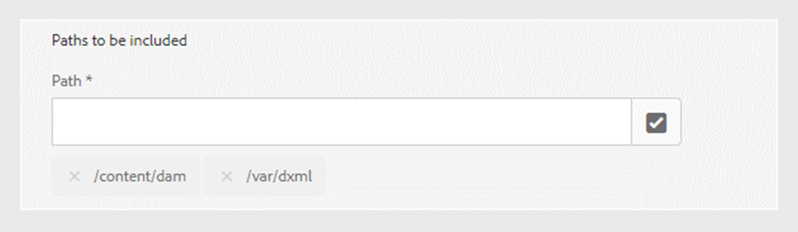
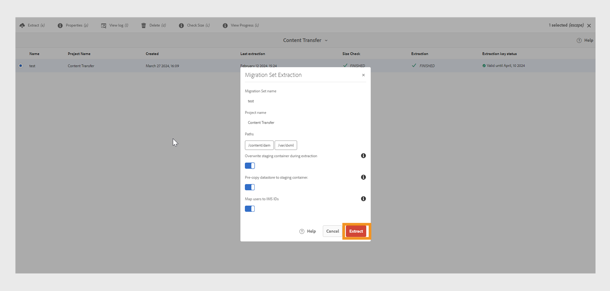
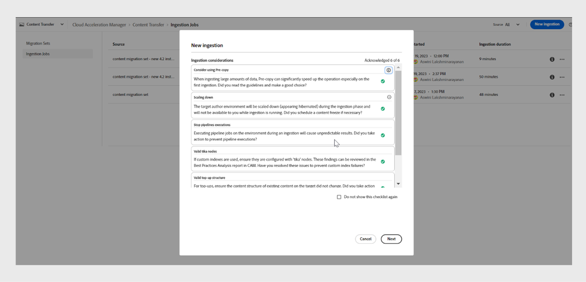
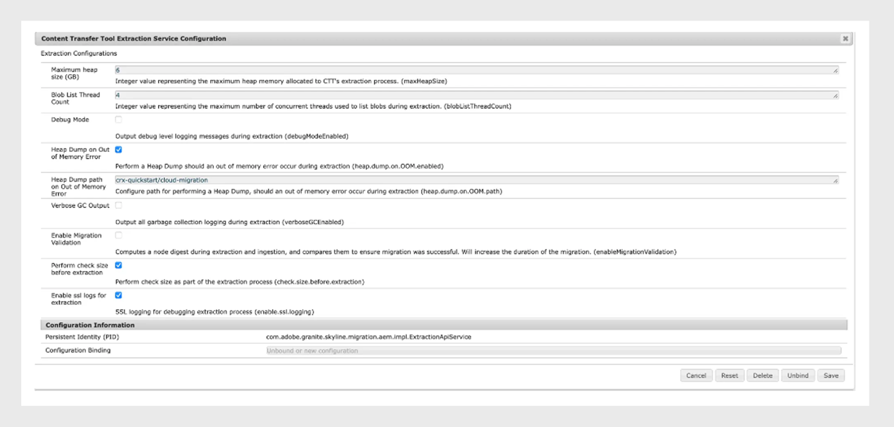

# 將內容從內部部署移轉至Cloud Service

Experience Manageras a Cloud Service為Experience Manager Guides、Assets、Forms和Screens提供可擴充、安全且敏捷的技術基礎。 這可讓行銷人員和IT專業人士專注於大規模提供具影響力的體驗。
透過Experience Manageras a Cloud Service，您的團隊便能專注於創新而非規劃產品升級。 新產品功能會經過徹底測試，並持續傳送給您的團隊，讓團隊可以隨時存取最新版Adobe Experience Manager。

本文提供將內部部署或Managed Services Experience Manager Guides內容移轉至Cloud Service的詳細逐步程式，確保順利轉換至雲端型平台。

## 必要條件

* Adobe Experience Manager 6.4或更新版本
* Experience Manager Guides應採用UUID版本。 如果您使用非UUID版本的Adobe Experience Manager Guides，請先使用[移轉非DITA內容](../install-guide/migrate-uuid-non-uuid.md)中的步驟移轉至UUID。
* 存取您要移轉內容之雲端執行個體的&#x200B;**Cloud Acceleration Manager**
* 支援高達20TB的存放庫大小
* 25 GB的Lucene索引總大小
* 節點名稱的長度必須少於150個位元組

## 移轉程式

**內容轉移工具**是由Adobe開發的工具，可用來啟動將現有內容從來源Adobe Experience Manager內部部署或Managed Services執行個體移轉至目標Experience Manager Cloud Service執行個體的作業。
此工具也會自動轉移主體 (使用者或群組)。

您可以從&#x200B;**軟體發佈**&#x200B;入口網站下載&#x200B;**內容轉移工具**&#x200B;的ZIP檔：

1. 選取&#x200B;**軟體發佈**&#x200B;入口網站上的&#x200B;**AEM as a Cloud Service**&#x200B;索引標籤。
1. 搜尋&#x200B;**內容轉移工具**。
1. 從清單中選取&#x200B;**內容轉移工具**&#x200B;並下載。

然後透過**封裝管理員**在您的來源Adobe Experience Manager執行個體上安裝封裝。 請務必下載最新版本。
如需最新版本的詳細資訊，請檢視[發行說明](https://experienceleague.adobe.com/docs/experience-manager-cloud-service/content/release-notes/release-notes/release-notes-current.html?lang=en)。

>[!NOTE]
> 
> 僅支援2.0.0版及更新版本，建議使用最新版本。

執行以下步驟，將Experience Manager Guides內容移轉至Experience Manager as a cloud service。

1. 登入[experience.adobe.com](https://experience.adobe.com/)並選取&#x200B;**Experience Manager**。

   

1. 在&#x200B;**Cloud Acceleration Manager**&#x200B;圖磚上按一下&#x200B;**啟動**。
   

1. 建立您的第一個專案。
   

1. 新增名稱和描述，然後按一下[建立]。**** 您的專案已建立。
1. 選取已建立的專案，並開啟專案畫面。
1. 在&#x200B;**內容轉移**&#x200B;圖磚上按一下&#x200B;**檢閱**。

   

1. 按一下&#x200B;**建立移轉集**。

1. 提供移轉集的名稱和說明。

   

1. 建立之後，請選取三個點，然後選取&#x200B;**複製擷取金鑰**。

1. 按一下&#x200B;**複製到剪貼簿**。 建立您的第一個專案。
   

1. 在上方選取「**Adobe Experience Manager**」，然後選取「**軟體發佈**」圖磚。
   

1. 在&#x200B;**軟體發佈**&#x200B;入口網站上，選取&#x200B;**Adobe Experience Manager作為Cloud Service**&#x200B;標籤，搜尋「內容轉移工具」並下載內容轉移工具套件。

   >[!NOTE]
   >
   >  請確定您下載最新版本。

1. 在內部部署執行個體的&#x200B;**封裝管理員**&#x200B;中上傳並安裝封裝`content-transfer.all-3.0.10.zip`。
   

1. 在內部部署執行個體上，選取&#x200B;**工具** > **作業** > **內容移轉** > **內容移轉**。

1. 選取&#x200B;**內容轉移**、建立移轉集，並貼上從Cloud Acceleration Manager複製的擷取金鑰。 這會在來源和目標之間建立連線。 然後它會驗證金鑰，並在輸入值後顯示有效性。

1. 啟用&#x200B;**包含版本**選項以包含檔案版本。
   

1. 提供您要移轉的路徑，然後按一下[儲存]。****
例如，`/content/sites`
或
   `/content/dam/tech-docs`
   

   >[!NOTE]
   >
   > 您必須為&#x200B;**Experience Manager Guides**&#x200B;內容強制移轉下列路徑。

   * `/content/dam`
   * `/var/dxml`

   建立移轉集時會限制下列路徑：
   * `/apps`
   * `/libs`
   * `/home`
   * `/etc`您可以選取CTT中的某些`/etc`路徑。

1. 按一下&#x200B;**儲存**
1. 選取&#x200B;**移轉集**，然後在頂端選取&#x200B;**擷取**。
   

1. 在&#x200B;**移轉集擷取**&#x200B;快顯視窗中驗證您所選取的路徑和設定的詳細資料，然後按一下&#x200B;**擷取**。 擷取需要幾分鐘的時間，而您將檢視更新狀態。
   

1. 擷取完成後，以狀態`finished`表示後，請前往Cloud Acceleration Manager並選取您在步驟18建立的專案。
如需詳細資訊，請選取三個點，然後選取**檢視詳細資料**。

1. 在移轉集詳細資訊快顯視窗中，驗證移轉集設定並關閉快顯視窗。 您可以檢視路徑和其他設定，如下列熒幕擷圖所示：
   

1. 按一下&#x200B;**內嵌工作** > **新增內嵌**。
1. 認可必要的核取記號值，然後按一下[建立]。****
   

1. 挑選移轉集，選取環境所需的伺服器，然後按一下[內嵌]。****

   

## 在Publish執行個體上執行內容轉移工具

在來源Publish例項上安裝內容轉移工具，以將內容移至目標Publish例項。
將內容擷取至Publish環境時，「內容轉移工具」不會區分已發佈和未發佈的內容。 移轉集中指定的內容會擷取到所選的目標執行個體。 使用者可將移轉集內嵌至作者例項、Publish例項，或兩者皆有。

### 建議做法

請考量下列建議：

* 使用與Author執行個體上使用的&#x200B;**內容轉移工具**&#x200B;相同版本。
* 在擷取至Publish期間，Publish層級將不會縮小（不像作者）。
* 僅移轉單一Publish節點。 開始提取之前，請從負載平衡器將其移除。

>[!NOTE]
>
> 為了預防，請確定Publish執行個體上不會發生寫入操作，包括使用者起始的動作，例如：
> * 在該環境中從AEM as a Cloud Service Author到Publish的內容發佈
> * Publish執行個體之間的使用者同步

## 疑難排解

如果擷取因下列錯誤而失敗，則您可匯入相關的CA憑證來解決此問題：

`javax.net.ssl.SSLHandshakeException: sun.security.validator.ValidatorException: PKIX path building failed: sun.security.provider.certpath.SunCertPathBuilderException: unable to find valid certification path to requested target`

**原因**： Adobe Experience Manager伺服器有防火牆限制，因此請將下列端點新增至允許清單。

`casstorageprod.blob.core.windows.net`

*啟用SSL記錄。*

