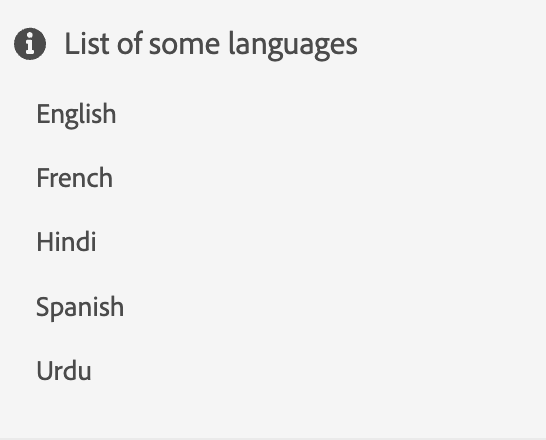

# Widget

如「元件」一節所述，可結合多個基本元件以產生Widget。
Widget可用來建立新的「更複雜」元件，或為元件專案提供結構。

讓我們來深入探討Widget的概念！

我們先製作一個簡單的Widget來顯示語言清單。

```js title="basicWidget.js"
const widgetJSON =  {
    "component": "div", 
    "id": "widget_languages", 
    "items": [ // adding components to the widget
        {
            "component": "div",
            "items": [
                {
                    "component": "icon",
                    "icon": "info"
                },
                {
                    "component": "label",
                    "label": "List of some languages"
                }
            ]
        },
        {
            "component": "list",
            "data": "@languages"
        }
    ]
},
```

在此，`@languages`是在`widget_languages`的模型中定義的陣列，如： [&quot;English&quot;、&quot;French&quot;、&quot;Hindi&quot;、&quot;Spanish&quot;、&quot;Urdu&quot;]

演算後的基本Widget如下所示：


