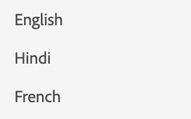

# 清單

若要顯示清單，我們使用元件清單。

```js title="list.js"
const listJSON =  {
    "component": "list", //tells the component name
    "data": "@languages", // an array of list items
},
```

在這裡，語言是一組簡單的字串。 `languages = ["English", "Hindi", "French"]`
如果我們想要呈現物件清單，可以使用專案設定來指定結構。

```js title="list.js"
const listJSON =  {
    "component": "list", //tells the component name
    "data": "@projects", // an array of list items
    "itemConfig": { // used to define the structure of the list items.
    "component": "widget",
    "id": "checkbox_label"
    }
},
```

itemConfig通常是`widget`。 若要深入瞭解Widget，請前往[Widget](../Widgets/basic-widget.md)

轉譯後的清單看起來像這樣：


