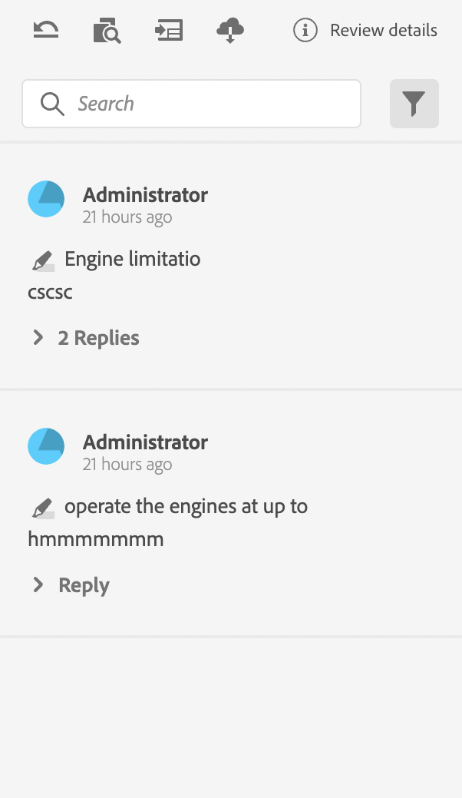

# 評論應用程式的元件

以下為稽核應用程式的主要元件：

- 內嵌稽核面板： `id: inline_review_panel`
   - 在XML編輯器端呈現稽核註解的右側面板。

- 主題評論： `id: topic_reviews`
   - 在「稽核應用程式」上呈現註解的右側面板。

- 檢閱註解： `id: review_comment`
   - 每個稽核註解的Widget。

檢閱應用程式上的檢閱評論：

檢閱xml編輯器端的註解：

- 評論回覆： `id: comment_reply`
   - 每個評論回覆的Widget。
     

- 新的評論回覆： `id: comment_new_reply`
   - 新評論回覆的Widget。
     

- 註解工具箱： `id: annotation_toolbox`
   - 檢閱應用程式右上方的工具列。
     
