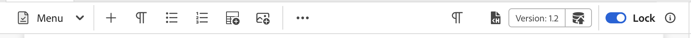
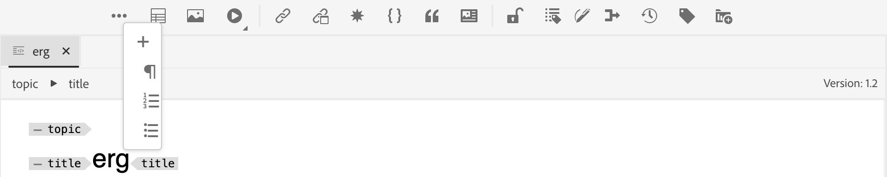

# 自訂標題列和工具列

若要自訂`topbar`和`toolbar`，您可以使用ID： `topbar`或`toolbar`，並遵循相同的檢視、控制器結構。

>[!NOTE]
>
>從2502版的Experience Manager Guides開始，識別碼&#x200B;**工具列**&#x200B;已重新命名為&#x200B;**編輯器工具列**。 如果您使用舊版，可以使用&#x200B;**工具列** ID自訂工具列。 我們目前沒有任何識別碼做為&#x200B;**topbar**，而且已有&#x200B;**editor_tab_bar**。

以下是工具列自訂的簡單範例。 我們已移除「`Insert Numbered List`」按鈕，並使用自訂的點按處理常式將「`Insert Paragraph`」按鈕取代為我們自己的元件。

>[!TIP]
>
>由於&#x200B;**editor_toolbar**&#x200B;設計用來呈現按鈕，因此新增Widget可能會中斷其CSS和回應能力。 建議僅包含按鈕或基本元件，例如標籤。

若要存取`proxy`物件下公開的功能，您必須使用`this.getValue`存取它，以擷取值為例。

若為AEM Guides 2502版本及其他版本，您可以參閱以下範例以自訂工具列。

```js title = toolbar_customization.js
const toolbarExtend = {
    id: "editor_toolbar",
    view: {
        items: [
            {
                component: "div",
                target: {
                    key:"title",value: "Insert Numbered List",                    
                    viewState: VIEW_STATE.REPLACE
                }
            },
            {
                "component": "button",
                "icon": "textParagraph",
                "variant": "action",
                "quiet": true,
                "title": "Insert Paragraph",
                "on-click": "INSERT_P",
                target: {
                    key:"title",value: "Insert Paragraph",                    
                    viewState: VIEW_STATE.REPLACE
                }
            },
            {
                "component": "button",
                "icon": "fileHTML",
                "variant": "action",
                "quiet": true,
                "title": "URL Link Customization",
                "on-click": "openExternalLinkDialog",
                target: {
                key: "title", value: "Insert Bulleted List",
                viewState: VIEW_STATE.REPLACE
                }
            }
        ]
    },
    controller: {
        init: function() {
            console.log(this.getValue("canUndo"))
            this.subscribeAppEvent({
              key: "editor.preview_rendered",
              next: async function (e) {
                console.log(this.getValue("canUndo"))
              }.bind(this)
            })
        },
        INSERT_P(){
            this.appEventHandlerNext("AUTHOR_INSERT_ELEMENT",  "p" )
        },
        openExternalLinkDialog() {
            this.appEventHandlerNext("AUTHOR_INSERT_ELEMENT",
                {
                args: "<xref href='' scope='external' format = 'dita' ></xref>", activeTabId: "conkey_reference"
                }
            )
        }
    }
}
```


自訂後，最終輸出如下所示：



如果自訂AEM Guides 4.6.x版和先前版本上的工具列，請參閱以下範例。

```js title = toolbar_customization.js
const topbarExtend = {
    id: "toolbar",
    view: {
        items: [
            {
                component: "div",
                target: {
                    key:"title",value: "Insert Element",                    
                    viewState: VIEW_STATE.REPLACE
                }
            },
            {
                component: "div",
                target: {
                    key:"title",value: "Insert Paragraph",                    
                    viewState: VIEW_STATE.REPLACE
                }
            },
            {
                component: "div",
                target: {
                    key:"title",value: "Insert Numbered List",                    
                    viewState: VIEW_STATE.REPLACE
                }
            },
            {
                component: "div",
                target: {
                    key:"title",value: "Insert Bulleted List",                    
                    viewState: VIEW_STATE.REPLACE
                }
            },
            {
                "component": "button",
                "extraclass": "insert-multimedia",
                "icon": "more",
                "variant": "action",
                "quiet": true,
                "holdAffordance": true,
                "title": "More Insert Options",
                "elementID": "toolbar_insert",
                "on-click": {
                    "name": "APP_SHOW_OPTIONS_POPOVER",
                    "args":{
                        "target": "toolbar_insert",
                        "extraclass": "new_options_buttons",
                        "items": [
                            {
                                "component": "button",
                                "icon": "add",
                                "variant": "action",
                                "quiet": true,
                                "title": "Insert Element",
                                "on-click": "AUTHOR_SHOW_INSERT_ELEMENT_UI"
                            },
                            {
                                "component": "button",
                                "icon": "textParagraph",
                                "variant": "action",
                                "quiet": true,
                                "title": "Insert Paragraph",
                                "on-click": "INSERT_P"
                            },
                            {
                                "component": "button",
                                "icon": "textNumbered",
                                "variant": "action",
                                "quiet": true,
                                "title": "Insert Numbered List",
                                "on-click": "AUTHOR_INSERT_REMOVE_NUMBERED_LIST"
                            },
                            {
                                "component": "button",
                                "icon": "textBulleted",
                                "variant": "action",
                                "quiet": true,
                                "title": "Insert Bulleted List",
                                "on-click": "AUTHOR_INSERT_REMOVE_BULLETED_LIST"
                            },
                            {
                                "component": "button",
                                "icon": "table",
                                "variant": "action",
                                "quiet": true,
                                "title": "Insert Table",
                                "on-click": "AUTHOR_INSERT_ELEMENT",
                            }
                        ]
                    },
                },
                target: {
                    key:"title",value: "Insert Table",                    
                    viewState: VIEW_STATE.REPLACE
                }
            },
        ]
    },
    controller: {
        init() {
            console.log(this.proxy.getValue('canUndo'))
            this.proxy.subscribeAppEvent({
                key: "editor.preview_rendered",
                next: async function (e) {
                    console.log(this.proxy.getValue('canUndo'))
                }.bind(this)
            })
        },
        INSERT_P(){
            this.next("AUTHOR_INSERT_ELEMENT",  "p" )
        }
    }
}
```

自訂後，最終輸出如下所示：




在另一個範例中，我們會建立自訂工具列按鈕，可以直接跳至&#x200B;**交叉參照**&#x200B;的所需子選項，例如電子郵件、檔案參照、Weblink等。


```js title = toolbar_customisation.js
const toolbarExtend = {
    id: "editor_toolbar",
    view: {
        items: [
            
                {
                    "component": "button",
                    "icon": "fileHTML",
                    "variant": "action",
                    "quiet": true,
                    "title": "External URL Link",
                    "on-click": "openExternalLinkDialogP",
            
                target: {
                    key:"title",value: "Insert Bulleted List",                    
                    viewState: VIEW_STATE.REPLACE
                }
            }
        ]
    },
    controller: {
        openExternalLinkDialog() {
            tcx.eventHandler.next ("AUTHOR_INSERT_ELEMENT")
            t{
          args:"<xref href='' scope='external' format = 'dita' ></xref>",activeTabId:"conkey_reference"
        }
    }
  }
}
```

在此，`activeTabId`是選取正確索引標籤的列舉。 依預設，選取「交叉參照」標籤會開啟`file_link`。 您可以視需求將`activeTabId`值變更為`content_reference`、`conkey_reference`、`key_reference`、`file_link`、`web_link`和` email_link`。
