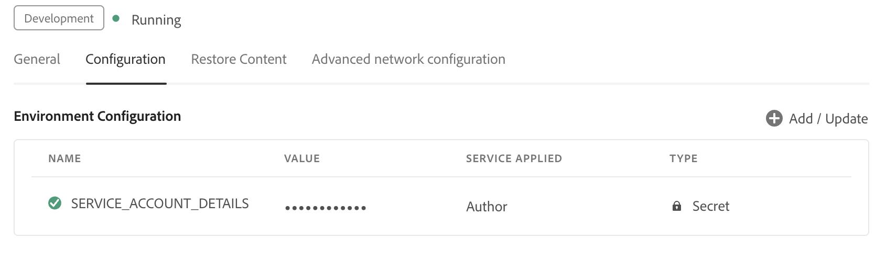

# 為Cloud Service以代理模式設定AI助理

作為管理員，您可以在Experience Manager Guides中為您的組織以代理模式配置AI助理。 設定步驟依您的AEM as a Cloud Service環境中是否啟用Unified Shell設定，以及使用者是透過SSO或非SSO驗證登入而有所不同。 本文會說明每個案例的設定程式。

## 必備條件

您必須先將您的組織加入&#x200B;**CX Enterprise Coworker**，才能以代理模式設定AI小幫手。

## 根據您的環境設定AI助理

使用下表來識別套用至使用者的設定路徑，然後遵循對應步驟進行。

| Unified shell | 登入型別 | 需要設定 |
|---|---|---|
| 已啟用 | SSO | 沒有其他設定。 一切開箱即用 |
| 已啟用 | 非SSO | 將IMS設定新增至環境 |
| 已停用 | SSO | 將IMS設定新增至環境 |
| 已停用 | 非SSO | 將IMS設定新增至環境 |

### 已啟用Unified Shell的使用者

**SSO登入**

如果已啟用Unified Shell且您的使用者透過SSO登入，則不需要進行其他設定。 當您的組織加入CX Enterprise Coworker後，代理模式中的AI助理就會自動運作。

**非SSO登入**

如果已啟用Unified Shell，但您的使用者在沒有SSO的情況下登入，則您必須[將IMS設定新增到下面的環境](#add-ims-configuration-to-the-environment)。

### 已停用Unified Shell的使用者

如果Unified Shell已停用，您必須針對下列兩者[將IMS設定新增到環境](#add-ims-configuration-to-the-environment)：

- SSO登入
- 非SSO登入

## 將IMS設定新增至環境

執行以下步驟，將IMS設定新增至環境：

1. 開啟Experience Manager，然後選取包含您要設定環境的程式。

2. 切換至&#x200B;**環境**&#x200B;標籤。

3. 選取您要設定的環境名稱。 這會將您導覽至&#x200B;**環境資訊**&#x200B;頁面。

4. 切換至&#x200B;**組態**&#x200B;標籤。

5. 將JSON服務詳細資料（在您於Adobe Developer Console中建立IMS設定時下載）貼到與`SERVICE_ACCOUNT_DETAILS`相對應的&#x200B;**值**&#x200B;欄位。 確定您使用環境預期的相同名稱和設定。

>[!NOTE]
>如果您尚未為您的環境建立OAuth/IMS憑證，請先在Adobe Developer Console中建立，然後再完成此步驟。

{width="800"}

## 啟用代理模式

為您的環境完成設定後，請聯絡客戶成功團隊以啟用代理模式。

為您的環境啟用代理程式模式後，請瀏覽至&#x200B;**Workspace設定**，並在&#x200B;**AI助理**&#x200B;區段的&#x200B;**一般**&#x200B;標籤下啟用&#x200B;**代理**&#x200B;切換。
