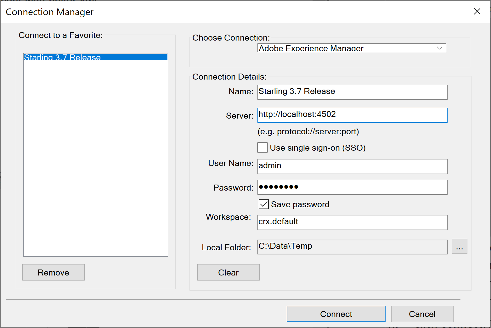

# 使用WebDAV工具及適用於內部部署的FrameMaker上傳現有DITA內容

您很可能擁有要與AEM Guides搭配使用的現有DITA內容存放庫。 對於這類現有內容，您可以使用下列任何一種方法，將內容大量上傳至AEM存放庫。

- [使用WebDAV工具](#use-a-webdav-tool)
- [使用FrameMaker](#use-framemaker)

## 使用WebDAV工具

如果您使用任何其他DITA編輯器編寫主題和地圖，您可以使用任何WebDAV工具來上傳檔案。 本節提供的程式使用WinSCP作為WebDAV工具來上傳內容。

執行以下步驟，使用WinSCP上傳檔案：

1. 下載並安裝WinSCP到您的電腦。

1. 啟動WinSCP應用程式

   「登入」對話方塊隨即顯示。

1. 在[登入]對話方塊中，選擇WebDAV作為&#x200B;**檔案通訊協定**&#x200B;並提供其他連線詳細資訊，以指定[新站台]設定，例如：

   - 託管AEM伺服器的URL、

   - 連線埠號碼`\(default is 4502\)`，以及

   - 存取您的AEM伺服器的使用者名稱和密碼。

1. 選取&#x200B;**登入**。

   成功連線後，您會在WinSCP使用者介面中看到AEM Assets的內容。 您可以使用WinSCP檔案總管輕鬆瀏覽、建立、更新或刪除內容。

## 使用WebDav工具以UUID上傳內容 {#id201MI0I04Y4}

您可以使用下列任何一種方法，透過UUID上傳您的內容：

- 從您的本機系統拖放內容。
- 使用AEM Assets UI中的&#x200B;**建立** \> **檔案**&#x200B;工作流程。
- 使用WinSCP之類的工具。

如果您使用WinSCP之類的工具，您可以設定configMgr中的&#x200B;**將具有相同UUID的舊檔案移動至新資料夾**&#x200B;選項，以定義要在重複檔案上執行的動作。 此選項會定義在檔案上執行的動作，該檔案可在AEM存放庫中的其他位置取得。 此設定可在configMgr的`*com.adobe.fmdita.config.ConfigManager*`套件組合中使用。

預設會開啟&#x200B;**將具有相同UUID的舊檔案移動到新資料夾**&#x200B;選項。 這代表上傳的檔案出現在存放庫中的其他資料夾時，現有檔案會移至目前位置並以上傳的檔案覆寫。 如果您未選取此選項，則檔案會在其現有位置被覆寫。

**使用UUID檔案的其他附註**：

在AEM存放庫中移動或複製內容時，必須考量下列幾點：

- 將一或多個檔案從一個位置複製到另一個位置時，系統會為不含任何UUID的檔案產生新的UUID。 此UUID會新增至檔案的中繼資料中。

- 如果檔案有衝突或重複，則會針對要複製或移動的新檔案產生唯一的檔案名稱。

- 沒有兩個檔案可以有相同的UUID。 會將唯一的UUID指派給所有新檔案。

將內容從本機系統移動或複製到AEM存放庫時，必須考量下列幾點：

- 如果檔案由兩個不同的使用者同時上傳，則稍後處理的檔案會覆寫較早的檔案。 然而，這種做法十分罕見，應避免使用。

- 當您從AEM存放庫簽出內容並在本機系統上變更時，請確保檔案名稱在上傳檔案時未變更。

## 使用FrameMaker

Adobe FrameMaker隨附強大的AEM聯結器，可讓您輕鬆將現有DITA和其他FrameMaker檔案`\(.book and .fm\)`上傳到AEM。 您可以使用各種檔案上傳功能，例如上傳單一檔案、上傳具有或不具有相依性的完整資料夾\（如內容參照、交叉參照和圖形\）。

執行以下步驟，使用FrameMaker的AEM Connector上傳內容：

1. 啟動FrameMaker。

1. 開啟&#x200B;**連線管理員**&#x200B;對話方塊。

   {width="550" align="left"}

1. 輸入以下詳細資料以連線至AEM存放庫：

   - **名稱**：輸入描述性名稱，以識別與AEM伺服器的連線。
   - **伺服器**：輸入AEM伺服器的URL和連線埠號碼。

   - **使用者名稱**/**密碼**：輸入使用者名稱和密碼以存取AEM伺服器。

1. 選取&#x200B;**連線**。

   成功建立連線後，AEM存放庫中的Assets會顯示在「存放庫管理員」視窗中。

   {width="550" align="left"}

   以滑鼠右鍵按一下任何檔案或資料夾，即可執行相關作業。 例如，如果以滑鼠右鍵按一下資料夾，您會獲得以下選項：上傳檔案、上傳具有相依性的檔案、上傳整個資料夾等。

**上層主題：**[&#x200B;移轉現有內容](migrate-content.md)
