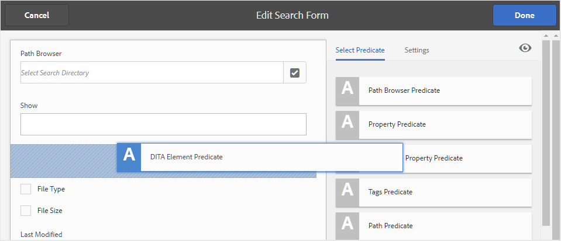

# 設定AEM Assets UI搜尋 {#id192SC800MY4}

依預設，AEM不會識別DITA內容，因此不會提供任何機制來搜尋其存放庫中的DITA內容。 AEM Guides可讓您在AEM存放庫中新增DITA內容搜尋功能。

依預設，AEM不會識別DITA內容，因此不會提供任何機制來搜尋其存放庫中的DITA內容。 此外，也沒有OOTB功能可根據其UUID搜尋內容。 AEM Guides可讓您在AEM存放庫中新增DITA內容搜尋和UUID型搜尋功能。

要設定DITA內容搜尋，必須執行下列工作：

1. [在資產UI中新增DITA元素搜尋元件](#id192SF0F50HS)
1. [在資產UI中新增UUID型搜尋元件](#id2034F04K05Z)
1. [提供許可權給使用者](#id192SF0G0RUI)
1. [在搜尋中新增自訂元素或屬性](#id192SF0G10YK)
1. [從現有內容擷取中繼資料](#id192SF0GA0HT)

除了新增搜尋功能外，您也可以設定不應納入搜尋的資料夾。 如需詳細資訊，請參閱 [從搜尋結果中排除暫存檔](#id197AHI0035Z).

## 在資產UI中新增DITA元素搜尋元件 {#id192SF0F50HS}

執行以下動作，在AEM Assets UI中新增DITA內容搜尋元件：

1. 以管理員身分登入Adobe Experience Manager。

1. 按一下 **Adobe Experience Manager** 在頂端連結，然後選擇 **工具**.

1. 選取 **一般** 工具清單中，按一下 **搜尋Forms** 圖磚。

1. 在 **搜尋Forms** 清單中，選取 **資產管理搜尋邊欄**.

1. 按一下 **編輯**.
1. 在 **選取述詞** 標籤，捲動至清單結尾。

1. 拖放 **DITA元素述詞** 在搜尋表單的所需位置。

   {width="650" align="left"}

1. 按一下 **完成** 以儲存變更。

   當您存取資產UI中的篩選選項時，將會取得DITA元素搜尋篩選選項。

   {width="350" align="left"}


## 在資產UI中新增UUID型搜尋元件 {#id2034F04K05Z}

執行以下步驟，在AEM Assets UI中新增UUID型搜尋元件：

1. 以管理員身分登入Adobe Experience Manager。

1. 按一下 **Adobe Experience Manager** 在頂端連結，然後選擇 **工具**.

1. 選取 **一般** 工具清單中，按一下 **搜尋Forms** 圖磚。

1. 在 **搜尋Forms** 清單中，選取 **資產管理搜尋邊欄**.

1. 按一下 **編輯**.
1. 在 **選取述詞** 索引標籤，選擇 **屬性述詞** 並將它拖放到搜尋表單中的所需位置。

1. 在 **設定** 索引標籤，為新新增的提供下列詳細資訊 **屬性述詞** 元件：

   - **欄位標籤**： UUID
   - **屬性名稱**： jcr：content/fmUuid
1. 按一下 **完成** 以儲存變更。

   當您存取Assets UI中的「篩選器」選項時，您將會取得UIS型搜尋篩選選項。


## 提供許可權給使用者 {#id192SF0G0RUI}

作者與發佈者必須獲得明確許可權，才能從Assets UI存取搜尋功能。 如果您不授予這些許可權，您的使用者將無法根據其元素/屬性值或UUID搜尋DITA內容。

執行下列步驟以提供對DITA搜尋功能的存取：

1. 存取使用者和群組許可權頁面。 存取頁面的預設URL為：

   `http://<server name>:<port>/useradmin.html`

1. 搜尋您要授予存取權的使用者群組或個別使用者。 例如，若要將存取權授與作者群組中的所有使用者，請在 **篩選查詢** 欄位並按 **輸入**.

   {width="350" align="left"}

1. 選取 **作者** 群組。

1. 在右窗格中，選取 **許可權** 標籤。

1. 導覽至下列資料夾位置：

   /conf/global/settings/dam/search

1. 提供 **讀取** 搜尋資料夾的許可權。

   {width="650" align="left"}

1. 按一下「**儲存**」。


選取的使用者或使用者群組現在可以存取資產UI中的搜尋DITA內容功能。

## 在搜尋中新增自訂元素或屬性 {#id192SF0G10YK}

為了讓DITA搜尋能夠運作，需要對DITA內容進行某些預先處理。 此預先處理步驟會從個別DITA map和主題中擷取選擇性內容，以便索引化內容以加快搜尋速度。 此程式在內部稱為 *序列化*. DITA檔案的序列化會在內容上傳期間發生，也可以隨選執行。 它使用組態檔案來決定每個DITA檔案中應該索引多少內容。 序列化檔案的預設位置為：

/libs/fmdita/config/serializationconfig.xml

預設搜尋組態可讓您搜尋DITA內的所有元素和屬性 `prolog` 元素。 如果您要根據其他元素或屬性進行搜尋，則需要設定搜尋序列化檔案。

>[!NOTE]
>
> 如果您想使用中的預設搜尋設定 `prolog` 元素，則可以略過此程式。

此檔案包含兩個主要區段 — 屬性集和規則集。 規則集區段的片段如下所示：

```XML
<ruleset filetypes="xml dita"><!-- Element rules --><rule xpath="//[contains(@class, 'topic/topic')]/[contains(@class, 'topic/prolog')]//*[not(*)]" text="yes" attributeset="all-attrs" /><!-- Attribute rules --><rule xpath="//[contains(@class, 'topic/topic')]/[contains(@class, 'topic/prolog')]///@[local-name() != 'class']" /></ruleset>
```

在規則集段落中，您可以指定：

- 擷取元素的規則

- 用於擷取屬性的規則


規則包含下列專案：

xpath ：這是從DITA檔案擷取元素或屬性的XPath查詢。 元素規則的預設設定會擷取全部 `prolog` 元素。 而且，屬性規則的預設設定會擷取所有屬性 `prolog` 元素。 您可以指定XPath查詢來序列化您要搜尋的元素或屬性。

XPath查詢包含檔案型別的類別名稱。 此 `topic/topic` 類別用於主題型別DITA檔案。 如果要為其他DITA檔案建立規則，則必須使用下列類別名稱：

| 檔案型別 | 類別名稱 |
|-------------|----------|
| 主題 |  — 主題/主題 |
| 任務 |  — 主題/主題任務/任務 |
| 概念 |  — 主題/主題概念/概念 |
| 參考 |  — 主題/主題參照/參照 |
| 地圖 |  — 地圖/地圖 |

文字：如果您想要搜尋指定元素中的文字，請指定yes值。 如果您指定no as值，則只會序列化元素內的屬性。 您要在屬性集區段中搜尋的屬性必須指定。

attributeset ：指定您要與此規則產生關聯的屬性集ID。 all-attrs值是一個特殊的大小寫，表示此規則的所有屬性都必須序列化。

屬性集包含您要在DITA內容中搜尋的屬性清單。 屬性集包含下列專案：

id ：屬性集的唯一識別碼。 這個ID是在規則集的屬性集引數中指定的。

attribute ：您要搜尋的屬性清單。 對於每個屬性，您都需要在 `attribute` 元素。

執行以下步驟，在搜尋序列化檔案中新增自訂DITA元素或屬性：

1. 登入AEM並開啟CRXDE Lite模式。

1. 導覽至序列化組態檔，可從下列位置取得：

   /libs/fmdita/config/serializationconfig.xml

1. 建立「 」的覆蓋節點 `config` 資料夾(在 `apps` 節點。

1. 導覽至 `apps` 節點：

   `/apps/fmdita/config/serializationconfig.xml`

1. 新增必要的元素或屬性規則集。

1. 儲存檔案。

1. 開啟Adobe Experience Manager Web主控台設定頁面。 存取設定頁面的預設URL為：

   http://&lt;server name=&quot;&quot;>：&lt;port>/system/console/configMgr

1. 搜尋並按一下 *com.adobe.fmdita.config.ConfigManager* 套件組合。

1. 按一下「**儲存**」。


新的序列化資訊會儲存並啟動以供搜尋。 不過，您必須從現有DITA內容中擷取中繼資料，才能供搜尋。

## 從現有內容擷取中繼資料 {#id192SF0GA0HT}

在預設搜尋序列化檔案中進行任何變更後，您必須在以下位置啟用DITA中繼資料擷取選項： *com.adobe.fmdita.config.ConfigManager* 組合併執行工作流程以擷取中繼資料。 這會從現有DITA檔案中擷取所需的中繼資料，然後可讓您搜尋相同的中繼資料。

如果您在更新序列化檔案之後建立新檔案或編輯任何檔案，則會自動從此類檔案中擷取中繼資料。 只有在AEM儲存庫中已經存在的檔案才需要解壓縮中繼資料的程式。

從現有DITA檔案擷取中繼資料涉及兩個工作：

1. 在configMgr中啟用中繼資料擷取選項
1. 執行中繼資料擷取工作流程

執行以下步驟，在configMgr中啟用中繼資料擷取選項：

1. 開啟Adobe Experience Manager Web主控台設定頁面。 存取設定頁面的預設URL為：

   http://&lt;server name=&quot;&quot;>：&lt;port>/system/console/configMgr

1. 搜尋並按一下 *com.adobe.fmdita.config.ConfigManager* 套件組合。

1. 選取 **啟用DITA中繼資料擷取** 選項。

1. 按一下「**儲存**」。


執行以下步驟以執行中繼資料擷取工作流程：

1. 以管理員身分登入Adobe Experience Manager。

1. 按一下 **Adobe Experience Manager** 在頂端連結，然後選擇 **工具**.

1. 選取 **指南** 從工具清單中，按一下 **DITA中繼資料提取** 圖磚。

1. 如果您想從單一檔案及其相依性擷取中繼資料，請按一下 **選取檔案** 連結並瀏覽檔案。

1. 如果您想要從資料夾內的多個檔案擷取中繼資料，請按一下 **選取資料夾** 連結，瀏覽並選取所需的資料夾。 按一下 **新增** 按鈕以將資料夾新增至序列化工作清單。

   >[!NOTE]
   >
   > 您可以選取多個資料夾並將其新增至序列化任務。

1. 按一下 **開始**.

1. 在確認中繼資料擷取對話方塊中，按一下 **確定**.


## 從搜尋結果中排除暫存檔 {#id197AHI0035Z}

依預設，會在整個AEM存放庫上執行搜尋。 可能有您想從搜尋中排除的一些位置。 例如，當您啟動內容翻譯工作流程時，未核准的檔案會保留在暫時的資料夾位置。 執行搜尋時，搜尋結果中也會傳回此暫存位置的檔案。

為了防止AEM Guides搜尋暫存翻譯資料夾位置，您需要在排除清單中新增暫存資料夾位置。

執行以下步驟，從搜尋中排除暫存翻譯資料夾：

>[!NOTE]
>
> 您可以使用此程式將任何其他資料夾位置新增至排除清單。

1. 登入AEM並開啟CRXDE Lite模式。

1. 導覽至下列位置提供的damAssetLucene節點：

   /oak：index/damAssetLucene

1. 在damAssetLucene節點中新增以下屬性：

   | 屬性名稱 | 類型 | 值 |
   |-------------|----|-----|
   | excludedPaths | String\[\] | 將下列值新增至此屬性： <br>/content/dam/projects/translation\_output |

1. 導覽至下列位置提供的lucene節點：

   /oak：index/lucene

1. 在lucene節點中新增以下屬性：

   | 屬性名稱 | 類型 | 值 |
   |-------------|----|-----|
   | excludedPaths | String\[\] | 將下列值新增至此屬性： <br><ul><li>/var/dxml</li><li>/content/dam/projects/translation\_output</li></ul> |
