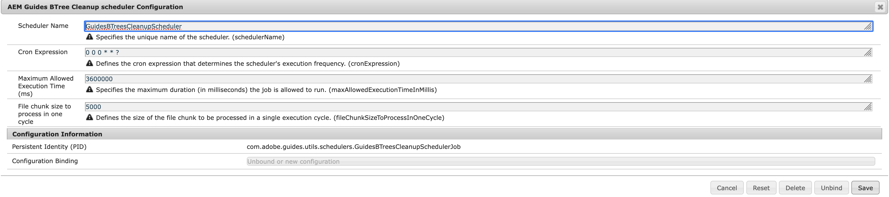
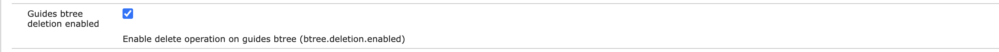

# 設定B樹狀結構清理

設定B-tree清理工作並管理`Guides B-tree deletion`設定，讓您的系統最佳化並維持儲存空間整潔。

## 設定B-tree清理工作

執行以下步驟來設定B-tree清理工作：

1. 開啟Adobe Experience Manager Web主控台設定頁面。

   存取設定頁面的預設URL為：

   ```http
   http://<server name>:<port>/system/console/configMgr
   ```

1. 搜尋並選取&#x200B;*com.adobe.guides.utils.schedulers.GuidesBTreesCleanupSchedulerJob*&#x200B;套件組合。

1. 更新cron運算式以設定B樹狀目錄清理排程器工作執行頻率。

1. 如下所示設定B-tree清理排程器。

   {align="left"}

1. 選取「**儲存**」。


## 設定參考線B樹狀結構刪除啟用設定

執行以下步驟以啟用設定：

1. 開啟Adobe Experience Manager Web主控台設定頁面。

   存取設定頁面的預設URL為：

   ```http
   http://<server name>:<port>/system/console/configMgr
   ```

1. 搜尋並選取&#x200B;*com.adobe.fmdita.config.ConfigManager*&#x200B;套件。
1. 啟用設定`Guides btree deletion enabled`。

   {align="left"}

1. 選取「**儲存**」。

