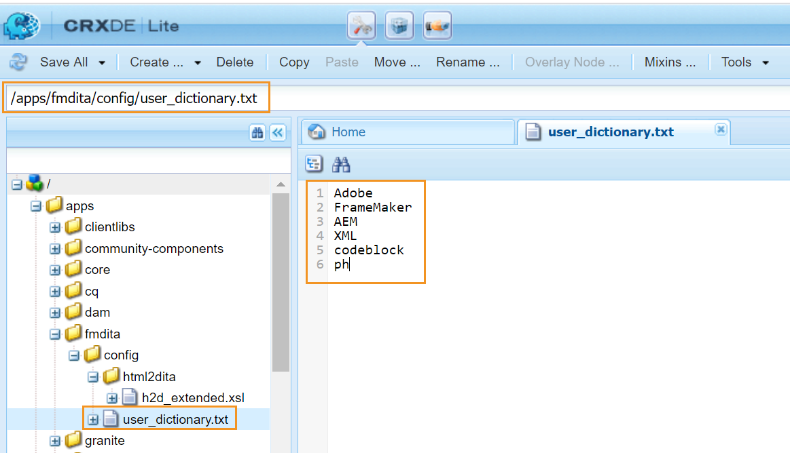

# 自訂AEM的預設字典 {#id209SD8000WU}

網頁編輯器可設定為使用AEM的拼字檢查程式或瀏覽器的拼字檢查程式。 如果您選擇使用AEM的拼字檢查程式，您就可以彈性定義自訂字詞清單。 這些自訂字詞接著會新增至AEM的字典中，且這些字詞在網頁編輯器中不會標籤為\（不正確\）。

執行以下步驟來建立新增至AEM字典中的自訂單字清單：

1. 登入AEM並開啟CRXDE Lite模式。

1. 導覽至下列節點：

   /apps/fmdita/config

1. 建立名為user\_dictionary.txt的新檔案。

1. 開啟檔案並新增您要在自訂字典中定義的字詞清單。

   下列熒幕擷圖顯示新增至user\_dictionary.txt檔案中的自訂字詞清單：

   {width="650"}

1. 儲存並關閉檔案。

作者需要重新啟動網頁編輯器工作階段，才能在AEM字典中更新自訂字詞清單。

**上層主題：**[&#x200B;自訂Web編輯器](conf-web-editor.md)
