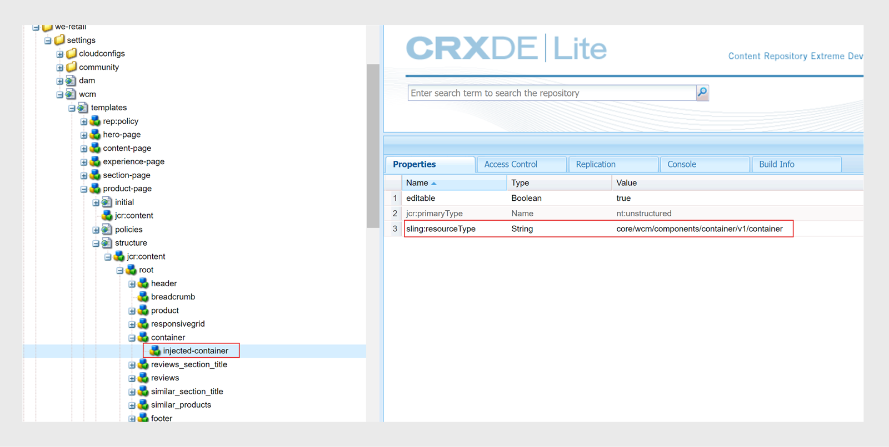

# 下載並安裝AEM Sites範本

執行以下步驟，針對內部部署軟體在Experience Manager Guides上下載並安裝AEM Sites範本：


## 套件安裝

1. 下載下列套件

   - 元件： [guides-components-all.zip](https://github.com/adobe/aemg-sites-components/releases/tag/v1.0.0)

   - 內部部署軟體的網站： [檔案](https://github.com/adobe/aemg-docs/releases/tag/v1.0.0)

1. 登入您的AEM執行個體並導覽至CRX封裝管理員。 存取封裝管理器的預設URL為：

   ```http
   http://<server name>:<port>/crx/packmgr/index.jsp
   ```

   封裝管理員會管理本機AEM安裝上的封裝。 如需使用封裝管理員的詳細資訊，請參閱AEM檔案中的[如何使用封裝](https://helpx.adobe.com/experience-manager/6-5/sites/administering/using/package-manager.html)。

1. 若要上傳封裝，請按一下[上傳封裝]。****

1. 在&#x200B;**上傳封裝**&#x200B;對話方塊中，瀏覽至您在步驟1下載的檔案，然後按一下&#x200B;**確定**。

   套件會上傳至您的AEM執行個體。

1. 若要安裝封裝，請按一下[安裝]。****

1. 在&#x200B;**安裝封裝**&#x200B;對話方塊中，按一下&#x200B;**安裝**&#x200B;以安裝封裝。


## 設定要與AEM Sites預設集搭配使用的範本

安裝套件後，會在Sites UI中建立名為&#x200B;**AEMG**&#x200B;的網站。 此範例網站說明如何設定網站結構以產生AEM Sites輸出。 這只是範例。 您可以根據需求建立自訂網站。


**AEMG**&#x200B;包含下列元件。
- **AEMG**&#x200B;資料夾中有英文(en)語言的資料夾。 您可以根據需求建立類似的語言副本。 例如，多語言網站包含英文(en)、德文(de)和法文(fr)語言副本。  進一步瞭解如何使用[語言副本精靈](https://experienceleague.adobe.com/en/docs/experience-manager-65/content/sites/administering/introduction/tc-wizard)建立語言副本。
- 在English(en)語言資料夾中，Experience Manager Guides提供許多現成的範例頁面，例如&#x200B;**搜尋**、**登入**、**檔案**&#x200B;和&#x200B;**支援**。

- **檔案**是範例檔案首頁。 它是所有產品相關檔案的中心位置
和會顯示說明檔案以個別圖磚方式提供的每個產品。

- 除了檔案首頁之外，還有&#x200B;**搜尋**、**登入**&#x200B;和&#x200B;**支援**&#x200B;的範例頁面。 您可以視需求自訂這些範例。
- 您可以擁有個別產品（例如Product1）的首頁。 範例頁面&#x200B;**Product1**&#x200B;出現在&#x200B;**Docs**&#x200B;下，也就是檔案首頁。

- Experience Manager Guides也提供下列預先定義的範本：

   - **內容頁面**&#x200B;範本：使用此範本建立包含大部分產品網站內容的標準頁面。 它們可以包括文字、影像、影片和其他內容元素。 此範本僅包含頁首和頁尾。 根據您的需求，自訂並使用它來建立任何頁面。 例如，您可以建立產品的支援頁面或登入頁面。
   - **首頁**&#x200B;範本：網站的主要登陸頁面，其中包括概觀、關鍵元素和功能等關鍵區段，以及導覽連結。 例如，產品ABC的首頁面會連線至其他內容或功能頁面。
   - **主題頁面**&#x200B;範本：用來組織和簡報主題型內容的頁面。 例如，使用手冊包含不同的主題頁面，每個頁面都包含與功能和疑難排解相關的特定主題。

  

使用這些範例和範本產生您的AEM Sites輸出：
- 產品首頁與地圖首頁相對應，並使用首頁範本建立。 在AEM Sites預設集中選取此路徑，即可在其下方發佈地圖內容。 產品首頁可包含其他首頁。
- 例如，您有Experience Manager Guides等產品，因此使用者、管理員和開發人員需要三本手冊。  使用「首頁」範本為每個手冊建立首頁，然後在AEM Sites輸出預設集中選取對應的首頁。

進一步瞭解如何在網頁編輯器中建立和設定[AEM Sites預設集](../user-guide/generate-output-aem-site-web-editor.md)。

## 使用範本建立首頁

執行以下步驟來建立產品的首頁：
1. 安裝套件後，從全域導覽中選取&#x200B;**網站**。
1. 選取安裝在網站UI中的「AEMG檔案」範本。
1. 在Sites UI中，按一下右上角的&#x200B;**建立**&#x200B;按鈕。
1. 從&#x200B;**建立**&#x200B;下拉式清單中選取&#x200B;**頁面**。
1. 選取&#x200B;**首頁**，然後按一下&#x200B;**下一步**。
1. 輸入網站標題和網站名稱，然後按一下右上角的&#x200B;**建立**。 使用&#x200B;**首頁**&#x200B;網站範本建立AEM網站範本。 例如，您可以建立產品`Product ABC`的首頁。


>[!NOTE]
>
>建立首頁後，您可以使用此路徑作為&#x200B;**Publish路徑**，用於產生AEM Sites預設集的輸出。 例如，`aemg-docs-en/docs/product-abc`。

## 編輯AEM Sites的主題範本

您也可以為AEM Sites自訂主題範本。 您可以在主題中編輯內容或設定不同AEM元件的屬性。 例如，您可以根據需求新增或移除元件。\
執行以下步驟來編輯主題範本：
1. 選取您要編輯的範本。
1. 選取頂端的&#x200B;**編輯**&#x200B;圖示。

AEM範本編輯器隨即開啟。 您可以編輯主題範本。 深入瞭解[建立頁面範本](https://experienceleague.adobe.com/en/docs/experience-manager-65/content/sites/authoring/siteandpage/templates#editing-a-template-structure-template-author)。


## 自訂現有的AEM Sites範本

除了預先定義的範本以外，您也可以將現有範本與AEM Sites預設集搭配使用。 執行以下步驟來自訂現有的AEM Sites範本：

### 範本設定

您需要下列兩種範本：

- 類別或登入範本：此範本用於產品檔案登入頁面，且與DITA map相對應。  使用此範本產生DITA map的AEM網站頁面。 您可以在任何層級使用此範本。
 — 新增文字元件至您現有的範本。 文字元件應具有強制屬性`text="$category.html$"`。
 — 例如，您可以選取We-Retail範本，並使用區段頁面範本做為DITA map的登入頁面範本。 若要這麼做，請進行下列熒幕擷取畫面中所示的變更：
  
   - 詳細資訊頁面或主題頁面範本：此範本用於地圖主題的內容。 所有DITA/XML內容的「網站」頁面都是使用「主題頁面」範本建立的。 若要建立這些範本，有兩個先決條件：
      - 將文字元件新增至範本（包含在容器元件中），並帶有強制屬性。`text="$topic.content$"`。
        
      - 在相同的範本結構中反映相同的容器和文字元件，如下列熒幕擷圖所示：
        

### 將類別頁面標示為檔案容器

假設使用前一個範本為檔案頁面建立了網站階層，請選擇在該網站階層中建立的其中一個類別頁面。 提供ID以標籤類別頁面為檔案容器。
若要這麼做，請為其屬性`id`指派值`category-page`。 請參閱下列熒幕擷圖：

