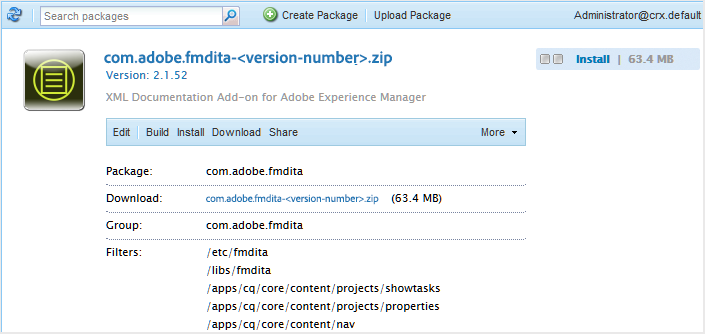

# 首次下載並安裝AEM Guides {#id213BCL00KEV}

執行以下步驟，第一次在電腦上下載和安裝AEM Guides：

>[!IMPORTANT]
>
> 如果您想要搭配AEM Guides使用Livefyre，請務必先安裝3.0之前的Livefyre版本，然後再安裝AEM Guides。 如果您是使用Livefyre 3.0版或更新版本，則沒有這類限制。

1. 從[Adobe軟體發佈入口網站](https://experience.adobe.com/#/downloads/content/software-distribution/en/aem.html)下載AEM Guides。

   >[!NOTE]
   >
   >在安裝Experience Manager Guides之前，請確認您的系統符合[技術需求](../install-guide/download-install-technical-requirements.md)。

1. 登入您的AEM執行個體並導覽至CRX封裝管理員。 存取封裝管理器的預設URL為：

   ```http
   http://<server name>:<port>/crx/packmgr/index.jsp
   ```

   封裝管理員會管理本機AEM安裝上的封裝。 如需使用封裝管理員的詳細資訊，請參閱AEM檔案中的[如何使用封裝](https://helpx.adobe.com/experience-manager/6-5/sites/administering/using/package-manager.html)。

   {width="650" align="left"}

1. 若要上傳AEM Guides套件，請按一下&#x200B;**上傳套件**。

1. 在上傳套件對話方塊中，導覽至您在步驟1下載的AEM Guides檔案，然後按一下&#x200B;**確定**。

   套件會上傳至您的AEM執行個體。

1. 若要安裝封裝，請按一下[安裝]。****

   {width="650" align="left"}

1. 在[安裝封裝]對話方塊中，按一下[安裝]。****

1. 若要開始使用AEM Guides，請按一下CRX封裝管理員左上角的「首頁」按鈕。


>[!NOTE]
>
> 在您的設定中，對AEM伺服器的所有執行個體執行安裝程式。

**上層主題：**[&#x200B;下載並安裝](download-install.md)
