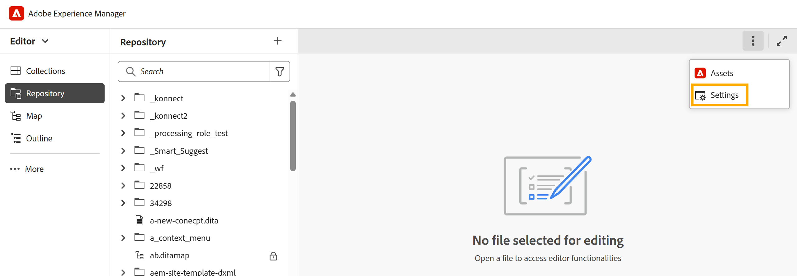

# 設定編輯器設定

在On-premise設定中，**設定**&#x200B;選項會出現在編輯器的索引標籤列中。 在Cloud Service設定中，此選項已重新命名為&#x200B;**Workspace設定**。

在&#x200B;**編輯器設定**&#x200B;下可用的所有現有設定選項維持不變。

內部部署的{width="650"}

若要瞭解可用的組態選項，請檢視[設定Workspace設定](../cs-install-guide/workspace-settings.md)。
