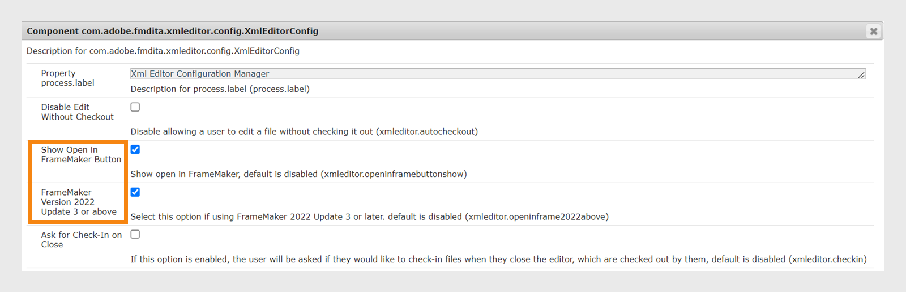

# 整合案頭式XML編輯器 {#id181GB01G0HS}

市面上有許多XML編輯器，您也可能已經使用了一個。 Adobe FrameMaker是最強大的XML編輯器之一，它附帶AEM聯結器。 在FrameMaker中使用AEM聯結器，您可以輕鬆地與AEM存放庫連線、簽出和簽入檔案，以及直接在FrameMaker中編輯檔案。 您也可以設定AEM Guides從網頁編輯器啟動FrameMaker。 在FrameMaker中開啟檔案後，您可以編輯該檔案並將其簽回AEM存放庫。

## 從網頁編輯器以FrameMaker啟用檔案編輯

您可以使用FrameMaker或任何其他DITA編輯器來建立和更新DITA內容。 但是，如果您的組織使用FrameMaker作為DITA編輯器，則您可以為使用者提供直接在AEM的FrameMaker中開啟DITA檔案的選項。

依預設，您的使用者在AEM工具列上看不到&#x200B;**在FrameMaker中開啟**&#x200B;按鈕。 執行以下步驟，在AEM工具列上新增此按鈕：

1. 開啟Adobe Experience Manager Web主控台設定頁面。

   存取設定頁面的預設URL為：

   ```http
   http://<server name>:<port>/system/console/configMgr
   ```

1. 搜尋並按一下&#x200B;**com.adobe.fmdita.xmleditor.config.XmlEditorConfig**&#x200B;套件。

   {width="550" align="left"}

1. 選取&#x200B;**在FrameMaker中顯示開啟按鈕**&#x200B;選項。

1. 按一下「**儲存**」。


當您啟用&#x200B;**在FrameMaker中顯示開啟按鈕**&#x200B;選項時，在AEM存放庫中選取任何DITA檔案時，就會顯示&#x200B;**在FrameMaker中開啟**&#x200B;按鈕。 當此選項&#x200B;*未啟用*&#x200B;時，只有當您在存放庫中選取.fm或.book檔案時，才會顯示&#x200B;**在FrameMaker中開啟**&#x200B;按鈕。
