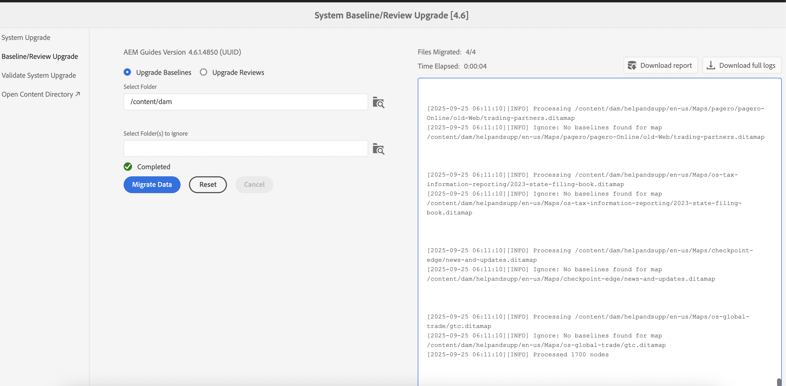
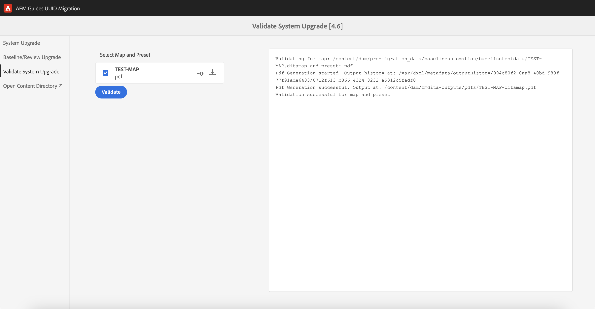

# 4.6.0 Service Pack 4 （非UUID）至4.6.1 UUID內容移轉

執行這些步驟，將您的內容從非UUID版本4.6.0 Service Pack 4移轉至UUID版本4.6.1。

>[!IMPORTANT]
>
> * 開始移轉程式前，請確定您已具備：
>
>   1. 已關閉所有進行中的評論。
>   1. 已關閉所有翻譯任務。
> * 將內容移轉至UUID伺服器之前，請確定您有已安裝相容AEM Guides版本的非UUID伺服器。
> * 如果您使用的版本早於4.6.0 Service Pack 4，則您必須先升級至4.6.0 Service Pack 4版。 請依照產品授權版本專屬的[升級指示](./upgrade-xml-documentation.md)執行。
> * 如果您使用4.6.0 Service Pack 4之後發行的特定Service Pack，則必須解除安裝該Service Pack並還原為4.6.0 Service Pack 4。

## 套件安裝

根據您的版本，從Adobe軟體發佈入口網站下載必要的套件：

1. **移轉前**： [com.adobe.guides.pre-uuid-migration-2.0.zip](https://experience.adobe.com/#/downloads/content/software-distribution/en/aem.html?package=%2Fcontent%2Fsoftware-distribution%2Fen%2Fdetails.html%2Fcontent%2Fdam%2Faem%2Fpublic%2Faemdox%2Fother-packages%2Fuuid-migration%2F4-0%2Fcom.adobe.guides.pre-uuid-migration-2.0.zip)
1. **下載UUID 4.6.1**&#x200B;版： [com.adobe.fmdita.feature-uuid-4.6.1.4850.zip](https://experience.adobe.com/#/downloads/content/software-distribution/en/aem.html?package=%2Fcontent%2Fsoftware-distribution%2Fen%2Fdetails.html%2Fcontent%2Fdam%2Faem%2Fpublic%2Faemdox%2Fother-packages%2Fuuid-migration%2F4-0%2Fcom.adobe.fmdita-6.5-uuid-4.6.1.4850.zip)
1. **移轉**： [com.adobe.guides.uuid-upgrade-2.0.zip](https://experience.adobe.com/#/downloads/content/software-distribution/en/aem.html?package=%2Fcontent%2Fsoftware-distribution%2Fen%2Fdetails.html%2Fcontent%2Fdam%2Faem%2Fpublic%2Faemdox%2Fother-packages%2Fuuid-migration%2F4-0%2Fcom.adobe.guides.uuid-upgrade-2.0.zip)

## 移轉前檢查

對非UUID版本4.6.0 Service Pack 4執行以下檢查：

1. 安裝移轉前套件[com.adobe.guides.pre-uuid-migration-2.0.zip](https://experience.adobe.com/#/downloads/content/software-distribution/en/aem.html?package=%2Fcontent%2Fsoftware-distribution%2Fen%2Fdetails.html%2Fcontent%2Fdam%2Faem%2Fpublic%2Faemdox%2Fother-packages%2Fuuid-migration%2F4-0%2Fcom.adobe.guides.pre-uuid-migration-2.0.zip) （版本4.6.0 Service Pack 4）。

   >[!NOTE]
   >
   >* 您需要管理員許可權才能執行移轉。
   >* 建議先修復有錯誤的檔案，再繼續移轉。

1. 如果系統中有超過100,000個DITA檔案，請更新查詢限制設定讓指令碼運作：

   * 導覽至`/system/console/configMgr and increase both the configs to more than number of assets - queryLimitInMemory`和`queryLimitReads under org.apache.jackrabbit.oak.query.QueryEngineSettingsService`

1. 啟動`http://<server-name>/libs/fmdita/clientlibs/xmleditor_uuid_upgrade/page.html`。
1. 從左側面板選取&#x200B;**相容性評估**，並瀏覽所有資產的`/content/dam`資料夾路徑。
1. 檢查相容性以列出以下資訊：
   * 檔案總數
   * 預估移轉時間
   * 有錯誤的檔案數
   * 具有GUID檔案名稱的檔案

   移轉中的

1. 如果出現錯誤，則分析日誌並修復這些錯誤。 修正錯誤後，您可以重新執行相容性矩陣。

1. 從左側面板中選取&#x200B;**設定驗證**。 然後，**選取對映**&#x200B;和&#x200B;**選取對映的預設集**&#x200B;以進行設定。 目前的輸出驗證清單會顯示移轉前存在的輸出檔案，並可在稍後針對移轉後產生的輸出檔案進行驗證。

   透過選取多個和大型DITA map，您可以驗證所有內容是否已成功移轉且沒有問題。 選取包含基準線的預設集也可確保基準線和版本成功移轉。

   ![在移轉中設定[驗證]索引標籤](assets/migration-configure-validation.png)

1. （可選）對內容執行版本清除以移除不必要的版本，並加快移轉程式。 若要執行版本清除，請從移轉畫面中選取選項&#x200B;**版本清除**，然後使用URL `http://<server- name>/libs/fmdita/clientlibs/xmleditor_uuid_upgrade/page.html`移至使用者介面。
   >[!NOTE]
   >
   >此公用程式不會移除基準線或評論中使用的任何版本，或具有任何標籤。

如需詳細資訊，請檢視[清除舊版](../install-guide/version-management.md#purge-older-versions-of-dita-files)。

## 移轉必要條件

1. 僅在作者執行個體上執行UUID移轉。
1. 確定下列基礎架構整備：
   * 製作例項在CPU和記憶體方面已進行升級，以支援更快速的處理，以及大量活動所需的額外記憶體。 例如，如果目前配置的CPU和記憶體是8 vCPU和24 GB棧積，則請將此活動的大小加倍。
   * 整體磁碟空間與暫存磁碟空間`(crx-quickstart directory)`的緩衝區應該是已使用的10倍。 完成移轉後，您可以執行壓縮以回收大部分的磁碟空間。
   * 開始此活動前，請執行&#x200B;**離線Tar壓縮**。
   * 請確保在此移轉期間未計畫索引或系統維護。

1. 安裝支援發行版本的UUID版本，而非非UUID版本。 例如，如果您使用4.6.0 Service Pack 4非UUID版本編號，則需要安裝UUID版本4.6.1 [com.adobe.fmdita.feature-uuid-4.6.1.4850.zip](https://experience.adobe.com/#/downloads/content/software-distribution/en/aem.html?package=%2Fcontent%2Fsoftware-distribution%2Fen%2Fdetails.html%2Fcontent%2Fdam%2Faem%2Fpublic%2Faemdox%2Fother-packages%2Fuuid-migration%2F4-0%2Fcom.adobe.fmdita-6.5-uuid-4.6.1.4850.zip)並執行移轉。

1. 安裝uuid移轉升級套件[com.adobe.guides.uuid-upgrade-2.0.zip](https://experience.adobe.com/#/downloads/content/software-distribution/en/aem.html?package=%2Fcontent%2Fsoftware-distribution%2Fen%2Fdetails.html%2Fcontent%2Fdam%2Faem%2Fpublic%2Faemdox%2Fother-packages%2Fuuid-migration%2F4-0%2Fcom.adobe.guides.uuid-upgrade-2.0.zip)。
1. 使用URL停用下列工作流程的啟動器： `http://<server-name>/libs/cq/workflow/content/console.html`。

   * DAM更新資產工作流程
   * dam中繼資料回寫工作流程

   >[!NOTE]
   >
   >理想情況下，任何在`content/dam`內任何路徑上執行的工作流程啟動器，都應停用。

1. 根據建議的變更更新下列設定：

   | 設定 | 屬性 | 值 |
   |---|---|---|
   | `com.adobe.fmdita.config.ConfigManager` | 啟用後處理工作流程啟動器 | 停用 |
   | `com.adobe.fmdita.config.ConfigManager` | uuid。 規則運算式 | `^GUID-(?<id>.*)` |
   | `com.adobe.fmdita.postprocess.version.PostProcessVersionObservation` | 啟用版本後處理 | 停用 |
   | Day CQ標籤服務 | 啟用驗證(validation.enabled) | 停用 |

1. 新增單獨的記錄器：
   * `com.adobe.fmdita.uuid`
   * `com.adobe.guides.uuid`。

1. （若未更早完成）如果系統中有超過100,000個DITA檔案，請將`queryLimitReads`下的`org.apache.jackrabbit.oak.query.QueryEngineSettingsService`更新為較大的值（任何大於現有資產數的值，例如200,000）。

   | PID | 屬性索引鍵 | 屬性值 |
   |---|---|---|
   | org.apache.jackrabbit.oak.query.QueryEngineSettingsService | querylimitereads | 值： 200000  預設值： 100000 |

## 移轉

1. 啟動`http://<server-name>/libs/fmdita/clientlibs/xmleditor_uuid_upgrade/page.html`。

   
   >[!NOTE]
   >
   > 如果您選擇「啟用DITA資產備份」，則暫存備份檔案會儲存在`/content/uuid-upgrade`下，且檔案移轉完成時會刪除DITA檔案備份。

1. 從左側面板選取&#x200B;**系統升級**&#x200B;以執行移轉。 建議一次移轉所有資料，因為系統以最佳方式在內部處理批次處理程式。 只有非DITA資產且未用於任何DITA資產的檔案才能略過移轉。

1. （可選）選取您要略過移轉的資料夾。 使用此選項可在稍後移轉這些資料夾或略過移轉它們。 請確定這些資料夾沒有任何DITA資產，且未被任何DITA資產參照（未來也不會被參照）。 例如，`content/dam/projects`。

1. 選取&#x200B;*啟用Dita資產備份*&#x200B;以在移轉前建立資產的備份。 移轉檔案時發生錯誤，可使用此備份進行回覆。 如果移轉成功，則會刪除備份。 不過，這會減慢移轉程式。

1. 開始移轉。
   >[!NOTE]
   >
   > 下載完整記錄，並觀察是否有任何錯誤。 如果發現任何錯誤或例外狀況&#x200B;*請勿繼續*，但請先修正錯誤。 常見錯誤列於本文結尾處。

1. 移轉一旦完成，即可下載報表及完整記錄檔。

1. 在移轉執行時選取[下載報表] **，檢查資料夾中的所有檔案是否已正確升級，以及所有功能是否只適用於該資料夾。**

   >[!NOTE]
   >
   > 內容移轉可在資料夾層級、完整`/content/dam`或相同資料夾上執行（重新執行移轉）。

   此外，請務必確實針對所有媒體資產完成內容移轉，例如您在DITA內容中使用的影像和圖形。

1. 移轉所有檔案後，從左側面板選取&#x200B;**基準/檢閱升級**&#x200B;以移轉基準，並在資料夾層級檢閱。

>[!NOTE]
>
>如果您重新啟動系統或中止移轉，當您使用與先前相同的引數重新執行指令碼時，指令碼將會繼續。 如果您因關機而遇到問題，請聯絡您的客戶成功團隊。

## 分析每個步驟的報告

**步驟：系統升級**

| 處理完成後的摘要 | 如何解譯？ | 動作 |
|---|---|---|
| 檔案總數：488 | 在指定的資料夾集下處理的檔案總數。 | 不適用 |
| 已成功移轉的檔案數： 488 | 已成功移轉至UUID的檔案數。 | 不適用 |
| 略過的檔案數： 0 | DAM存放庫中的某些檔案可能有子資產，且這些子資產因不符合UUID移轉資格而予以跳過。 | 不適用 |
| 升級失敗的檔案數： 0 | 如果計數不是0，則必須分析記錄檔中的任何問題。 | 檢查例外，您可能需要修正錯誤並重新執行移轉。 |
| 總花費時間： 00:01:18 |  |  |

此外，可以在報告的摘要表格下存取在移轉程式期間升級的&#x200B;**個檔案清單**&#x200B;和&#x200B;**個失敗的檔案**。

**步驟：升級基準線**

| 處理完成後的摘要 | 如何解譯？ | 動作 |
|---|---|---|
| 檔案總數：288 | 至少1個基準線的DITA map數目。 |
| 已成功移轉的檔案數： 13 | DITA map數目，已順利升級所有基準線。 |
| 略過的檔案數： 275 | 沒有任何基準線的DITA map數目。 |
| 升級失敗的檔案數： 0 | 無效的基準線物件數目（空白）會列在報表(Excel)中。 | 檢查是否有其他錯誤： `baselineObj not found on` |

此外，可以在報告的摘要表格下存取在移轉程式期間升級的&#x200B;**個檔案清單**&#x200B;和&#x200B;**個失敗的檔案**。

## 移轉後

1. 移轉完成後，請從左側面板選取&#x200B;**驗證系統升級**，並在移轉前後驗證輸出檔案，以確保移轉成功。

   

1. 在移轉伺服器之後，請啟用下列工作流程和設定（包括移轉期間最初停用的所有其他工作流程）以繼續使用伺服器：

   * DAM更新資產工作流程
   * DAM中繼資料工作流程

   >[!NOTE]
   >
   >理想狀況下，任何工作流程啟動器，只要在`content/dam`內的任何路徑上執行，就應該啟用移轉。

1. 啟用下列設定：

   | 設定 | 屬性 | 值 |
   |---|---|---|
   | `com.adobe.fmdita.config.ConfigManager` | *啟用後處理工作流程啟動器* | 啟用 |
   | `com.adobe.fmdita.postprocess.version.PostProcessVersionObservation` | *啟用版本後處理* | 啟用 |
   | Day CQ標籤服務 | *啟用驗證(validation.enabled)* | 啟用 |

1. 要檢閱移轉後的Assets屬性：

   | 設定 | 屬性 | 非UUID的移轉前值 | UUID上的移轉後值 |
   |---|---|---|---|
   | `com.adobe.fmdita.config.ConfigManager` | **使用AEM網站頁面名稱的標題** | False （預設值） | 真 |

   >[!NOTE]
   >
   > 如果在移轉之前，屬性&#x200B;**在**&#x200B;內使用AEM網站頁面名稱的標題`com.adobe.fmdita.config.ConfigManager`，設定為&#x200B;*False*，則在移轉之後，需要更新此屬性。

1. 完成驗證後，可執行壓縮以回收大部分的磁碟空間（請參閱`https://experienceleague.adobe.com/docs/experience-manager-65/deploying/deploying/revision-cleanup.html?lang=en`）。

