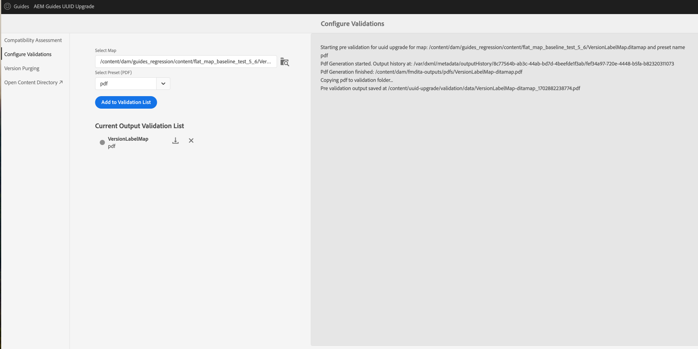

# 移轉受版本控制的內容

執行這些步驟，將您的非UUID版本化內容移轉至UUID內容。

>[!NOTE]
>
>請遵循 [升級指示](./upgrade-xml-documentation.md) 特定於您的產品的授權版本。

## 相容性矩陣

| 最新Experience Manager指南版本（非UUID） | 移轉至UUID的必要版本 | 支援的升級路徑 |
|---|---|---|
| 3.8.5、4.0.x或4.1.x | 4.1非UUID | 安裝4.1 (UUID)並執行移轉 |
| 4.2、4.2.x或4.3 | 4.3.0非UUID | 安裝4.3.1 (UUID)並執行移轉 |
| 4.3.1 | 不適用 | 不適用 |

## 套件安裝

根據您的版本，從Adobe軟體發佈入口網站下載必要的套件：

  版本4.1的套件升級路徑

1. **移轉前**： [com.adobe.guides.pre-uuid-migration-1.0.9.zip](https://experience.adobe.com/#/downloads/content/software-distribution/en/aem.html?package=%2Fcontent%2Fsoftware-distribution%2Fen%2Fdetails.html%2Fcontent%2Fdam%2Faem%2Fpublic%2Faemdox%2Fother-packages%2Fuuid-migration%2F1-0%2Fcom.adobe.guides.pre-uuid-migration-1.0.9.zip)
1. **移轉**： [com.adobe.guides.uuid-upgrade-1.0.19.zip](https://experience.adobe.com/#/downloads/content/software-distribution/en/aem.html?package=%2Fcontent%2Fsoftware-distribution%2Fen%2Fdetails.html%2Fcontent%2Fdam%2Faem%2Fpublic%2Faemdox%2Fother-packages%2Fuuid-migration%2F1-0%2Fcom.adobe.guides.uuid-upgrade-1.0.19.zip)

 版本4.3.1的套件升級路徑

1. **移轉前**： [com.adobe.guides.pre-uuid-migration-1.1.3.zip](https://experience.adobe.com/#/downloads/content/software-distribution/en/aem.html?package=%2Fcontent%2Fsoftware-distribution%2Fen%2Fdetails.html%2Fcontent%2Fdam%2Faem%2Fpublic%2Faemdox%2Fother-packages%2Fuuid-migration%2Fcom.adobe.guides.pre-uuid-migration-1.1.3.zip)
1. **移轉**： [com.adobe.guides.uuid-upgrade-1.1.15.zip](https://experience.adobe.com/#/downloads/content/software-distribution/en/aem.html?package=%2Fcontent%2Fsoftware-distribution%2Fen%2Fdetails.html%2Fcontent%2Fdam%2Faem%2Fpublic%2Faemdox%2Fother-packages%2Fuuid-migration%2Fcom.adobe.guides.uuid-upgrade-1.1.15.zip)

## 移轉前

對非UUID版本（非UUID 4.1或非UUID 4.3.0）執行下列檢查：

1. 根據您的版本安裝移轉前套件。

   >[!NOTE]
   >
   >* 您需要管理員許可權才能執行移轉。
   >* 建議先修復有錯誤的檔案，再繼續移轉。

1. （可選）對內容執行版本清除以移除不必要的版本，並加快移轉程式。 若要執行版本永久刪除，請選取選項 **版本清除** 從移轉畫面，使用URL前往使用者介面 `http://<server- name>/libs/fmdita/clientlibs/xmleditor_uuid_upgrade/page.html`.
   >[!NOTE]
   >
   >此公用程式不會移除基準線或評論中使用的任何版本，或具有任何標籤。

1. Launch `http://<server-name>/libs/fmdita/clientlibs/xmleditor_uuid_upgrade/page.html`.
1. 選取 **相容性評估**  從左側面板瀏覽資料夾路徑。
1. 檢查相容性以列出以下資訊：
   * 檔案總數
   * 總版本
   * 預估移轉時間
   * 有錯誤的檔案數

   {width="800" align="left"}

1. 選取 **設定驗證** 從左側面板。 然後 **選取地圖** 和 **選取預設集** 以設定這些變數。 目前的輸出驗證清單會顯示移轉前存在的輸出檔案，並可在稍後針對移轉後產生的輸出檔案進行驗證。

   {width="800" align="left"}

## 移轉

### 步驟1：更新設定

1. 請確定可用的空間至少是AEM （crx-quickstart目錄）在移轉期間所佔用空間的10倍。 完成移轉後，您可以執行壓縮來回收大部分的磁碟空間(請參閱 [修訂清除](https://experienceleague.adobe.com/docs/experience-manager-65/deploying/deploying/revision-cleanup.html?lang=en))。

1. 啟用 *啟用後處理工作流程啟動器* 在 `com.adobe.fmdita.config.ConfigManager` 和 *啟用版本後處理* 在 `com.adobe.fmdita.postprocess.version.PostProcessVersionObservation.`

1. 安裝支援發行版本的UUID版本，而非非UUID版本。 例如，如果您使用4.1非UUID版本編號，則需安裝UUID 4.1版並執行移轉。

1. 安裝新套件以進行uuid移轉。

1. 停用下列工作流程以及執行的任何其他工作流程 `/content/dam` 在中使用啟動器 `http://<server-name>/libs/cq/workflow/content/console.html`.

   * DAM更新資產工作流程
   * dam中繼資料回寫工作流程

1. 停用 *啟用後處理工作流程啟動器* 在 `com.adobe.fmdita.config.ConfigManager` 和停用 *啟用版本後處理* 在 `com.adobe.fmdita.postprocess.version.PostProcessVersionObservation`.

1. 停用屬性啟用驗證(`validation.enabled`)。

1. 確定 `uuid.regex` 屬性資料夾在中已正確設定 `com.adobe.fmdita.config.ConfigManager`. 如果空白，則設定為預設值 —  `^GUID-(?<id>.*)`.
1. 新增單獨的記錄器 `com.adobe.fmdita.uuid` 瀏覽器回應也可在以下網址取得： `/content/uuid-upgrade/logs`.

### 步驟2：執行移轉並驗證

#### 安裝移轉套件

1. Launch `http://<server-name>/libs/fmdita/clientlibs/xmleditor_uuid_upgrade/page.html`.

   {width="800" align="left"}

1. 選取 **系統升級** 從左側面板開始執行移轉。 在較小資料的資料夾上開始執行，然後再執行 `/content/dam`.

1. 選取 **下載報表** 當移轉正在執行時，檢查資料夾中的所有檔案是否已正確升級，以及所有功能是否只適用於該資料夾。

>[!NOTE]
>
> 內容移轉可在檔案夾層級執行，完成 `/content/dam`，或相同的資料夾（重新執行移轉）。

此外，請務必確實針對所有媒體資產完成內容移轉，例如您在DITA內容中使用的影像和圖形。

#### 基準線及檢閱移轉

選取 **基準/檢閱升級** 從左側面板移轉基準線並在資料夾層級檢閱。

{width="800" align="left"}

### 步驟3：還原設定

成功移轉伺服器後，請啟用後處理、標籤和下列工作流程（包括移轉期間最初停用的所有其他工作流程）以繼續在伺服器上運作。

* DAM更新資產工作流程
* DAM中繼資料工作流程

>[!NOTE]
>
>如果某些檔案在移轉前未處理或損毀，則會在移轉前損毀，甚至在移轉後仍會損毀。

## 移轉驗證

1. 移轉完成後，請選取「 」 **驗證系統升級** 從左側面板中，在移轉之前和之後驗證輸出檔案，以確保移轉成功。

   {width="800" align="left"}

1. 完成驗證後，可執行壓縮以回收大部分的磁碟空間(請參閱 `https://experienceleague.adobe.com/docs/experience-manager-65/deploying/deploying/revision-cleanup.html?lang=en`)。

