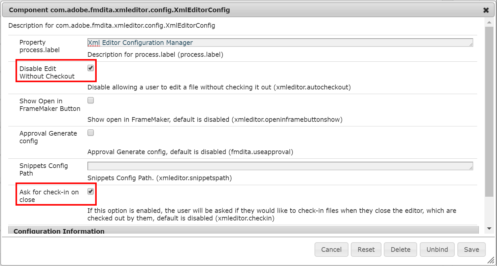

# 版本管理 {#id181GB000XY4}

版本設定是任何內容管理系統的一個重要方面。 它可讓您在特定時間點建立數位資產的快照。 數位資產已有版本，您可以還原並更新資產的所需版本。 通常，建立任何資產的版本時，您會取出並簽入所需的資產。

作為管理員，您可以強制實施規則來限制使用者編輯檔案而不將其出庫。 同樣地，您可以確保所有出庫的檔案都會入庫，以避免任何資料遺失。

在多用途環境中，確保使用者不會從系統刪除檔案也很重要。 對於由其他使用者簽出的檔案，此要求更為重要。您可以允許或防止使用者覆寫由其他使用者簽出的檔案。 為避免使用者意外從系統中刪除已出庫的檔案，AEM Guides提供了您可使用的配置。 除了出庫檔案外，您還可以控制刪除包含參照的檔案或從其他檔案參照的檔案。 此外，您也可以為上傳的檔案建立新版本。

## 為上傳的檔案建立新版本

>[!NOTE]
>
> 此設定僅適用於上傳檔案。

若要建立上傳檔案的新版本，請執行下列步驟：

1. 開啟Adobe Experience Manager Web主控台設定頁面。

   存取設定頁面的預設URL為：

   ```http
   http://<server name>:<port>/system/console/configMgr
   ```

1. 搜尋並按一下&#x200B;**com.adobe.fmdita.config.ConfigManager**&#x200B;套件。

1. 選取&#x200B;**為已上傳的檔案建立新版本**&#x200B;選項。

   依預設，此選項是關閉的。

   選取此選項時，就會發生新版本管理機制，並覆寫適用於任何後續上傳的預設上傳行為，這會將上傳檔案的內容儲存為新版本。 如果取消選取選項，AEM Guides會使用AEM的預設版本管理機制。

1. 按一下「**儲存**」。


>[!NOTE]
>
> 如果您啟用屬性&#x200B;**為已上傳的檔案建立新版本** \(create.ver.new.content\)，並使用&#x200B;**Assets UI**&#x200B;大量上傳資產，則可以以70個或以下的批次上傳檔案。

## 設定允許編輯已取出檔案的設定

AEM Guides的網頁編輯器可讓您建立和更新DITA主題。 您可以設定Web編輯器，僅允許編輯已從存放庫出庫的檔案。 這樣可確保其他寫入器不會意外覆寫由其他寫入器開啟以進行編輯的主題。 一旦開啟主題進行編輯後，作者就可以在關閉檔案時簽入檔案。

另一個重要規則是確保已出庫的檔案會入庫回系統。 這可防止使用者不小心關閉檔案而不將其簽回。

執行下列步驟以啟用這些功能：

1. 開啟Adobe Experience Manager Web主控台設定頁面。

   存取設定頁面的預設URL為：

   ```http
   http://<server name>:<port>/system/console/configMgr
   ```

1. 搜尋並按一下&#x200B;**com.adobe.fmdita.xmleditor.config.XmlEditorConfig**&#x200B;套件。

1. 選取&#x200B;**停用[不簽出]的編輯**&#x200B;選項。

   {width="650" align="left"}

   使用此選項，使用者在簽出檔案之前，不會在工具列中看到「編輯」選項。

1. 選取&#x200B;**關閉時要求籤入**&#x200B;選項，以在已簽出的檔案關閉時顯示警告訊息，而不儲存或將其簽回存放庫。

1. 按一下「**儲存**」。


>[!NOTE]
>
> 無論您是開啟還是關閉此功能，在主題預覽中永遠都可以使用檔案「出庫」和「入庫」選項。

## 上傳時覆寫已簽出的檔案

>[!NOTE]
>
> 此設定僅適用於從Assets UI建立檔案時，而不適用於使用WebDAV工具上傳檔案時。

若要允許使用者在上傳時覆寫已由其或其他使用者簽出的檔案，請執行以下步驟：

1. 開啟Adobe Experience Manager Web主控台設定頁面。

   存取設定頁面的預設URL為：

   ```http
   http://<server name>:<port>/system/console/configMgr
   ```

1. 搜尋並按一下&#x200B;**com.adobe.fmdita.config.ConfigManager**&#x200B;套件。

1. 選取&#x200B;**在上傳時覆寫取出檔案**&#x200B;選項。

   此選項預設為開啟。 選取此選項後，使用者將可覆寫已出庫的檔案。 如果未選取該選項，則當使用者或其他使用者取出檔案時，將無法覆寫檔案。

1. 按一下「**儲存**」。


## 防止刪除已出庫的檔案

若要防止使用者意外刪除已由其或其他使用者出庫的檔案，請執行下列步驟：

1. 開啟Adobe Experience Manager Web主控台設定頁面。

   存取設定頁面的預設URL為：

   ```http
   http://<server name>:<port>/system/console/configMgr
   ```

1. 搜尋並按一下&#x200B;**com.adobe.fmdita.xmleditor.config.XmlEditorConfig**&#x200B;套件。

1. 選取&#x200B;**防止刪除簽出的內容**&#x200B;選項。

   此選項預設為開啟。 選取此選項後，使用者將無法刪除已出庫的檔案。

1. 按一下「**儲存**」。


若要支援此功能，已在`oak:index`中新增索引屬性`drivelock`：

`/oak:index/damAssetLucene/indexRules/dam:Asset/properties/drivelock`

{width="800" align="left"}

除了新的索引屬性之外，請確定已在`/oak:index/damAssetLucene`上設定下列屬性：

- `jcr:primaryType`=`"oak:QueryIndexDefinition"`
- `async`=`"async"`
- `compatVersion`=`"{Long}2"`
- `evaluatePathRestrictions`=`"{Boolean}true"`
- `reindex`=`"{Boolean}false"`
- `reindexCount`=`"{Long}3"` *\（這是完成重新索引的次數計數，已取代為安裝我們的套件\）*
- `type`=`"lucene"`

>[!NOTE]
>
> 您可以將`reindex`的值變更為`"{Boolean}true"`。 這樣一來，資料夾階層內已出庫檔案的搜尋結果就會更快。

## 防止刪除參照的檔案

身為管理員，您可以控制誰可以從AEM存放庫中刪除檔案。 具體來說，如果檔案包含參照或被其他檔案參照，則可以定義誰可以刪除這類檔案。

使用此設定，您可以允許或禁止所有使用者刪除檔案，或只允許特定使用者群組刪除檔案。 如果允許刪除檔案，則會遵循以下程式：

- 如果您要刪除包含所有參照和參照檔案的資料夾，則會刪除所有檔案。 程式會先刪除不包含任何參照的所有檔案，接著刪除包含參照或被參照的檔案。

- 如果您要刪除資料夾，而該資料夾內的任何檔案由該資料夾外的檔案參照，則在刪除檔案之前，系統會提示您移除參照。


若要定義誰可以刪除包含參照的檔案或由其他檔案參照的檔案，請執行下列步驟：

1. 開啟Adobe Experience Manager Web主控台設定頁面。

   存取設定頁面的預設URL為：

   ```http
   http://<server name>:<port>/system/console/configMgr
   ```

1. 搜尋並按一下&#x200B;**com.adobe.fmdita.config.ConfigManager**&#x200B;套件。

1. 找出所參考Assets **選項的**&#x200B;區塊刪除。

1. 根據您想要授予刪除存取權的對象，請指定下列其中一個常數：

   - allow\_unsafe\_delete\_for\_all：授予所有使用者刪除檔案的許可權。 在這種情況下，如果檔案\(s\)包含參照或由其他檔案參照，則您也可以強制刪除此類檔案。 刪除檔案之前，您將會看到包含參照的提示，您可以取消刪除操作、移除參照，最後刪除檔案。 或者，您可以強制刪除檔案而不移除參照。

     {width="550" align="left"}

   - allow\_unsafe\_delete\_for\_delete\_assets\_group：屬於&#x200B;*delete-assets*&#x200B;群組的系統管理員或使用者可刪除檔案。 若有其他使用者嘗試刪除含有任何參照的檔案，則在移除所有參照之前，不允許使用者刪除這類檔案。 當沒有許可權的使用者嘗試刪除檔案時，會出現下列熒幕擷圖。

     {width="550" align="left"}

   - block\_unsafe\_delete\_for\_all：不允許所有使用者\（包括管理員\）刪除檔案，直到刪除對檔案的參照和從檔案的參照。

1. 按一下「**儲存**」。


## 清除舊版的DITA檔案

當您更新內容並建立新版本時，舊版的DITA檔案會保留在存放庫中。 可能會在一段時間內為您的DITA檔案建立許多版本，並且可能會共同佔用存放庫中的大量空間。 AEM Guides可讓您設定應從存放庫刪除的舊版本。

如果您有管理許可權，可以使用指定的URL存取此公用程式：

`<server folder path> /libs/fmdita/clientlibs/xmleditor_version_purge/page.html`

會維護且不會清除符合任何指定准則的DITA檔案版本：

- 是檔案的第一個版本
- 包含在基準線中
- 包含在任何翻譯或稽核工作流程中
- 已套用標籤
- 符合定義的年齡或版本數量標準

執行以下步驟來清除舊版：

1. 輸入要永久刪除之檔案的下列詳細資訊：

   {width="350" align="left"}

1. &#x200B;
   - **從最新版本保留的版本數目**：輸入應保留且未清除的版本數目。 例如，如果輸入5，則會保留最後5個版本，而之前的版本則符合其他清除條件時，可以清除該版本。
- **保留時間跨度內建立的版本\（以天為單位\）**：輸入版本的最長期限（以天為單位）。 如果符合其他清除條件，則符合清除指定天數之前的版本。 例如，如果輸入100，則符合其他永久刪除條件時，所有在100天之前建立的版本都符合永久刪除的條件。
- **路徑**：選取您要清除其檔案的檔案或資料夾路徑。

  >[!NOTE]
  >
  > 您只能清除DITA檔案。

1. 按一下&#x200B;**預覽清除報告**。

   >[!NOTE]
   >
   > 一次只能有一個清除作業。 如果另一個版本正在處理中，則無法起始另一個版本永久刪除作業。

   系統會產生版本清除報告。

1. 下載版本清除報告，並檢查要清除的檔案和版本。
1. 您可以選擇&#x200B;**取消清除**&#x200B;或&#x200B;**開始清除**。

   {width="350" align="left"}

   系統會顯示清除狀態。

   按一下&#x200B;**下載版本清除報告**&#x200B;以檢視清除的版本。 此報表提供所有版本的清除狀態，以及保留特定版本或清除該版本的原因。


>[!NOTE]
>
> 報表下載位置如下： /var/dxml/versionpurge
