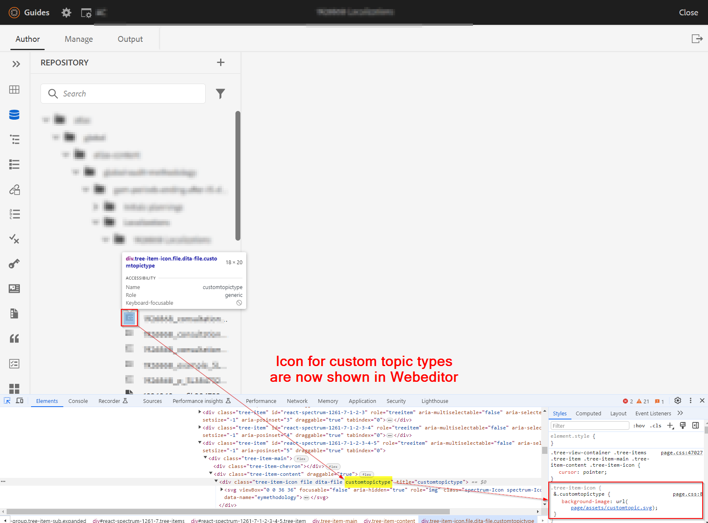

# 為自訂/專門化dita （主題或地圖）型別設定圖示


## 問題陳述

使用AEM Guides中使用的自訂結構，您可以建立自訂主題或對應型別，並且可能會注意到自訂主題/對應型別不會在網頁編輯器或Assets UI中顯示圖示。 請參閱下方熒幕擷圖以取得參考


因此，若要將圖示指派給自訂主題/地圖型別，您必須執行下列動作：
- 尋找自訂主題/地圖型別
- 撰寫樣式以新增自訂型別的所需圖示


我們可以實作上述步驟，在網頁編輯器（存放庫檢視）和資產UI中顯示圖示。 以下是兩者的步驟


## 在網頁編輯器檢視中顯示自訂主題/對應的圖示

_步驟1：_ 決定自訂dita主題/ap的dita型別
- 在Web編輯器中開啟存放庫檢視>在瀏覽器上開啟開發人員主控台
- Inspect所列出主題/地圖旁的圖示空間
- 檢查指派給自訂主題的類別
- 如需詳細資訊，請參閱下方的熒幕擷圖 
- 我們將使用此類別來指派圖示並寫入此專案的css

_步驟2：_ 建立css並將圖示指派給此dita型別
- 在/apps下建立使用者端程式庫，假設您在所需路徑下建立cq：ClientLibraryFolder
   - 將類別「apps.fmdita.xml_editor.page」新增至其中
- 在此目錄下建立資料夾「資產」，並新增您要用於自訂dita型別的所有圖示
- 在client library資料夾下新增css檔案，如&quot;tree-icons.css&quot;
   - 新增下列程式碼至其中

```
            .tree-item-icon {
                &.custommaptype {
                    background-image: url('assets/custommap.svg')
                }
                &.customtopictype {
                    background-image: url('assets/customtopic.svg')
                }
            }
```

- 新增css.txt至client library資料夾下，並新增對「tree-icon.css」的參照
- 儲存/部署這些變更

如需更多詳細資訊，請參閱下面的熒幕擷圖。


最終輸出如下方熒幕擷圖所示



## 顯示資產UI中自訂主題/對應的圖示

_步驟1：_ 決定自訂dita主題/map的dita型別
- 這已在先前方法的步驟1中說明

_步驟2：_ 建立Javacscript來定義要針對自訂主題/地圖型別載入哪些圖示
- 在/apps下建立使用者端程式庫，假設您在所需路徑下建立cq：ClientLibraryFolder
   - 新增下列屬性至其中：
      - &quot;categories&quot;（多值字串）值，為&quot;dam.gui.admin.coral&quot;
      - &quot;dependencies&quot;(multivalue string)值，如&quot;libs.fmdita.versioncontrol&quot;
- 建立檔案「/libs/fmdita/clientlibs/clientlibs/xmleditor/clientlib-dam/topic_type.js」的復本至此/apps目錄
   - 編輯複製的「topic_type.js」，並在「typeImageNameMap」變數下變更/新增customtopictype
   - 您也可以將變數「parentImagePath」的值變更為儲存自訂圖示的位置，以變更影像資料夾的路徑
- 在使用者端資料庫資料夾下建立名為js.txt的檔案，並新增「topic_type.js」的參照
- 儲存/部署這些變更請參考下方的熒幕擷圖以取得詳細資訊。
  

而最終輸出將會如熒幕擷圖中所示 