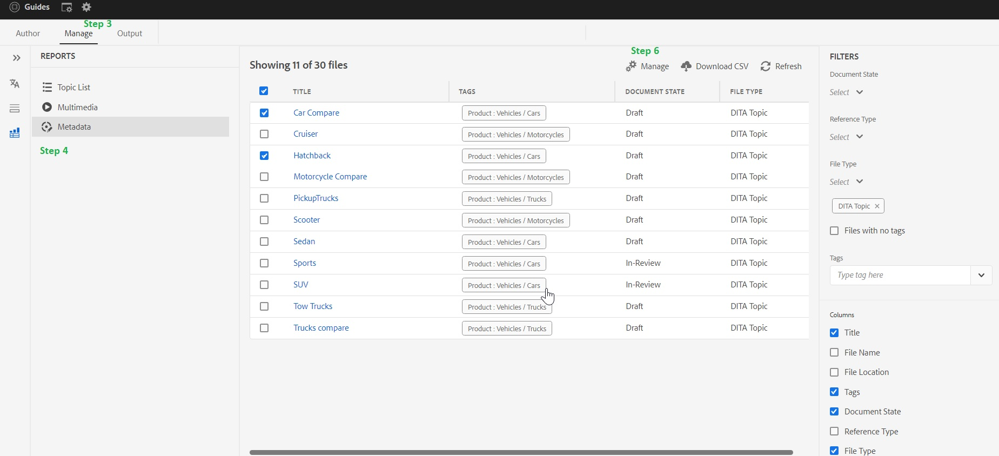

# 如何新增、移除及管理DITA內容中的標籤

標籤可用於分類您的內容。 如果內容已正確標籤，可協助您在Ditamap中找出正確的主題，一般使用者可在您發佈的輸出中更快速地找到適當內容

> **_注意:_**&#x200B;以下文章適用於AEM Guides Build 4.2 （內部部署） /2023年2月（雲端版本）或更新版本

## 建立標籤

標籤是原生AEM功能，您的AEM管理員可協助您初始建立和設定這些標籤。

## 新增、移除及管理DITA內容中的標籤

**在AEM cq：標籤中建立的任何標籤都可以新增、移除及管理您的DITA內容**

有多種方式可以將標籤新增至您的DITA內容，但本文將主要介紹AEM Guides網頁編輯器UI。

### 步驟：

1. 前往指南UI中的存放庫檢視
2. 按兩下ditamap並在地圖檢視中開啟
3. 前往管理標籤
4. 在「管理」標籤中，前往「中繼資料」選項
5. 您的所有直接和間接ditamap檔案清單會在此處載入。
6. 選取一或多個檔案並按一下「管理」圖示。 您可以在此處將標籤新增至選取的檔案。
您也可以移除所選檔案中常見的現有標籤。

## 疑難排解和常見問題

### 在管理 — >中繼資料中的清單是空的或不完整

`If list is empty or  incomplete then you may need to run the indexing on your ditamap, You can refer` [升級指示（索引您的內容）](https://experienceleague.adobe.com/docs/experience-manager-guides-learn/tutorials/install-guide/on-prem-ig/download-install-upgrade-aemg/upgrade-xml-documentation.html?lang=zh-Hant#steps-to-index-the-existing-content-to-use-the-new-find-and-replace%3A)

### 自訂中繼資料未出現在清單中

`Only Tags present in cq:tags can be managed from here and custom metadata is not supported`

## 其他實用資源

- [使用地圖控制面板(Assets UI)大量標籤](https://experienceleague.adobe.com/docs/experience-manager-guides-learn/tutorials/user-guide/manaege-metadata/map-editor-bulk-tagging.html?lang=zh-Hant)
- [網頁編輯器中的Ditamap報表](https://experienceleague.adobe.com/docs/experience-manager-guides-learn/tutorials/user-guide/reports-aem-guide/reports-web-editor.html?lang=zh-Hant)
- [AEM中的標籤](https://experienceleague.adobe.com/docs/experience-manager-learn/assets/configuring/tagging.html?lang=zh-Hant)

**如有任何其他查詢，請連絡您個別的CSM**
