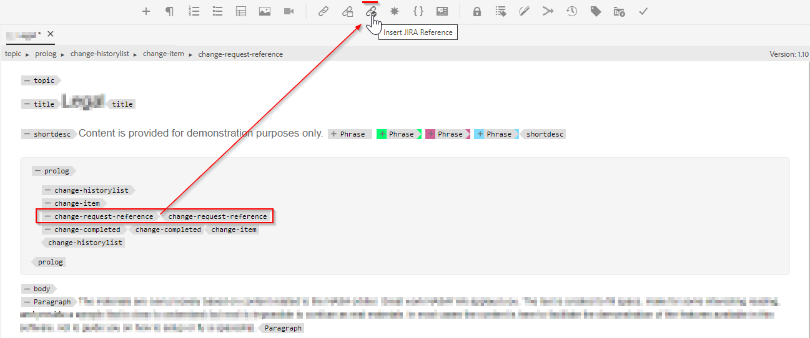

# 在編輯器工具列中新增自訂可操作的按鈕

在本文中，我們將瞭解如何在編輯器工具列中新增自訂按鈕，並呼叫javascript以執行所需的自訂操作。

將可操作的按鈕新增至網路編輯器涉及以下步驟：
- 正在需要的位置新增&#x200B;*ui_config.json*&#x200B;中的按鈕
- 在瀏覽器中註冊按一下按鈕的事件，讓使用者在按一下按鈕時執行動作


## 以範例來實施

以作者想要將jira參考新增至主題序號區段的範例來瞭解此情況。 包含內嵌jira reference-id的prolog區段可能如下所示：


包含JIRA ID的「change-request-id」元素應從API中擷取（比方說，根據應用程式描述的特定JIRA查詢）。 當使用者編寫prolog區段時，使用者應該能夠按一下按鈕並從網頁編輯器工具列插入jira參考id，例如：



當使用者按一下按鈕時，應該會顯示對話方塊，其中應提取可能的選項，並允許使用者選取所需的JIRA ID，例如：


然後應將「change-request-id」新增至prolog：


## 實作此


### 在&#x200B;*ui_config.json*&#x200B;中設定按鈕，以在Webeditor中新增按鈕

使用資料夾設定檔來檢查「XML編輯器設定」索引標籤下的&#x200B;*ui_config.json*，並將按鈕設定JSON新增到「工具列」群組的所需區段中

```
{
    "on-click":"insertJIRARef",
    "icon":"linkCheck",
    "variant":"quiet",
    "type":"button",
    "title":"Insert JIRA Reference"
}
```

[使用此連結來進一步瞭解資料夾設定檔和設定ui_config.json](https://experienceleague.adobe.com/docs/experience-manager-guides-learn/videos/advanced-user-guide/editor-configuration.html?lang=zh-Hant)


### 處理新按鈕的點按事件

    注意：以下步驟可作為此貼文附加的套件使用


- 儲存資料夾設定檔後，請在專案目錄（可能位於&#x200B;*/apps*下）下建立「cq：ClientLibraryFolder」，並新增屬性，如下列熒幕擷取畫面所示：
  

```
This example uses "coralui3" library to show a dialog as it is used in the Javascript sample we presented.
You may use different library of your choice.
```

- 在此使用者端程式庫資料夾底下建立兩個檔案，如下所述：
   - *overrides.js*：將有javascript程式碼來處理「insertJIRARef」的點按事件（使用附加的套件來取得此javascript的內容）
   - *js.txt*：將包含&quot;overrides.js&quot;以啟用此javascript

- 儲存變更，您就可以開始測試了。


### 測試

- 開啟Web編輯器
- 從使用者偏好設定中選擇您新增自訂&#x200B;*ui_config.json*&#x200B;的資料夾設定檔。 如果您將其新增至全域設定檔，表示您可能已經在使用它。
- 開啟主題，您會注意到工具列有一個新按鈕「插入Jira參照」
- 然後，您可以將prolog區段新增至主題，並嘗試在prolog元素「change-request-reference」內按一下「插入Jira參考」按鈕

```
<prolog>
    <change-historylist>
        <change-item>
            <change-request-reference>
            </change-request-reference>
            <change-completed></change-completed>
            <change-summary></change-summary>
        </change-item>
    </change-historylist>
</prolog>
```

請參考下方的熒幕擷圖瞭解其外觀：


### 附件

- 將安裝Webeditor使用者端程式庫的範例clientlibs封裝，該程式庫具有工具列按鈕動作的javascript程式碼： [使用此連結下載](../../../assets/authoring/webeditor-addbuttonontoolbar-insertjira-clientlib.zip)
- 您可以上傳至資料夾設定檔的範例&#x200B;*ui_config.json*： [下載範例ui_config.json](../../../assets/authoring/sample_ui_config_Guides4.2-InsertJiraReference.json)

```
Please note this is compatible to AEM 6.5 and AEM Guides version 4.2.
If you are using a different version please add the toolbar button to the ui_config.json manually.
```
