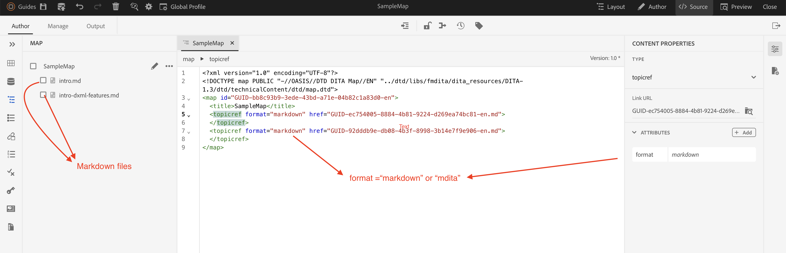

# 在AEM Guides中使用Markdown

## 可用選項

在AEM Guides中使用Markdown檔案有2種選項：

- 選項1 ：在AEM Guides中匯入現有的Markdown，並直接在ditamap中使用它們進行發佈

- 選項2 ：將現有的Markdown檔案轉換為DITA

讓我們來討論每個選項：

### 選項1：在AEM Guides中匯入現有的Markdown，並直接在ditamap中使用它們進行發佈

其設定更簡單，實作更快速。 但是，AEM Guides功能（例如內容重複使用）的功能利用有限。

使用者需要新增屬性`format="markdown" `或`format="mdita"`，讓發佈引擎瞭解檔案型別並據此發佈。

範例檔案： [Markdown Ditamap](https://acrobat.adobe.com/id/urn:aaid:sc:AP:da31137e-be84-44fb-8974-d038eeff0283)

#### Publish以PDF和網頁輸出

AEM Guides提供網頁(Html5/AEM網站)和PDF(原生PDF/DITA-OT)選項，可發佈包含Markdown內容的ditamap

### 選項2 ：將Markdown轉換為DITA格式

充分利用AEM Guides功能，包括內容重複使用、條件處理翻譯、基準等。 但是，必須先將`.md`轉換為`.dita`格式。

您可以使用Adobe FrameMaker和DITA-OT等外部工具將Markdown轉換為DITA。

若為Adobe FrameMaker，請參閱： [匯入Markdown](https://www.adobe.com/in/products/framemaker/features.html#import-markdown)

若為DITA-OT，請參閱： [Markdown作為輸入](https://www.dita-ot.org/dev/topics/markdown-input.html)

使用Adobe FrameMaker轉換的範例檔案： [Markdown轉換為DITA範例](https://acrobat.adobe.com/id/urn:aaid:sc:AP:874881f3-ba43-410c-abc6-2df899536d79)

#### Publish以PDF和網頁輸出

一旦Markdown檔案轉換為DITA，使用者即可順暢地將輸出發佈為AEM Guides中可用的任何格式。

AEM Guides中的可用格式： [輸出格式](../../../../user-guide/generate-output-understand-presets.md)
