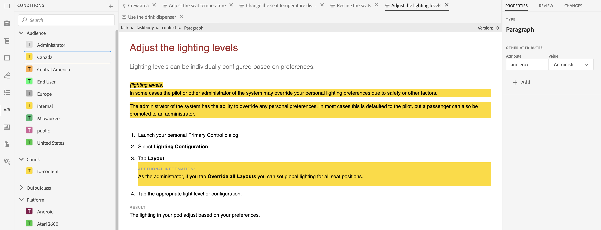

# 使用條件式內容

**使用案例**

* 作者可以設定內容條件，以控制是否顯示在輸出中。

* 作者可在發佈時選擇顯示/隱藏不同的條件。

* 例如，作者可以在內容中新增屬性為1.0版和2.0版，並使用條件來包含1.0版的1.0版和排除2.0版。

**步驟1**

在[!UICONTROL 資料夾設定檔]中定義與檔案相關的條件：
請參閱《安裝與組態指南》第69頁[中的&#x200B;**設定全域或資料夾層級設定檔的條件屬性**&#x200B;一節](https://helpx.adobe.com/content/dam/help/en/xml-documentation-solution/4-2/Adobe-Experience-Manager-Guides_Installation-Configuration-Guide_EN.pdf)

**步驟2**

在XML編輯器中選取&#x200B;**使用者偏好設定**&#x200B;中步驟1定義的&#x200B;**[!UICONTROL 資料夾設定檔]**：
請參閱使用手冊[&#128279;](https://helpx.adobe.com/content/dam/help/en/xml-documentation-solution/4-2/Adobe-Experience-Manager-Guides_User-Guide_EN.pdf)第41頁中的&#x200B;**使用者偏好設定**&#x200B;節

**步驟3**

使用條件來條件化內容的區段：
請參閱使用手冊[&#128279;](https://helpx.adobe.com/content/dam/help/en/xml-documentation-solution/4-2/Adobe-Experience-Manager-Guides_User-Guide_EN.pdf)第90頁中的&#x200B;**條件**&#x200B;小節

**步驟4**

定義對應層級的條件預設集，以選擇要於輸出中啟用的條件：
請參閱使用手冊[&#128279;](https://helpx.adobe.com/content/dam/help/en/xml-documentation-solution/4-2/Adobe-Experience-Manager-Guides_User-Guide_EN.pdf)第249頁中的&#x200B;**使用條件預設集**&#x200B;節
