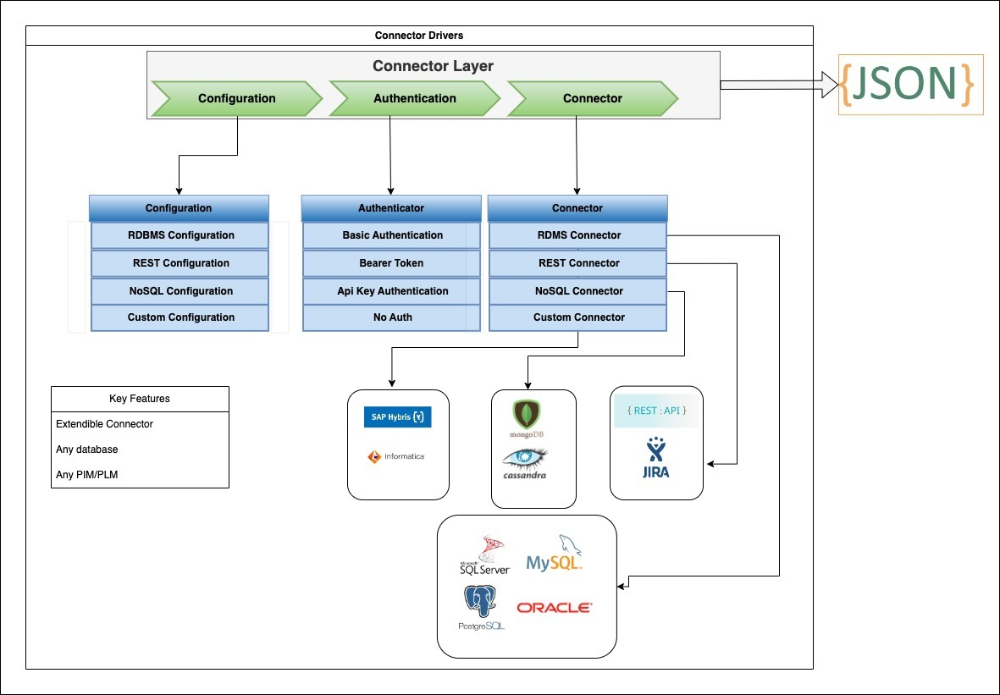
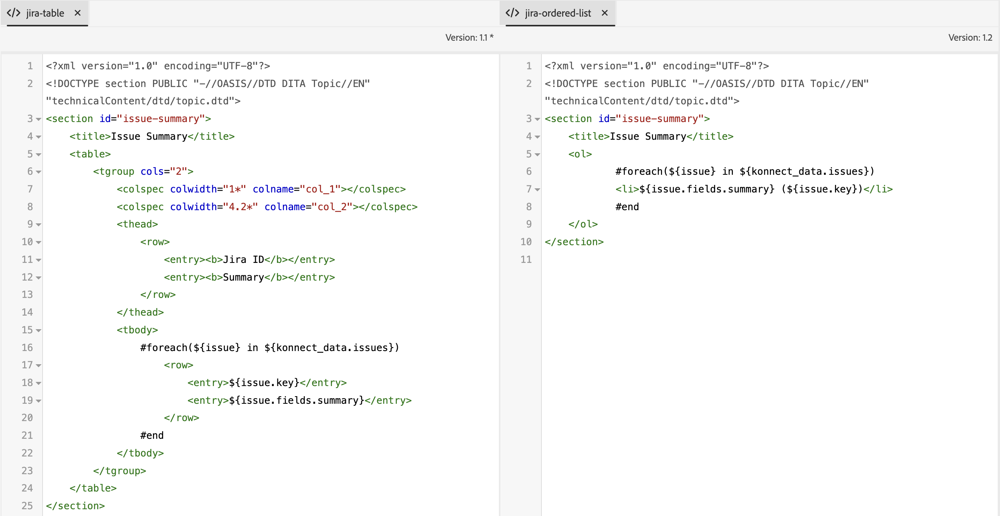
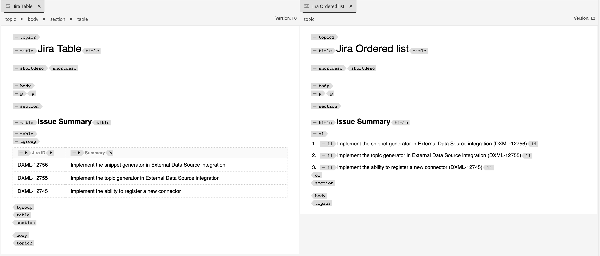

# 外部資料來源整合

來自外部系統的資料可輕鬆整合至您的Experience Manager Guides執行個體。 連線到外部資料來源可大幅增強內容管理系統的功能與可用性。


您可以使用資料整合，有效率地連線及擷取外部來源的資料。 有了這項功能，您就不必依靠IT團隊取得資料，然後手動複製並貼上資料，或持續更新外部系統中的變更。

此功能可確保與原始原始來源同步，且無需依賴手動複製貼上作業即可協調更新說明檔案。 它還有助於維護Experience Manager Guides和外部資料來源之間的資料一致性。

此外，從外部資料來源擷取內容後，您可以以DITA格式製作內容，也可以重複使用整合的內容。


## 資料來源整合架構

資料來源的整合架構主要包含兩個主要元件：外部資料來源及其與Experience Manager Guides例項的整合。

### 外部資料來源

您可以從Experience Manager Guides連線的部分資料來源如下：

- 關聯式資料庫(RDBMS)
   - PostgreSQL、MySQL、Microsoft SQL Server、MariaDB和SQLite
- 非關聯式資料庫
   - MongoDB、Apache Cassandra、Apache CouchDB和Redis
- 產品資訊管理(PIM) /產品生命週期管理(PLM)
   - Pimcore、Salsify、Akeneo和Informatica
- 產品管理系統
   - JIRA和Microsoft Azure DevOps面板(ADO)
- 線上分析處理(OLAP)與分析系統

### Experience Manager Guides中的整合


透過使用已驗證的聯結器，資料會從外部系統傳輸，並在Experience Manager Guides中產生資料。


### Experience Manager Guides中的整合

執行以下步驟，將內容整合至Experience Manager Guides：

1. **設定資料來源聯結器**
   - 資料來源聯結器可作為介面，與外部資料來源建立連線。 您必須設定聯結器以建立連線並包含驗證方法，例如`Basic Auth`或`API key Auth`。 所有設定詳細資料（包括加密資訊）都會安全地儲存在Adobe Experience Manager中。
   - 聯結器層可擴充，可讓您建立實作，以連線至Experience Manager Guides未提供的現成可用的各種系統。
     
   >[!NOTE]
   >
   > 存取Konnect定義模組，並實作Connector介面以建立自訂聯結器。 深入瞭解如何[設定自訂資料來源聯結器](./conf-custom-data-source-connector.md)。

1. **自訂Velocity範本**

   - Experience Manager Guides支援Velocity (https://velocity.apache.org/)，這是一個極為強大的範本引擎，可將資料從JSON檔案轉換為DITA內容。 Velocity可讓您靈活地瀏覽具有任何巢狀層級的JSON結構。
   - 下列範例說明如何整合來自Jira的Velocity範本和資料，以輕鬆產生表格或排序清單。
      - Jira回應

        ```
        {
            "expand": "schema,names",
            "total": 5,
            "hostname": "https://jira.corp.adobe.com",
            "maxResults": "200",
            "issues": [
                {
                    "key": "DXML-12756",
                    "fields": {
                        "description": "Implement the snippet generator in External Data Source integration",
                        "summary": "Implement the snippet generator in External Data Source integration"
                    }
                },
                {
                    "key": "DXML-12755",
                    "fields": {
                        "description": "Implement the topic generator in External Data Source integration",
                        "summary": "Implement the topic generator in External Data Source integration"
                    }
                },
                {
                    "key": "DXML-12745",
                    "fields": {
                        "description": "Implement the ability to register a new connector",
                        "summary": "Implement the ability to register a new connector"
                    }
                }
            ],
            "startAt": 0
        }
        ```

      - 範本
        {width="800" align="left"}
      - 從相同資料來源但不同範本產生的資料
        {width="800" align="left"}

1. **使用範本產生內容**
   - 您可以從已建立的範本產生內容。
   - 您可以產生各種型別的內容：
      - 程式碼片段：這是一次性可用的內容。 您可以在已定義的範本中從聯結器產生資料，然後將資料內嵌於所需的標籤中。
      - DITA主題：產生各種主題以依內容原樣使用，或可重複用作&#x200B;*可重複使用的元件*。
      - DITA Topic + Map：您也可以使用主題產生完整的對應，然後直接使用資料進行發佈，或將其用做其他資料中的&#x200B;*可重複使用的元件*。


1. **Publish整合的內容**
   - 發佈是Experience Manager Guides的OOTB功能，您可以直接發佈從外部系統產生的所有資料作為PDF或AEM Site輸出。

>[!MORELIKETHIS]
>
> 下列檔案提供設定聯結器以及在執行個體中使用聯結器的詳細資訊。
> - [設定資料來源聯結器](../../../install-guide/conf-data-source-connector-tools.md)
> - [使用片段或主題產生內容](../../../user-guide/web-editor-content-snippet.md)