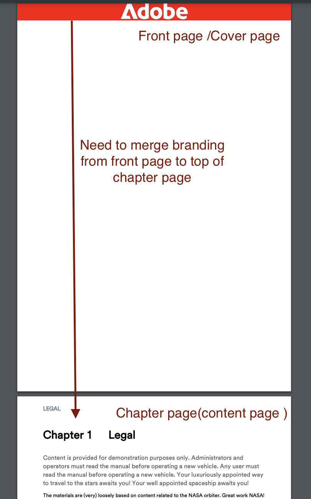
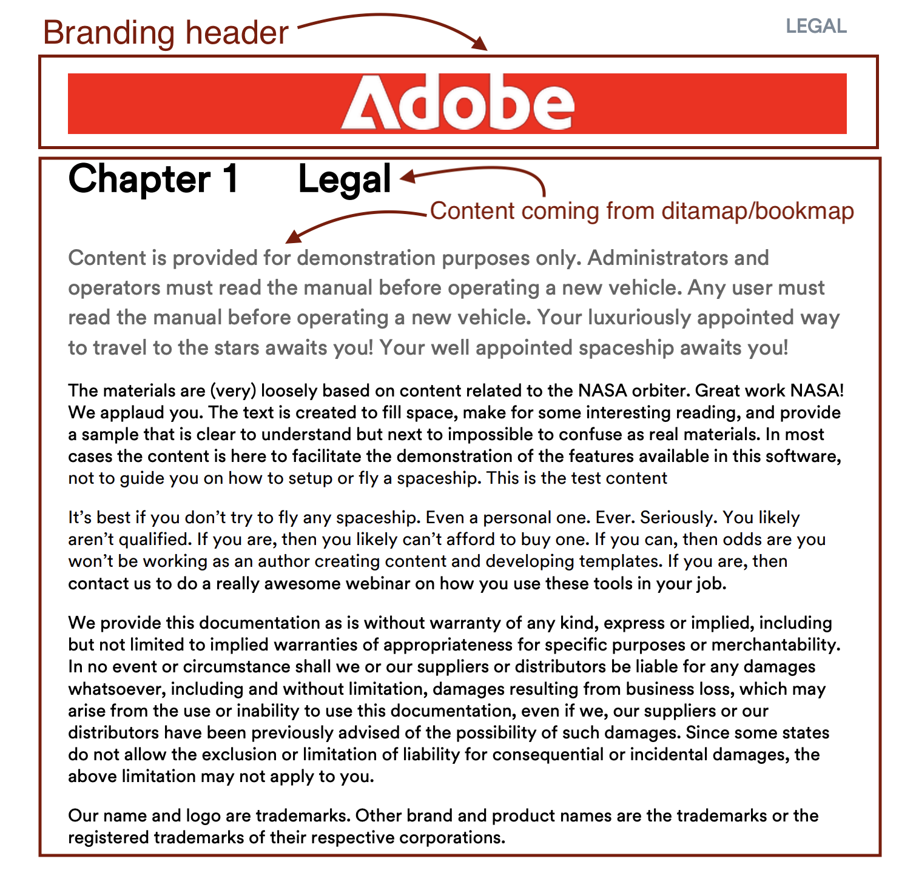
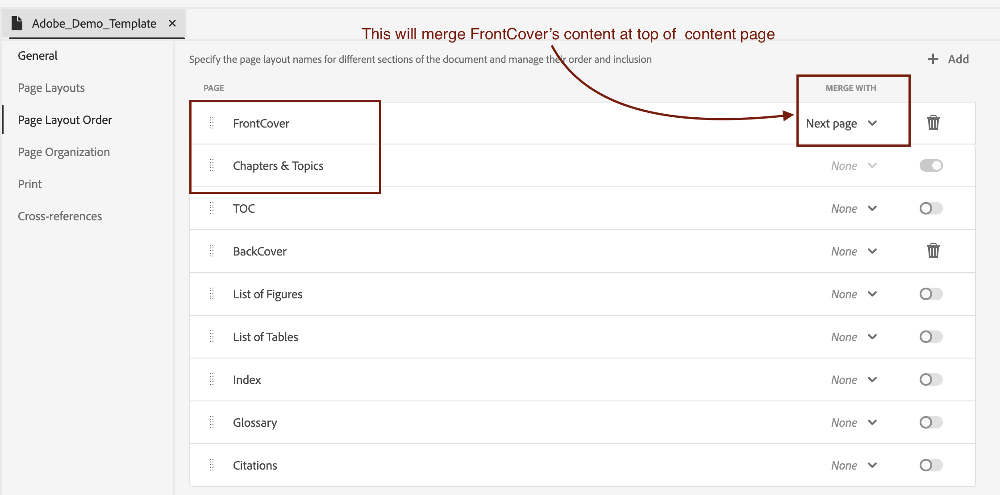
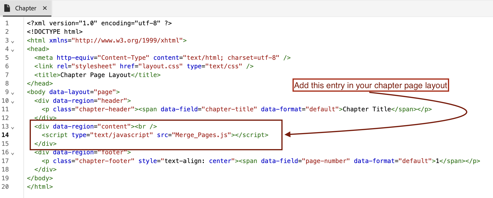
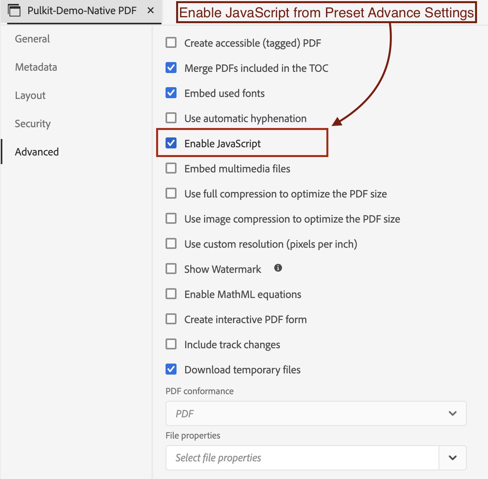

# 將企業品牌新增至DITAPDF的第一頁

## 本文會涵蓋：

藉由將FrontCover頁面與章節頁面無縫地合併，達成企業品牌化，確保企業身分識別顯眼地顯示在內容頂端。

- [設定您的內容](#set-up-your-content)
- [在PDF範本中進行必要的變更](#create-necessary-changes-in-pdf-template)

**之前：**


<br>
<br>

**之後：**



## 設定您的內容

若要以PDF格式發佈內容，您必須建立Ditamap或Bookmap。

範例書籤結構圖：

```
<bookmap>
  <title>My Bookmap Title </title>
  <frontmatter>
    <booklists>
      <toc/>
      <figurelist/>
      <tablelist/>
    </booklists>
  </frontmatter>

  <chapter href="chapter1.ditamap">
  <chapter href="chapter2.ditamap">
  </chapter>

  <backmatter>
    <booklists>
      <indexlist/>
    </booklists>
  </backmatter>
</bookmap>
```

範例Ditamap結構：

```
<map title="My map Title">

  <topicref href="topic1.dita" >
  </topicref>
  <topicref href="topic2.dita">
  </topicref>
  
</map>
```

如果Bookmap包含`<frontmatter>`，則會自動產生PDF的FrontCover。


## 在PDF範本中進行必要的變更

在本節中，我們將設定範本。 （您可以使用或複製高科技範本以開始使用。）

### 設定您的範本：

- 前往您的原生PDF範本。
- 移至您的FrontCover頁面版面並加以編輯。
- 在這裡，在`data-region="content"`中新增您的商標影像。
- 如有需要，可在章節範本中新增其他必要的變更。
- 現在請根據您的內容遵循下列步驟。


#### 如果您使用Ditamap來產生PDF：

發佈DITAMAP時，原生PDF提供自動產生FrontCover頁面的功能。 啟用或停用FrontCover頁面產生的選項可在原生PDF範本中設定。

若要合併：
- 移至原生PDF範本設定 — >頁面配置順序
- 現在合併FrontCover與下一頁，即章節和主題。
  
- 儲存範本，為您的預設集選取此範本並發佈！


#### 如果您使用Bookmap產生PDF

若是書籤，頁面配置順序是由書籤的結構控制，而非範本的順序。

為了在Bookmap上達成此目的，我們將使用NativePDF的JavaScript功能。

- 在範本的資源資料夾中新增至JavaScript下方

```
window.addEventListener('DOMContentLoaded', function () {
    window.pdfLayout.onAfterPagination(function () {
        var frontMatterWrappers = document.querySelectorAll('.rh-front-matter-wrapper');

        frontMatterWrappers.forEach(function(wrapper) {
            var contentDiv = wrapper.querySelector('div[data-region="content"]');
            var chapterBody = document.querySelector('.chapter-body');

            if (contentDiv && chapterBody) {
                chapterBody.insertBefore(contentDiv, chapterBody.firstChild);
            }

            wrapper.remove();
        });
    });
});
```

- 在您的章節範本中加入此JavaScript 。
  

- 從預設集選項啟用JavaScript
  

- Publish！

## 附件：

- [下載範例PDF範本套件以檢視套用的變更。](../assets/publishing/NativePDF_DemoTemplate.zip)
- [下載範例PDF預設集套件以檢視套用的變更。](../assets/publishing/Preset_Package.zip)


## 其他資源：

- [如何在PDF中包含DITA Bookmap的目錄](./how-to-include-bookmap-toc-in-pdf-publishing.md)
- [原生PDF專家會議影片](../../expert-sessions/native-pdf-publishing-eamples-part1-june2023.md)

