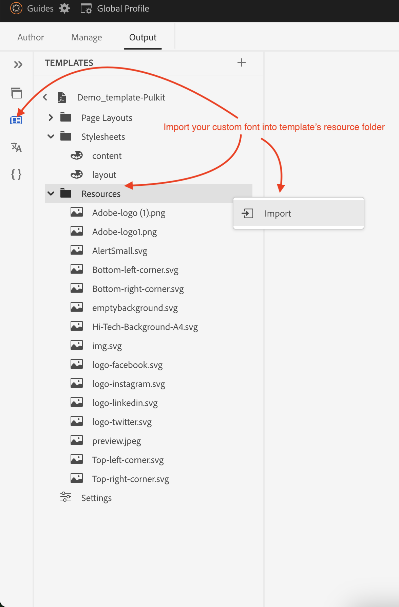
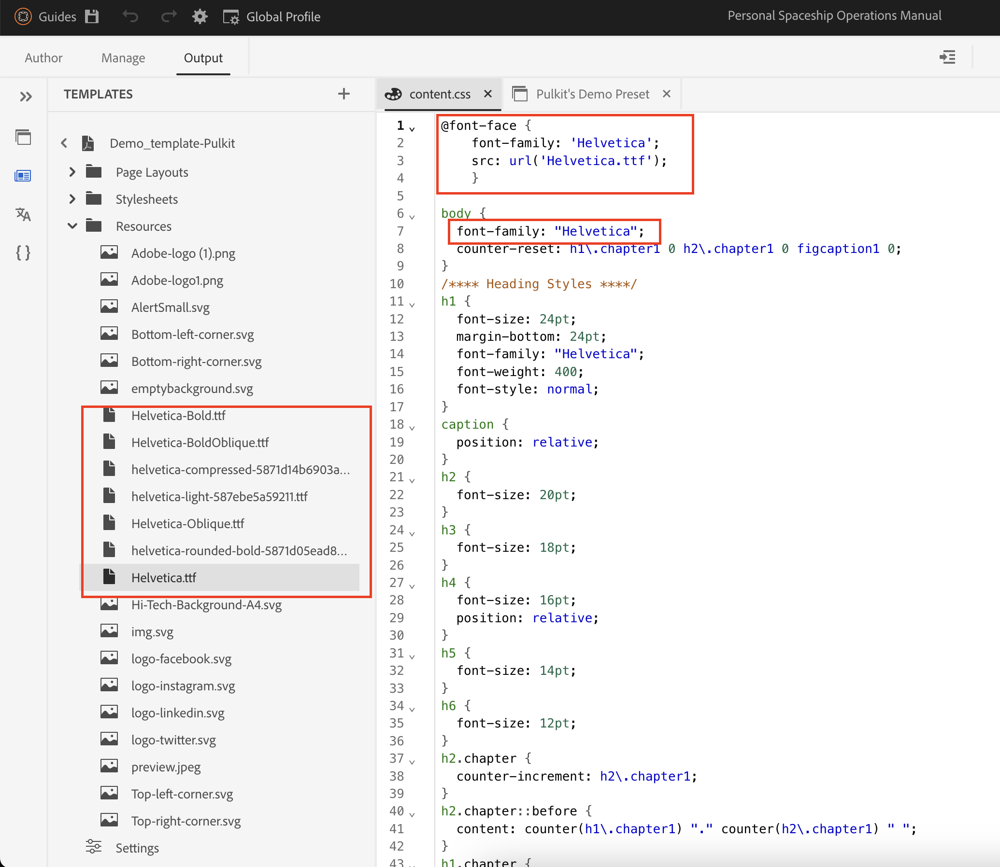
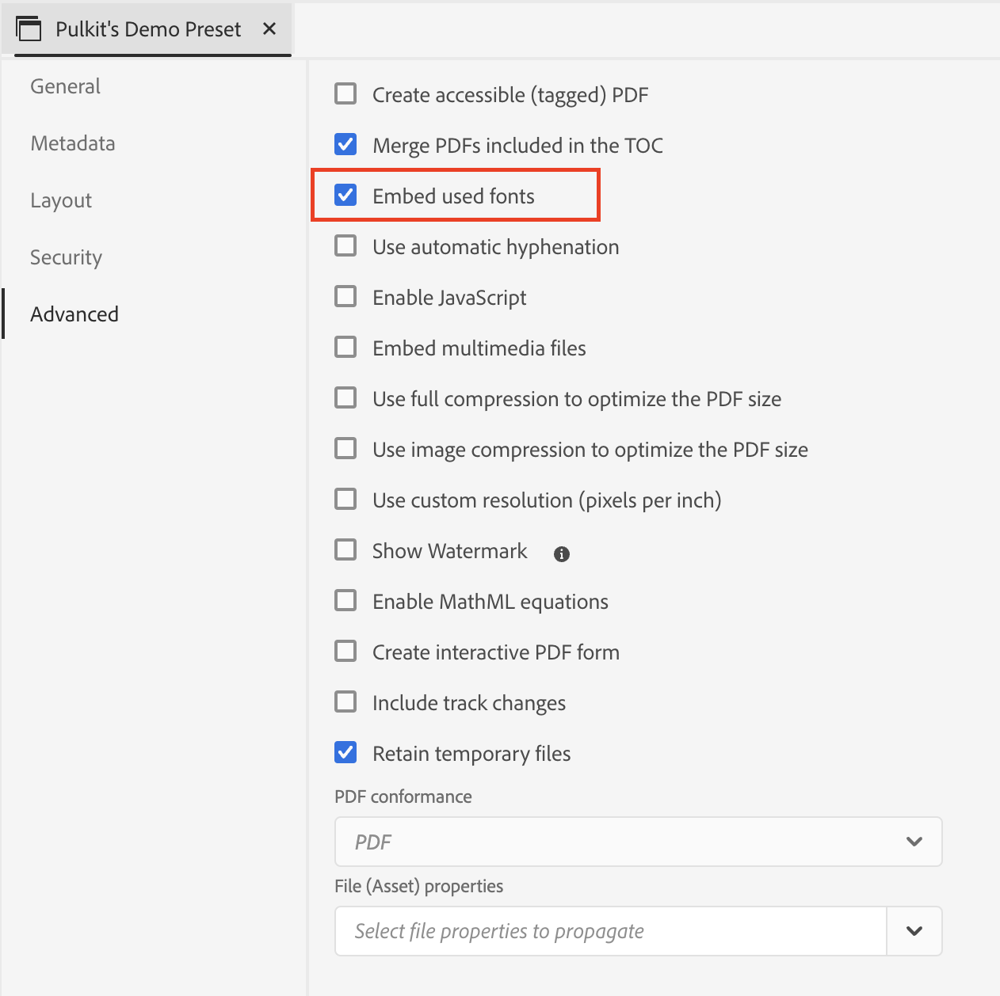
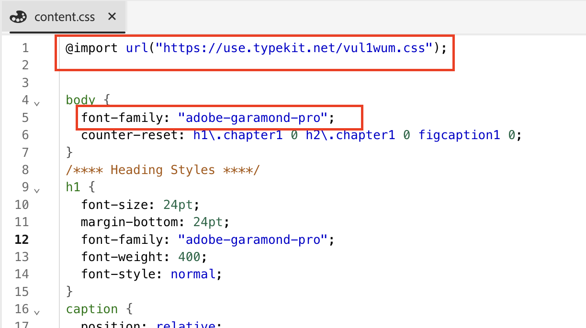

# 新增自訂字型至您的DITA原生PDF

## 本文涵蓋：

新增自訂字型，以強化所有內容的品牌識別與視覺一致性。

此程式包含3個步驟：

- [上傳自訂字型](#step-1--upload-the-custom-font-to-the-resource-folder-of-your-template)
- [在PDF範本的樣式表中進行必要的變更](#step-2--make-necessary-changes-in-pdf-templatess-stylesheet)

- [嵌入使用的字型（選擇性）](#step-3-optional--embed-used-font-in-pdf)

## 步驟1 ：將自訂字型上傳至範本的資源資料夾

## 步驟2 ：在PDF範本的樣式表中進行必要的變更

中的字型

## 步驟3 （選用） ：將使用的字型內嵌在PDF中

的自訂字型

## 常見問題集

- ### 我可以使用Adobe Fonts嗎？

> 是，請前往fonts.adobe.com並按一下[新增至Web專案]。
> 
> 複製匯入程式碼，例如`" @import url("https://use.typekit.net/xxxx.css")`；
>
> 將內容CSS貼上，並在CSS檔案中進行所需的變更。

- ### 我的字型未以PDF顯示

> 仔細檢查字型名稱拼字（最常見的錯誤）
>
> 如果PDF開啟的系統無法使用字型，請確定您正在內嵌字型

- ## 如需任何其他查詢，請聯絡您個別的CSM

## 其他資源：

- [如何在PDF中包含DITA Bookmap的目錄](./how-to-include-bookmap-toc-in-pdf-publishing.md)
- [如何在PDF發佈中包含目錄](./how-to-include-bookmap-toc-in-pdf-publishing.md)
- [原生PDF專家研討會影片](../../expert-sessions/native-pdf-publishing-eamples-part1-june2023.md)