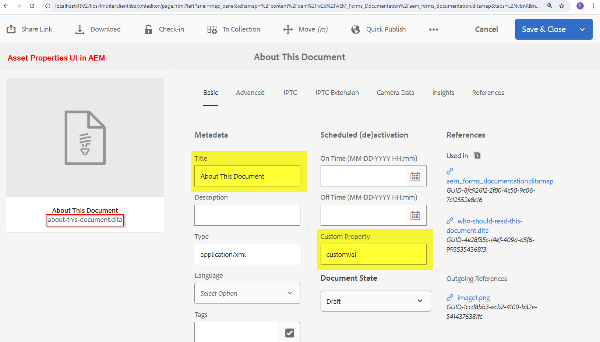
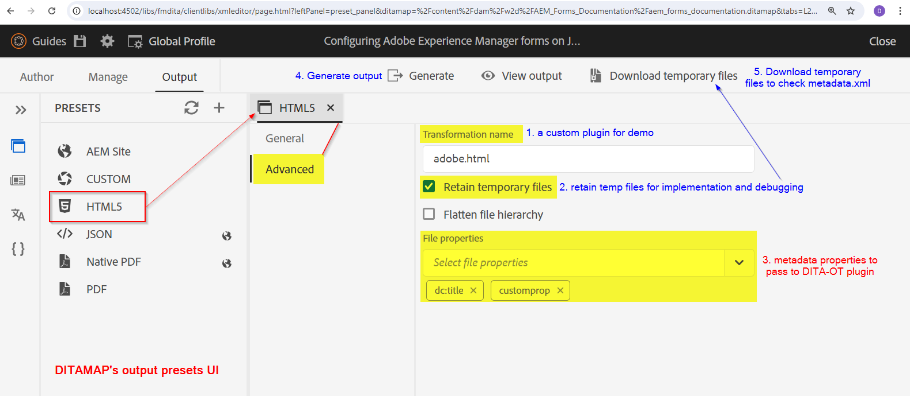
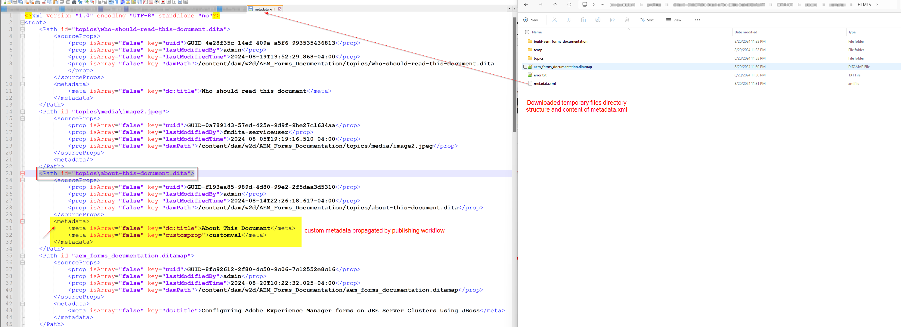
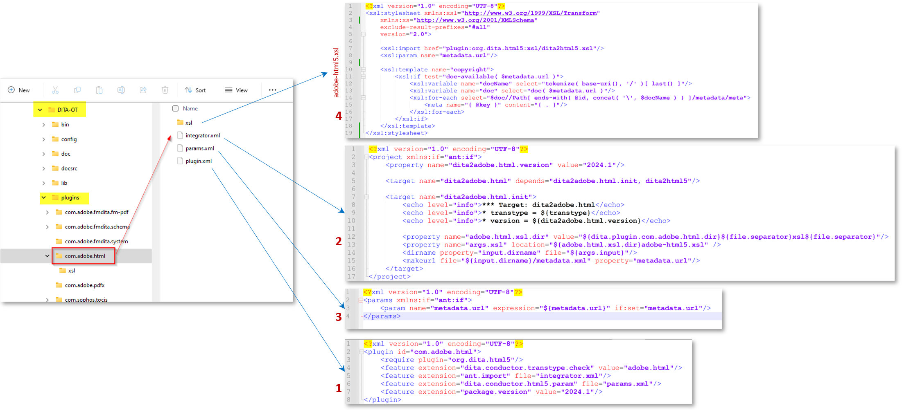

# 將AEM Assets中繼資料傳播至DITA-OT外掛程式產生的輸出

在本文中，我們將說明如何對DITA-OT外掛程式實作變更，以讀取metadata.xml _（可在暫存檔案中取得）_，並利用AEM Guides發佈工作流程傳遞的屬性在DITA-OT外掛程式中，並在產生的輸出中設定它。

概括地說，以下是您將在本文中學習的步驟：
- 在AEM Guides中設定ditamap輸出預設集的中繼資料
- 在產生輸出時，存取DITA-OT暫存目錄中的此metadata.xml
- 在DITA-OT外掛程式中實作，以讀取此&#x200B;_metadata.xml_，並在產生的輸出中使用可用的屬性
- 檢查產生的輸出以檢視傳播的中繼資料

## 背景

透過AEM Guides，您可以使用DITA-OT外掛程式，透過已設定的外掛程式，發佈至您選擇的輸出格式，並且
您也可以將在AEM DAM中管理的資產的中繼資料傳遞至DITA-OT程式，以便在產生的輸出中使用它 — 請參閱有關[如何設定ditamap/主題以透過輸出預設集傳遞中繼資料的檔案](https://experienceleague.adobe.com/en/docs/experience-manager-guides/using/user-guide/output-gen/pass-metadata-dita-ot)


## 假設

您已使用AEM Guides版本4.4.0/2024.6或更高版本進行AEM設定
您事先瞭解DITA-OT的運作方式及其目錄結構


## 步驟說明

### 在資產上設定中繼資料

使用AEM Assets中繼資料結構，您可以在AEM中為Assets建立自訂屬性欄位，使用者可以將中繼資料指派給資產。 以&#x200B;_主題_&#x200B;資產為例，其中可設定名稱為&#x200B;_customprop_&#x200B;的中繼資料為範例，請參考下方的熒幕擷圖：




### 在ditamap輸出預設集上設定中繼資料以傳遞至DITA-OT

在地圖上設定您選擇的輸出預設集，以匯出中繼資料並傳遞至DITA-OT
假設我們正在使用DITA-OT外掛程式產生HTML5輸出，例如_adobe.html_。
請參閱下方的熒幕擷圖，瞭解如何為地圖設定輸出預設集，以將中繼資料傳遞至DITA-OT外掛程式。
1. 開啟地圖並瀏覽至此地圖的&#x200B;_輸出_&#x200B;標籤，然後開啟HTML5預設集，然後按一下&#x200B;_進階_&#x200B;標籤，在此上將轉換名稱設定為&#x200B;_adobe.html_ （這是我們將設定並用於範例的外掛程式，您也可以定義自訂外掛程式）
2. 設定&#x200B;_保留暫存檔案_，以便能夠下載暫存檔案，並檢查metadata.xml的構成方式，您可以使用此檔案進行開發
3. 選取您要透過metadata.xml傳遞至DITA-OT的中繼資料屬性。 在此範例中，假設我們想要傳遞&#x200B;_dc：title_&#x200B;和&#x200B;_customprop_
4. 儲存預設集並產生輸出
5. 使用預設集上顯示的按鈕下載暫存檔

請參閱下面的熒幕擷圖以瞭解上述步驟：



### 實作DITA-OT外掛程式

#### 存取暫存目錄中的metadata.xml

在下載的暫存檔套件中，您會注意到metadata.xml檔案，您可以在此檢視屬性和值的結構（請參閱下面的熒幕擷圖）


##### 瞭解metadata.xml

- 此檔案包含所有已發佈資產的清單，每個資產具有：
   - Path專案&rbrack;的DITA目錄&lbrack;id屬性中的檔案路徑
   - 和&#x200B;_中繼資料_&#x200B;專案&rbrack;下的中繼資料屬性值配對&lbrack;清單

```
        <Path id="topics\about-this-document.dita">
            <sourceProps>
                ...
            </sourceProps>
            <metadata>
                <meta isArray="false" key="dc:title">About This Document</meta>
                <meta isArray="false" key="customprop">customval</meta>
            </metadata>
        </Path>
```

#### 存取DITA-OT外掛程式中每個資產的中繼資料

若要讓DITA-OT外掛程式讀取&#x200B;_metadata.xml_&#x200B;及其中可用的屬性，我們需要執行下列動作：
- 在&#x200B;_plugins.xml_&#x200B;中定義自訂外掛程式設定，其中定義外掛程式初始化的引數和整合器，範例外掛程式檔案如下所示：

```
<?xml version="1.0" encoding="UTF-8"?>
<plugin id="com.adobe.html">
    <require plugin="org.dita.html5"/>
    <feature extension="dita.conductor.transtype.check" value="adobe.html"/>
    <feature extension="ant.import" file="integrator.xml"/>
    <feature extension="dita.conductor.html5.param" file="params.xml"/>
    <feature extension="package.version" value="2024.1"/>
</plugin>
```

- 啟動外掛程式時：
   - 設定變數以指向metadata.xml檔案，亦即，在外掛程式下的&#x200B;_integrator.xml_&#x200B;中，設定屬性以定義中繼資料檔案的路徑，並且
   - 定義執行自訂xsl轉換規則的檔案，即&#x200B;_args.xsl_，在此案例中會指向檔案&#x200B;_xsl/adobe-html5.xsl_。
請參閱下列程式碼：

```
    <property name="adobe.html.xsl.dir" value="${dita.plugin.com.adobe.html.dir}${file.separator}xsl${file.separator}"/>
    <property name="args.xsl" location="${adobe.html.xsl.dir}adobe-html5.xsl" />
    <dirname property="input.dirname" file="${args.input}"/>
    <makeurl file="${input.dirname}/metadata.xml" property="metadata.url"/>
```

- 將變數&#x200B;_metadata.url_&#x200B;的值傳遞至自訂XSL，以視需要加以運用，例如在現有/已建立的&#x200B;_param.xml_&#x200B;中，將引數傳遞至外掛程式，請參閱下方的params.xml範例檔案：

```
    <?xml version="1.0" encoding="UTF-8"?>
    <params xmlns:if="ant:if">
        <param name="metadata.url" expression="${metadata.url}" if:set="metadata.url"/>
    </params>
```

- 在自訂XSL轉換檔案&#x200B;_xsl/adobe-html5.xsl_&#x200B;中，您可以從中繼資料檔案讀取中繼資料值，並以您想要的方式在輸出中設定它。 在此範例中，我們會新增中繼資料值至html head > meta標籤。 請參閱下列程式碼：

```
<xsl:import href="plugin:org.dita.html5:xsl/dita2html5.xsl"/>
    <xsl:param name="metadata.url"/>
    <xsl:template name="copyright">
        <xsl:if test="doc-available( $metadata.url )">
            <xsl:variable name="docName" select="tokenize( base-uri(), '/' )[ last() ]"/>
            <xsl:variable name="doc" select="doc( $metadata.url )"/>
            <xsl:for-each select="$doc//Path[ ends-with( @id, concat( '\', $docName ) ) ]/metadata/meta">
                <meta name="{ @key }" content="{ . }"/>
            </xsl:for-each>
        </xsl:if>
    </xsl:template>
```

請參閱下方熒幕擷圖，強調上述步驟
實作dita-ot外掛程式的


### 測試外掛程式實作

您可以執行以下命令來測試外掛程式，使用從AEM下載的暫存檔案（具有對應內容及其metadata.xml）來測試外掛程式

```
./dita --input=docsrc/samples/HTML5/aem_forms_documentation.ditamap --format=adobe.html
```

假設您已複製目錄「DITA-OT/docsrc/samples/HTML5」下的已下載暫存檔案。
您也可以下載資源區段中提供的範例。

執行上述命令時，您可以檢查目錄「DITA-OT/bin/out」中的輸出，您可以在此處檢查針對主題「about-this-document.dita」產生的html檔案，該主題在&#x200B;_head_&#x200B;元素中將具有自訂中繼資料

```
<head>
    <meta http-equiv="Content-Type" content="text/html; charset=UTF-8">
    <meta charset="UTF-8">
    <meta name="copyright" content="(C) Copyright 2024">
    <meta name="DC.format" content="HTML5">
    <meta name="DC.identifier" content="GUID-f193ea85-989d-4d80-99e2-2f5dea3d5310">
    <meta name="DC.language" content="en-US">
    <meta name="dc:title" content="About This Document">
    <meta name="customprop" content="customval">
    <title>About This Document</title>
</head>
```

### 部署

開發DITA-OT外掛程式之後，您就可以使用DITA-OT目錄下的&#x200B;_dita —install_&#x200B;命令，將此外掛程式整合到DITA-OT中，並將其部署到AEM伺服器[請參閱本文章以取得更多詳細資料](https://experienceleaguecommunities.adobe.com/t5/experience-manager-guides/steps-to-setup-a-custom-dita-ot/td-p/407659)


## 資源

1. 從範例ditamap下載的範例暫存檔 — 使用此連結[下載](../../assets/publishing/sample-temp-html5-adobe.html-content.zip)
2. 具有上述說明實作[的DITA-OT外掛程式使用此連結](../../assets/publishing/sample-custom-plugin-com.adobe.html.zip)下載