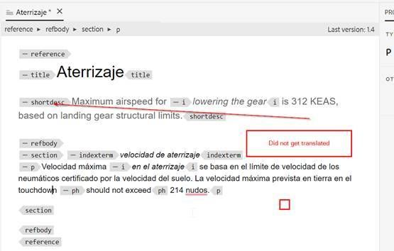

# 如何從翻譯中排除主題中的段落

最簡單的方式是使用translation=no屬性。

+ 作者可以在不想翻譯的段落上插入額外的屬性，如&#x200B;**translation=no**。 需要通知翻譯廠商，他們可以在終端進行設定，以忽略具有此屬性的文字。
+ OOTB機器翻譯(搭配試用Microsoft翻譯聯結器)具有相同的行為。
+ 使用Microsoft翻譯進行測試：如果您在段落層級定義&#x200B;**translate=no**&#x200B;屬性，則不會翻譯完整的段落。 此屬性可在任何元素處定義，不會轉譯該元素內的內容。

以下是幾個熒幕擷取畫面，進一步說明此問題：

**Source內容**

**翻譯成西班牙文的內容**

