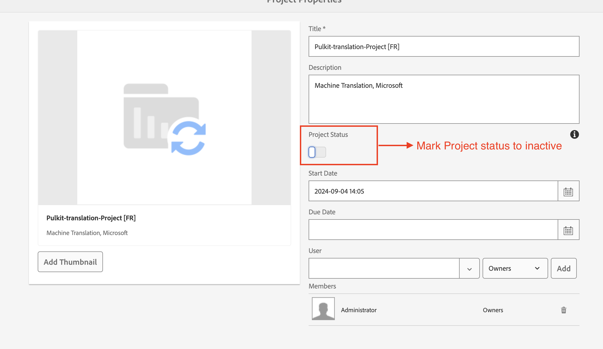
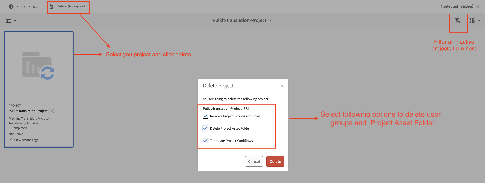
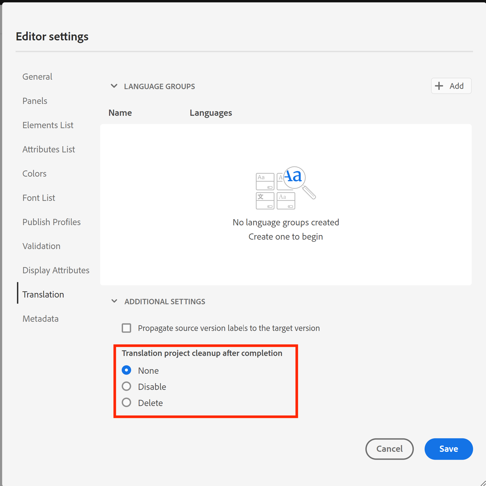

# 在AEM Guides中翻譯時應遵循的最佳實務

系統上的翻譯活動會隨著時間而增加，翻譯專案的效能可能會降低。

每個翻譯專案會產生多個使用者群組以供存取，導致系統內的使用者群組數量增加。 隨著使用者群組數量增加，與使用者許可權相關的CRUD作業可能會逐漸變慢，進而影響整體AEM效能。 此外，如果翻譯專案在完成後仍然有效，可能會對AEM和翻譯供應商之間的翻譯同步效能產生負面影響。

**遵循下列最佳實務有助於維持有效率的環境。**

## 如果您使用低於4.6 （內部部署）或2404 （雲端）的舊版組建版本：

- 在翻譯完成並核准後，將所有專案標示為「非使用中」。專案仍可供檢閱，且只會標示為非使用中。
   - 遵循這些步驟將有助於維持整體翻譯效能的良好狀態。
     

- 對於標示為非使用中的舊版專案資料夾，應刪除其已核准和已稽核
   - 遵循這些步驟將透過清除與此專案資料夾關聯的臨時翻譯檔案和使用者群組，幫助保持整體翻譯效能的良好狀態。
     

## 如果您在上，請建置4.6或2404或更新版本：

您可以繼續依照上述步驟操作。 從4.6/2404版開始，AEM Guides為管理員引進了編輯器設定，以停用翻譯專案的自動刪除。

參考：[自動刪除或停用已完成的翻譯專案](https://experienceleague.adobe.com/en/docs/experience-manager-guides/using/user-guide/author-content/create-preview-topics/author-content-aem-guides/work-with-web-editor/translate-documents-web-editor#automatically-delete-or-disable-a-completed-translation-project)

