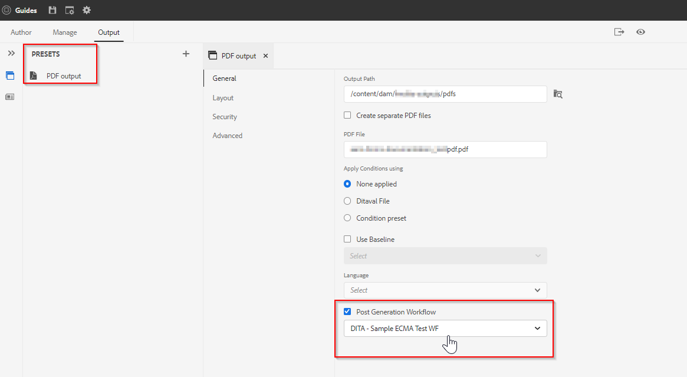

# AEM Guides發佈 — 貼文產生工作流程

AEM Guides可讓您靈活指定輸出後產生工作流程。 您可以在使用AEM Guides產生的輸出上執行一些後續處理工作。
例如，您可能會想要在PDF輸出上設定某些屬性，或是在產生輸出後想要傳送電子郵件給一組使用者。

## 使用後產生工作流程需要哪些步驟

### 建立工作流程程式

建立以Java或ECMA為基礎的工作流程處理，以對產生的輸出執行作業。 例如，將部分中繼資料從來源複製到產生的內容，或操控產生的輸出的中繼資料。
- 我們將以使用ECMA指令碼建立此程式為例（您可以參考附加的套件）
- 如需以Java為基礎的工作流程程式，請參閱[安裝與設定指南](https://helpx.adobe.com/content/dam/help/en/xml-documentation-solution/4-2/Adobe-Experience-Manager-Guides_UUID_Installation-Configuration-Guide_EN.pdf#page=119)中的&lt;自訂輸出後產生工作流程&#x200B;*>一節*

### 建立工作流程模型

使用您在上一步建立的自訂工作流程程式，建立工作流程模型並將該程式步驟新增到其中。
- 您也必須新增強制的處理程式步驟&quot;*完成產生貼文*&quot;，作為工作流程的最後一個步驟。

請參閱下列範例工作流程模型：

### 在地圖上使用此貼文產生工作流程

產生後工作流程是可設定在AEM Guides發佈機制中任何輸出預設集的屬性。 範例：

輸出預設集上的

假設已建立選取的模型。

### 測試

現在您可以使用此預設集執行發佈，並驗證程式步驟輸出

## 範例

您可以參考以下套件，並透過套件管理員進行安裝，以測試範例產生後工作流程（*，如上述熒幕擷取畫面所述*）

[基於ECMA的後生成工作流程模型範例](../assets/workflows/sample-pgwf-ecma-test-wfmetadata.zip)
