# Experience Manager Guides和Edge Delivery Services (Beta)

Adobe Experience Manager Guides可讓您透過專用的GitHub型發佈設定檔，直接將DITA內容發佈至Edge Delivery Services (EDS) (目前可在&#x200B;*Beta*&#x200B;中使用)。 此功能可讓組織提供高效能、回應式檔案體驗，同時在Experience Manager Guides中維護DITA型撰寫工作流程。

如需在Adobe Experience Manager中使用EDS的詳細資訊，請檢視[Edge Delivery Services概觀](https://experienceleague.adobe.com/zh-hant/docs/experience-manager-cloud-service/content/edge-delivery/overview)。

若要啟用從Experience Manager Guides發佈至EDS (Beta)的功能，您必須完成GitHub和Experience Manager Guides的一系列設定步驟。 以下各節將依序概述每個步驟，並解釋它們在整體發佈工作流程中如何搭配運作。

1. [設定EDS適用的GitHub (Beta)](#set-up-and-configure-github-for-eds-beta)
2. [在Experience Manager Guides中為EDS (Beta)建立並設定發佈設定檔](#create-and-configure-a-publish-profile-for-eds-beta-in-experience-manager)
3. [使用EDS區塊自訂輸出](#customize-output-using-eds-blocks)

如需快速影片逐步解說，請檢視[在AEM Guides中發佈](https://experienceleague.adobe.com/zh-hant/docs/experience-manager-guides/using/knowledge-base/expert-session/publishing-in-aem-guides-aug25)。

## 設定EDS適用的GitHub (Beta)

本節說明如何設定和設定GitHub以搭配EDS (Beta)使用。 內容包括使用Adobe檔案集建立存放庫、透過AEM Code Sync連線GitHub至Adobe Experience Manager、設定必要的GitHub和OAuth應用程式，以及定義用於發佈內容的存放庫掛載點。

### 建立EDS的GitHub存放庫(Beta)

EDS (Beta)需要預先定義結構的GitHub存放庫。 Adobe提供專為Experience Manager Guides使用者設計的官方檔案存放庫。

執行以下步驟來建立您的存放庫：

1. 開啟Experience Manager Guides樣板範本存放庫[`aem-guides-boilerplate`](https://github.com/adobe/aem-guides-boilerplate)。
   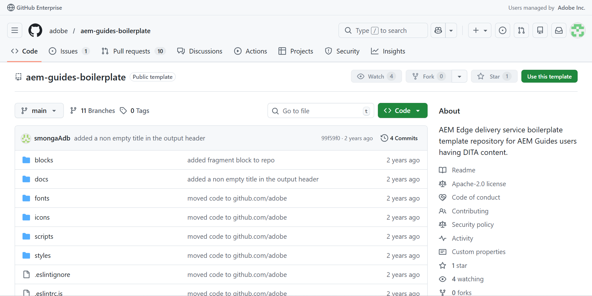{align="left"}

2. 使用此範本建立新的存放庫。 瞭解[從範本](https://docs.github.com/en/repositories/creating-and-managing-repositories/creating-a-repository-from-a-template)建立存放庫。 確定存放庫可見性已設定為&#x200B;*公用*，以便EDS可以存取它。

   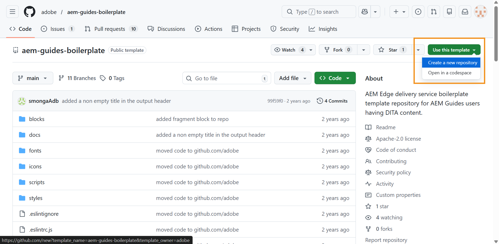{align="left"}

存放庫現在已建立，並與樣版範本結構一致。

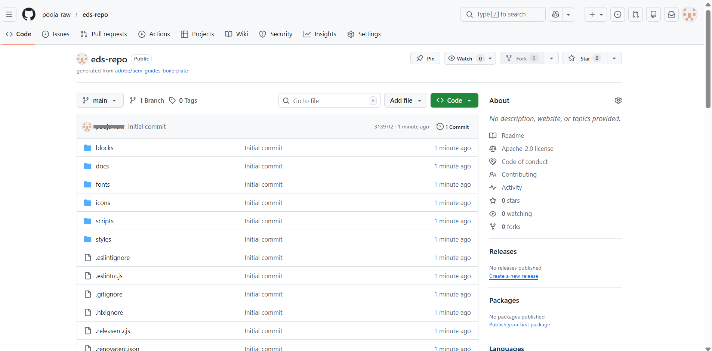{align="left"}

### 透過AEM程式碼同步連線GitHub至Adobe

Adobe Experience Manager使用名為&#x200B;**AEM Code Sync**&#x200B;的GitHub應用程式，將內容從Experience Manager Guides推送至GitHub。

執行以下步驟來安裝和設定&#x200B;*AEM Code Sync*&#x200B;應用程式：

1. 瀏覽至[AEM程式碼同步](https://github.com/apps/aem-code-sync)頁面，並選取&#x200B;**安裝**。
2. *AEM Code Sync*&#x200B;會監視存放庫變更，並確保將更新正確推送至GitHub。

   >
   >
   > 安裝應用程式時，請確定您使用擁有存放庫的相同GitHub帳戶。

   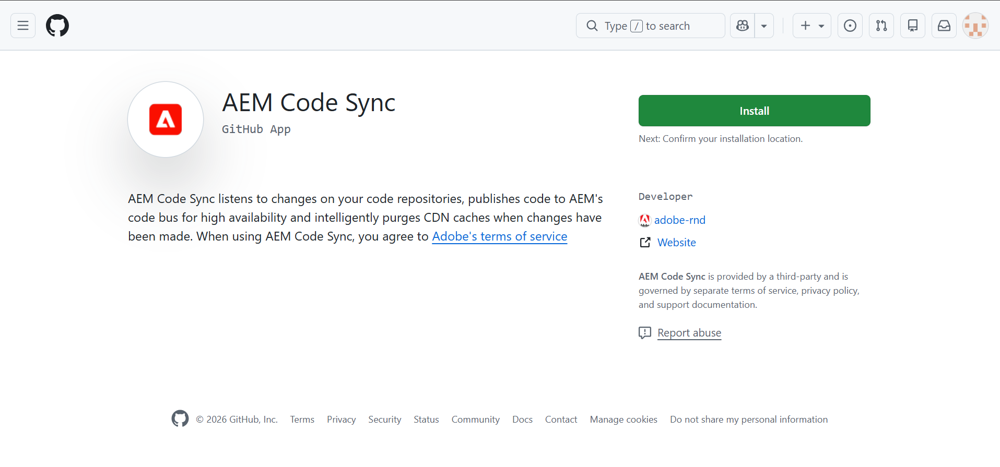{align="left"}
3. 在下一頁，授予您所建立之存放庫的存取權。 若要這麼做，請選取&#x200B;**僅選取存放庫**&#x200B;選項，然後從下拉式清單中選取您的存放庫。

   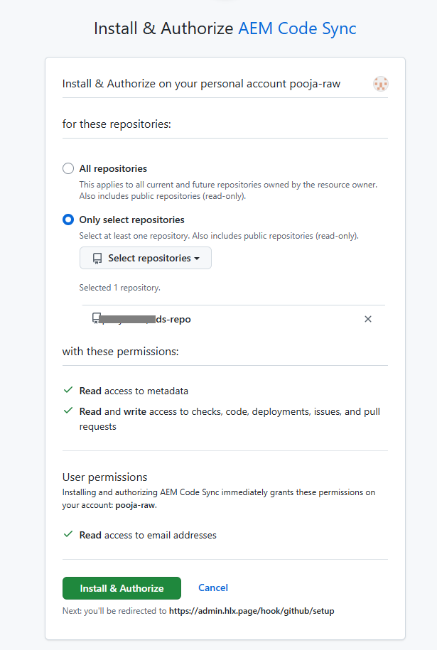{width="350" align="left"}
4. 選取&#x200B;**安裝並授權**。

系統會將您重新導向至GitHub設定頁面，確認成功註冊&#x200B;*AEM Code Sync*&#x200B;應用程式。 您也可以從此頁面儲存您網站的預覽和即時URL。

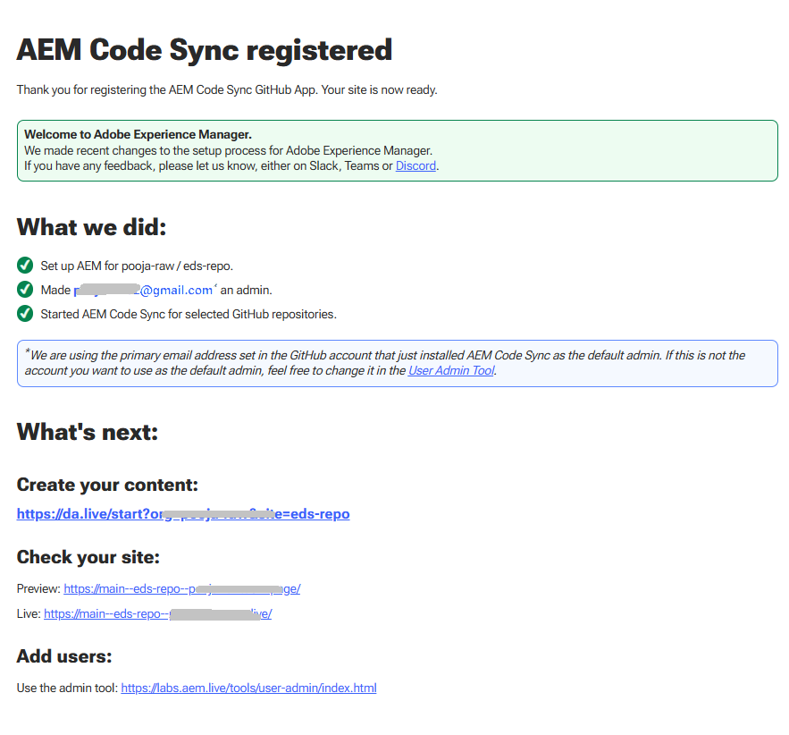{align="left"}

### 建立新的GitHub應用程式

1. 在GitHub上，導覽至左側邊欄並選取&#x200B;**開發人員設定**。
2. 在左側邊欄中，選取&#x200B;**GitHub應用程式**。
3. 選取&#x200B;**新的GitHub應用程式**。

   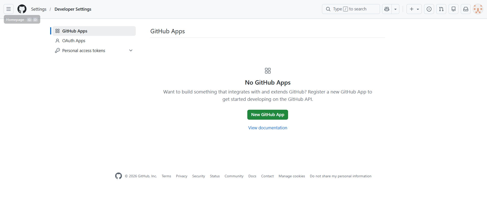{width="650" align="left"}
4. 在&#x200B;**註冊新的GitHub應用程式**&#x200B;頁面上，提供下列詳細資料：
   - **GitHub應用程式名稱**：輸入您應用程式的名稱。 例如`USERNAME-eds-app`，其中USERNAME是您的GitHub使用者名稱。
   - **首頁URL**：輸入Experience Manager Guides執行個體的URL。

     範例URL （格式）： `https://<aem-author-url>/libs/fmdita/clientlibs/xmleditor/page.html`

     範例URL： `https://author-p16602-e335172-cmstg.adobeaemcloud.com/libs/fmdita/clientlibs/xmleditor/page.html`
   - **回呼URL**：與首頁URL相同。
   - **Webhook URL**：停用此選項。
   - **存放庫許可權**：設定&#x200B;**動作、管理和證明**&#x200B;的&#x200B;*讀取和寫入*&#x200B;許可權。
5. 選取&#x200B;**建立GitHub應用程式**。

您的應用程式現已準備就緒。 系統會將您重新導向至GitHub應用程式的&#x200B;**設定**&#x200B;頁面。

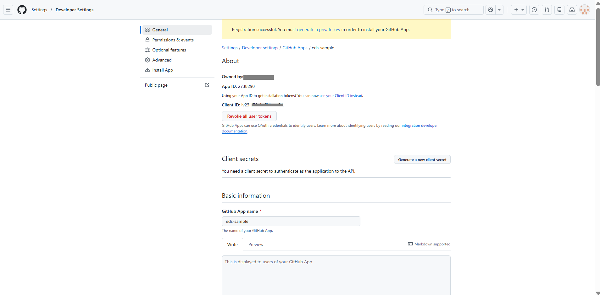{align="left"}

### 建立新的OAuth應用程式

在Experience Manager Guides中建立EDS (Beta)發佈設定檔時，需要OAuth應用程式才能驗證使用者。 它使用&#x200B;*使用者端識別碼*&#x200B;和&#x200B;*使用者端密碼*&#x200B;來啟用安全的登入流程。

執行以下步驟來建立新的OAuth應用程式：

1. 在GitHub上，導覽至左側邊欄並選取&#x200B;**開發人員設定**。
2. 在左側邊欄中，選取&#x200B;**OAuth應用程式**。
3. 選取&#x200B;**新的OAuth應用程式**。

   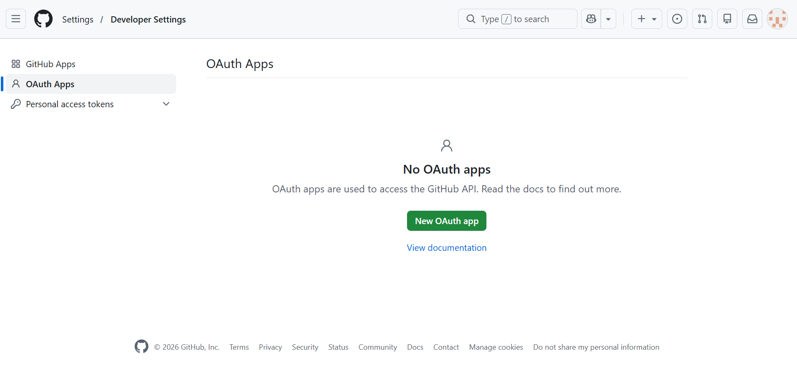{width="650" align="left"}
4. 提供下列必要詳細資訊，註冊您的應用程式：
   - **應用程式名稱**：輸入您的EDS存放庫名稱
   - **首頁URL**：輸入Experience Manager Guides執行個體的URL。 （如需範例URL格式，請參閱[建立新的GitHub應用程式](#create-a-new-github-app)區段的步驟4）。
   - **授權回呼URL**：與首頁URL相同
5. 選取&#x200B;**啟用裝置流程**&#x200B;選項，然後選取&#x200B;**註冊應用程式**&#x200B;以完成註冊。

   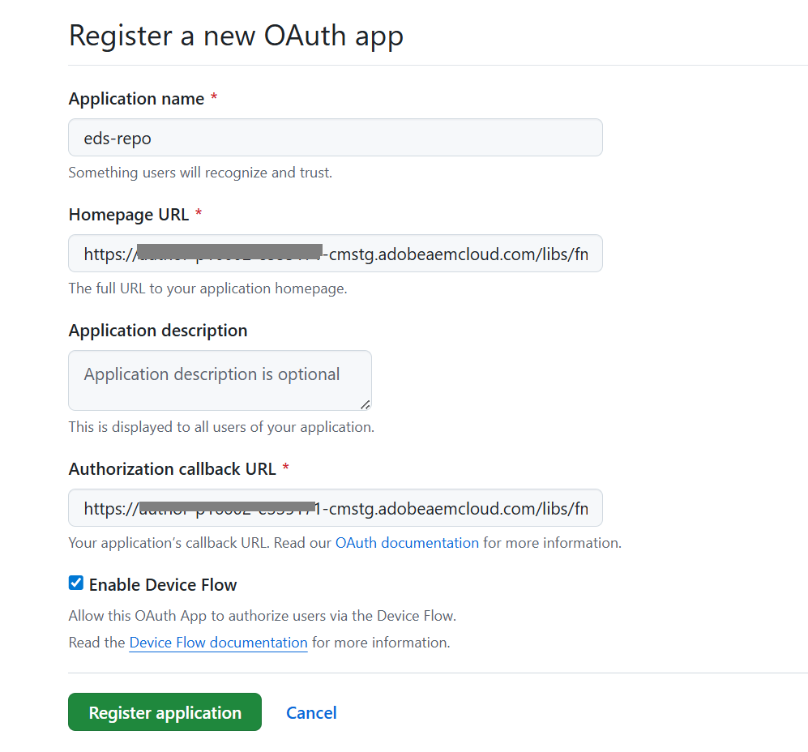{width="650" align="left"}

您的應用程式現已準備就緒。 記下&#x200B;*使用者端識別碼*。 在Experience Manager Guides中設定發佈設定檔時，您現在或稍後可以產生最多5個&#x200B;*使用者端密碼*。

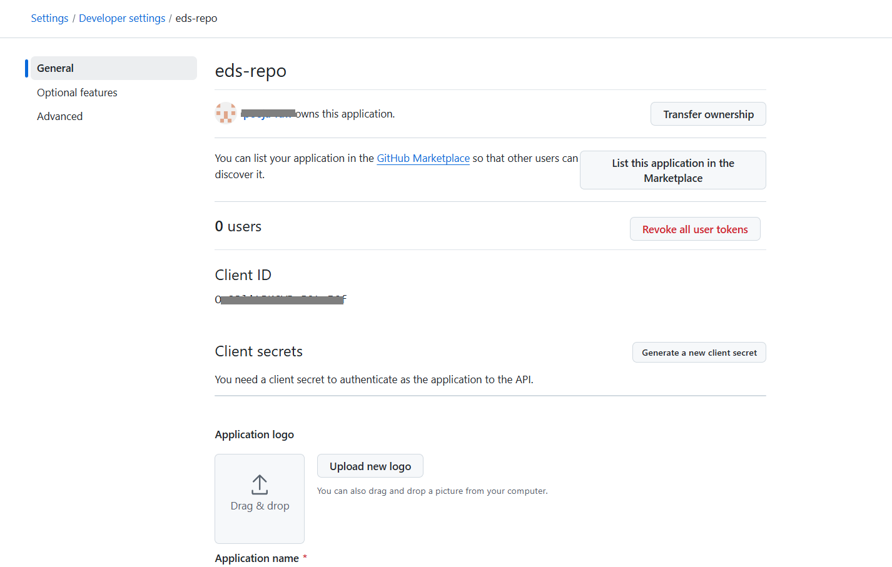{align="left"}

### 在EDS (Beta)存放庫中設定掛接點URL

EDS (Beta)會從&#x200B;*檔案中定義為*&#x200B;掛接點`fstab.yaml` URL的GitHub存放庫路徑讀取內容。

若要在`fstab.yaml`檔案中設定掛接點URL：

1. 開啟存放庫中的`fstab.yaml`檔案，並更新下列專案：
   - `your-user-name`
   - `your-repo-name`

   >
   >
   > 在掛接點URL中，`main`表示您要發佈內容的分支，`docs`表示您正在使用的EDS (Beta)存放庫的根資料夾。 如果您偏好在GitHub上變更分支名稱，則必須在&#x200B;*掛接點* URL （在`fstab.yaml`檔案中）中更新相同的分支名稱，並在Experience Manager Guides中更新對應的EDS發佈設定檔。

   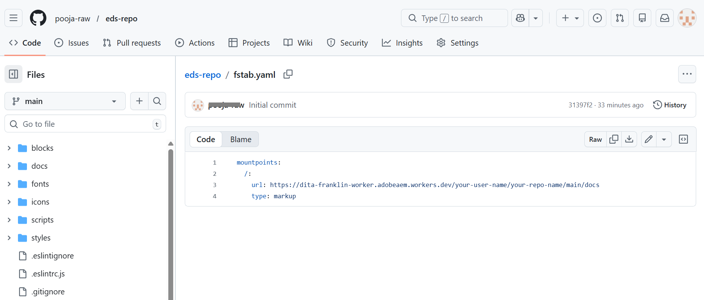{width="650" align="left"}
2. 選取&#x200B;**認可變更**，輸入認可詳細資料，然後確認。
3. 返回[開發人員設定](https://github.com/settings/apps)，找到您的應用程式，然後選取&#x200B;**編輯**。

   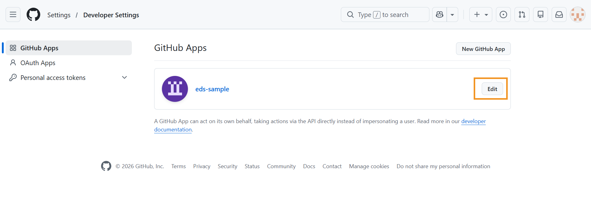{width="650" align="left"}
4. 瀏覽至&#x200B;**安裝應用程式**&#x200B;頁面，並選取&#x200B;**安裝**。

   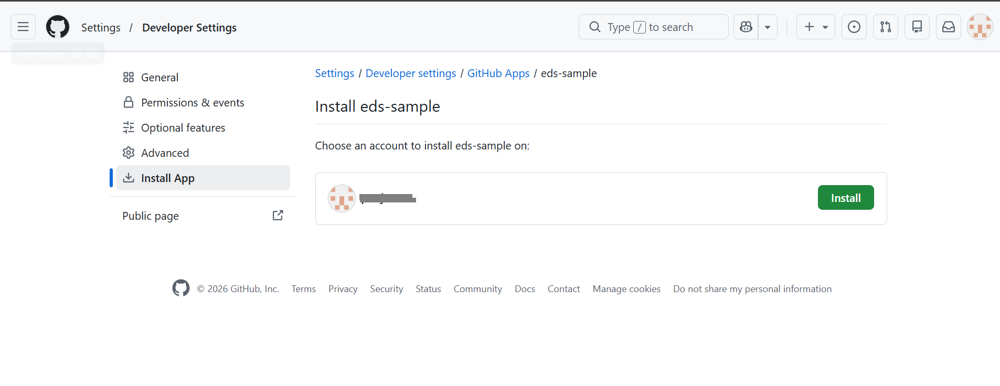{width="650" align="left"}
5. 透過AEM程式碼同步[區段從](#connect-github-to-adobe-via-aem-code-sync)連線GitHub至Adobe重複步驟2和3，以授權存放庫。

## 在Experience Manager中為EDS (Beta)建立並設定發佈設定檔

以下各節將依序概述每個步驟，並說明如何在Experience Manager Guides中設定EDS (Beta)發佈設定檔、設定輸出預設集及使用EDS (Beta)產生輸出。

### 建立EDS (Beta)發佈設定檔

1. 移至&#x200B;**[Workspace設定]** **>** **發佈設定檔**。
2. 選取&#x200B;**+**&#x200B;圖示以建立新的發佈設定檔，並提供下列詳細資料：
   - **伺服器型別**：從下拉式清單中選取&#x200B;**GitHub Edge Delivery Services (Beta)**。
   - **名稱**：輸入此設定檔的名稱。
   - **存放庫名稱**：使用從樣板建立的GitHub存放庫名稱。
   - **使用者名稱**：輸入您的GitHub使用者名稱。
   - **Branch main**：設定為主要（預設）。
   - **根資料夾**：設定為檔案（預設）。
   - **使用者端ID和使用者端密碼**：從您的GitHub應用程式擷取這些專案（如需詳細資訊，請參閱[建立新的OAuth應用程式](#create-a-new-oauth-app)區段）。
3. 選取&#x200B;**登入**&#x200B;以進行驗證。

   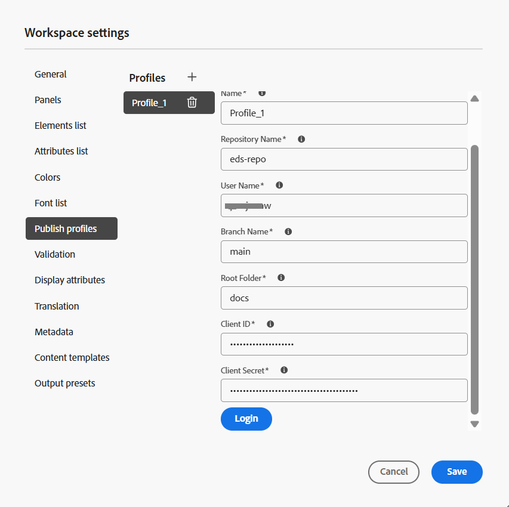{width="650" align="left"}
4. 成功驗證時，選取&#x200B;**儲存**。

您的EDS (Beta)發佈設定檔現已完成設定。

### 建立EDS (Beta)的輸出預設集並產生輸出

1. 在Map主控台中開啟地圖。
2. 在&#x200B;**輸出預設集**&#x200B;索引標籤中，選取&#x200B;**+**&#x200B;以建立新的輸出預設集。
3. 在&#x200B;**新輸出預設集**&#x200B;對話方塊中，提供下列詳細資料：
   - **型別**：選取&#x200B;**Edge Delivery服務(Beta)**
   - **名稱**：提供此預設集的名稱
4. 選取「**新增**」。

   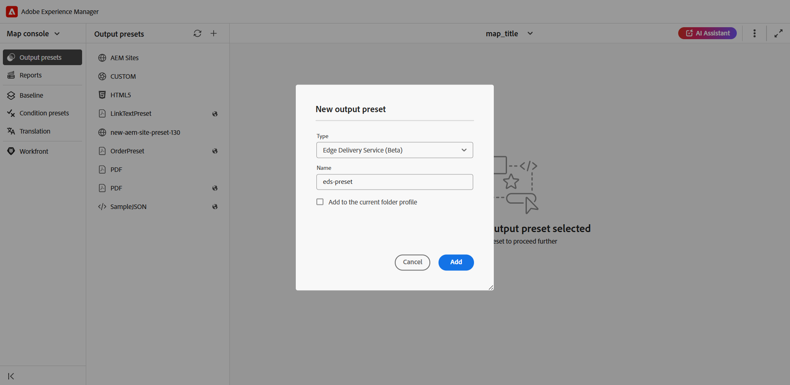{width="650" align="left"}
5. 開啟新建立的EDS (Beta)輸出預設集，並導覽至&#x200B;**設定**&#x200B;標籤。
   - 選取在上一步建立的發佈設定檔。
   - 啟用&#x200B;**推播至即時**。

   啟用&#x200B;**推送至即時**&#x200B;時，產生的輸出會認可至GitHub，而對應的更新會立即傳播至即時的網站。

   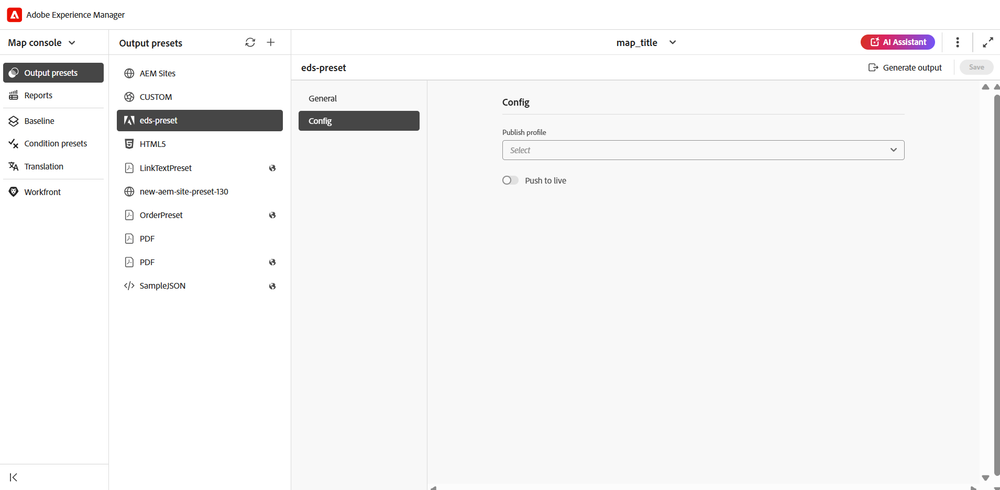{width="650" align="left"}

6. 選取&#x200B;**儲存**，然後選取&#x200B;**產生輸出**。

>
>
> 產生的輸出儲存在EDS (Beta)存放庫的&#x200B;**檔案**&#x200B;資料夾中。

現在會產生EDS (Beta)輸出。 內容以乾淨、回應式的版面配置呈現。 其中包含一般元素，例如頁面標題、階層連結、內文內容，以及主題中使用的任何區塊。 左側的目錄（從地圖產生）可協助您跨主題導覽，而右側的迷你目錄會反白標示目前頁面中的區段。 整個輸出可完全回應，確保裝置間的最佳化且一致讀取體驗。

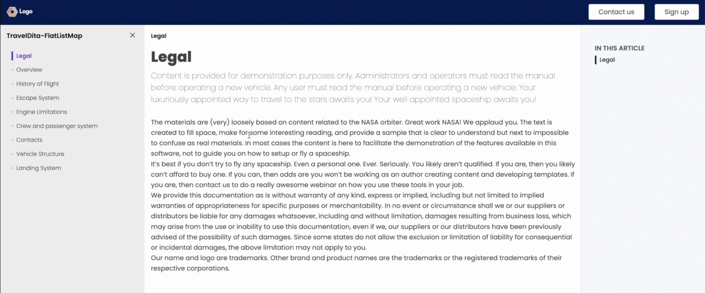{align="left"}

## 使用EDS區塊自訂輸出

EDS使用`blocks`來控制內容的不同部分的樣式和顯示方式。 您可以修改現有區塊或建立自訂區塊。

以下列出的範例會逐步引導您自訂現有區塊並建立新區塊，以便在Experience Manager Guides中設定最終EDS (Beta)輸出的樣式。

### 自訂階層連結區塊以更新其文字顏色

跨頁面使用階層連結，以協助使用者瞭解自己在檔案中的位置。 由於此區塊在整個網站中會一致顯示，因此更新其樣式可允許統一設計更新。

執行以下步驟來自訂階層連結區塊，以更新其文字顏色：

1. 前往您的GitHub存放庫並開啟`blocks`資料夾。
2. 選取&#x200B;**階層連結**&#x200B;區塊。

   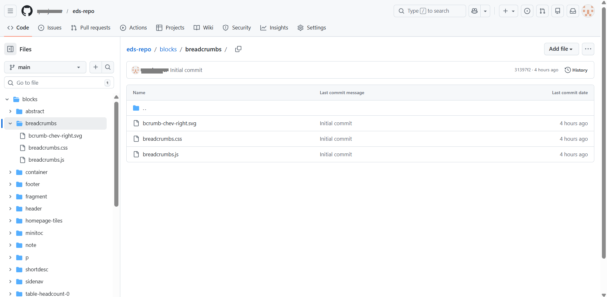{width="650" align="left"}
3. 開啟`css`檔案並更新文字色彩。
4. 將變更提交至GitHub。
5. 重新整理已上線的網站以檢視更新。

### 更新EDS (Beta)指令碼以在發佈的輸出中建立自訂元素

某些情況下，您可能只想要設定內容特定部分的樣式。 請執行以下步驟，使用自訂區塊來達成此目的。

1. 開啟主題檔案並選取標籤元素內的文字。

   在下列熒幕擷圖中，已選取`example`標籤內的內容。
   {width="650" align="left"}
2. 若要設定`example`標籤內的文字：
   - 瀏覽至&#x200B;**內容屬性**。
   - 新增`outputclass`屬性。
   - 將其值設為`example eds-force-block`。
   - 選取「**新增**」。
     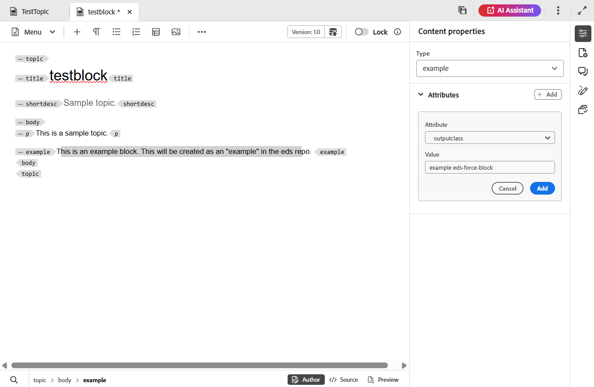{width="650" align="left"}
3. 儲存並重新產生輸出。
4. 在`outputclass`目錄中建立與`blocks`同名的新資料夾。 瞭解[新增檔案到存放庫](https://docs.github.com/en/repositories/working-with-files/managing-files/adding-a-file-to-a-repository#adding-a-file-to-a-repository-using-the-command-line)。

   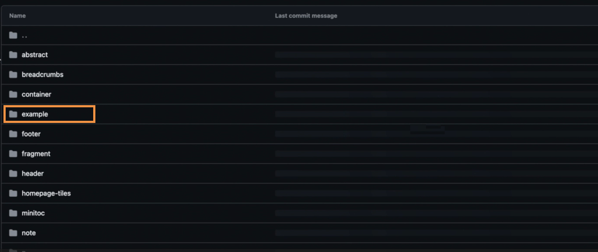{width="650" align="left"}
5. 新增必要的`css`和選用的`js`檔案。

   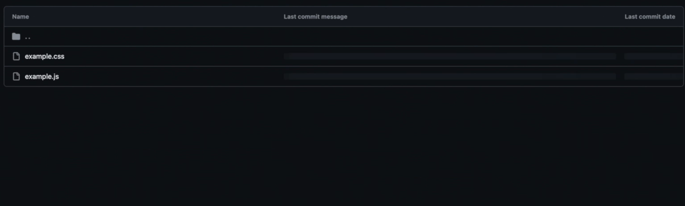{width="650" align="left"}
6. 認可變更並重新產生輸出。

選取的內容現在會顯示區塊中定義的自訂樣式。

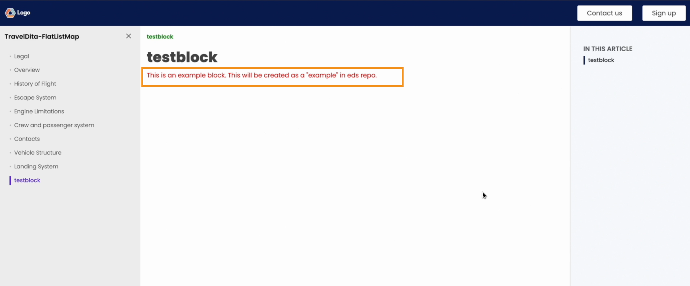{width="650" align="left"}